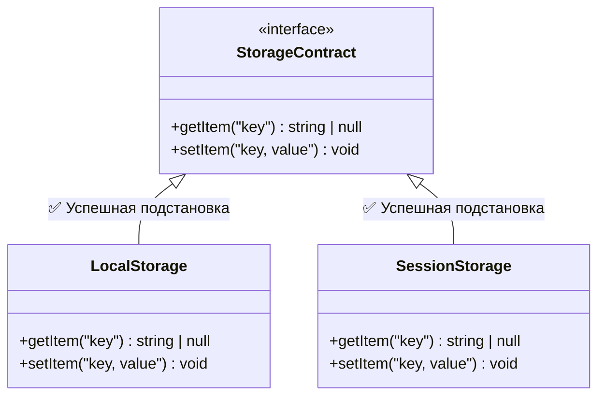

# Liskov Substitution Principle (LSP)

**Принцип подстановки Барбары Лисков (LSP)** гласит: «Объекты в программе должны быть заменяемыми на экземпляры их подтипов без изменения правильности выполнения программы».

Во Frontend-разработке (особенно при использовании TypeScript) это означает: если компонент или функция ожидает определенный интерфейс (контракт), то любая реализация этого интерфейса должна работать корректно, не ломая логику и не требуя дополнительных проверок типа (`if (type === ...)`).

## Какую боль мы решаем?

Часто при расширении функционала разработчики наследуют классы или переиспользуют интерфейсы, но при этом **изменяют ожидаемое поведение**. Это приводит к неожиданным багам и необходимости писать "костыли" для проверки того, с какой конкретно реализацией мы сейчас работаем.

## Как это работает на практике

Представьте, что у нас есть система работы с хранилищем (Storage).

### ❌ Антипаттерн (Нарушение LSP)

```typescript
// Базовый контракт
interface Storage {
  setItem(key: string, value: string): void;
  getItem(key: string): string | null;
}

// Реализация 1: LocalStorage (работает нормально)
class LocalStorageService implements Storage {
  setItem(key: string, value: string) { window.localStorage.setItem(key, value); }
  getItem(key: string) { return window.localStorage.getItem(key); }
}

// ❌ Реализация 2: CookieStorage (ломает ожидания)
class CookieStorageService implements Storage {
  setItem(key: string, value: string) {
    // В куках мы решили, что значение должно быть еще и зашифровано, 
    // или мы ожидаем 3-й аргумент для времени жизни (expires)
    document.cookie = `${key}=${value}; path=/;`;
  }
  
  getItem(key: string) {
    // А тут вдруг возвращается не строка, а распарсенный JSON, или выбрасывается ошибка
    throw new Error("Чтение кук запрещено из соображений безопасности!");
  }
}
```
**Проблема:** Если функция ожидает `Storage`, она рассчитывает, что метод `getItem` вернет строку или `null`. Если мы передадим туда `CookieStorageService`, программа упадет из-за `throw new Error`. Контракт нарушен, подстановка не удалась.

### ✅ Как надо (Соблюдение контрактов)

Если класс не может выполнить контракт родителя, он **не должен от него наследоваться** или реализовывать этот интерфейс. Лучше разделить интерфейсы (ISP).

В мире UI-компонентов LSP часто нарушается через пропсы.
```tsx
// Базовый интерфейс кнопки
interface ButtonProps extends React.ButtonHTMLAttributes<HTMLButtonElement> {
  variant?: 'primary' | 'secondary';
}

// ✅ Хорошо: AsyncButton полностью поддерживает контракт ButtonProps
interface AsyncButtonProps extends ButtonProps {
  isLoading?: boolean;
}

function AsyncButton({ isLoading, children, ...rest }: AsyncButtonProps) {
  return (
    <button {...rest} disabled={isLoading || rest.disabled}>
      {isLoading ? <Spinner /> : children}
    </button>
  );
}

// Теперь везде, где ожидается <button>, мы можем безопасно подставить <AsyncButton>, 
// потому что она ведет себя как обычная кнопка (поддерживает onClick, disabled, type и т.д.)
```

## Визуализация: Контракты


Любой из этих классов можно передать в функцию `function saveUser(storage: StorageContract)`, и она отработает предсказуемо.

## Скрытые трейдоффы и границы применимости

> [!CAUTION] Опасность: "Утиная типизация" (Duck Typing)
> TypeScript использует структурную типизацию. Если у двух объектов одинаковая форма (поля и методы), TS сочтет их совместимыми. Однако LSP говорит не только о совпадении типов, но и о **совпадении поведения**. 
> Даже если типы сошлись, но один метод тайно форматирует строку в upper-case, а другой нет — это нарушение LSP.

**Где ломается:**
Во Frontend часто приходится работать со сторонними библиотеками или старым legacy-кодом, где контракты не соблюдаются. В таких случаях приходится писать **Адаптеры** (Adapter Pattern), чтобы привести несовместимое поведение к нужному нам интерфейсу, вместо того чтобы пытаться заставить объекты напрямую соответствовать друг другу.