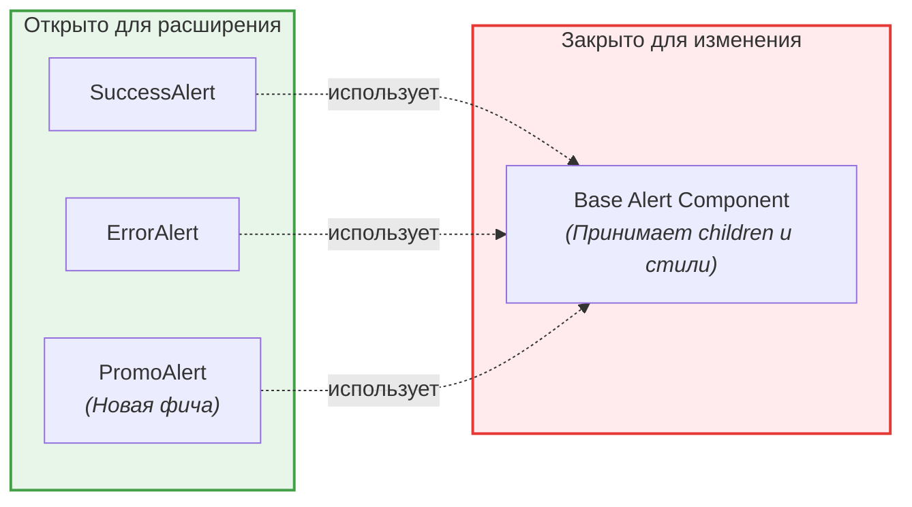

# Open-Closed Principle (OCP)

**Принцип открытости/закрытости (OCP)** гласит: «Программные сущности (классы, модули, функции) должны быть открыты для расширения, но закрыты для изменения». 

В контексте Frontend это значит, что при добавлении новой фичи (например, нового типа кнопки, нового графика или новой роли пользователя), мы **не должны переписывать существующий код** (добавляя бесконечные `if/else` или `switch`). Вместо этого мы должны передавать новую логику через пропсы, композицию или полиморфизм.

## Какую боль мы решаем?

Представьте компонент уведомлений (Alert), который изначально поддерживал только успешные (success) и ошибочные (error) сообщения. Приходит бизнес и просит добавить предупреждения (warning), информационные сообщения (info), а потом еще и кастомные уведомления с иконками.

Если мы нарушаем OCP, мы будем каждый раз лезть внутрь компонента `Alert` и добавлять новые проверки:

### ❌ Антипаттерн (Нарушение OCP)

```tsx
// ❌ Плохо: При каждом новом типе мы меняем исходный код компонента
function Alert({ type, message }: { type: 'success' | 'error' | 'warning', message: string }) {
  let icon;
  let bgClass;

  // Жестко зашитая логика внутри компонента
  if (type === 'success') {
    icon = <CheckIcon />;
    bgClass = 'bg-green-100';
  } else if (type === 'error') {
    icon = <ErrorIcon />;
    bgClass = 'bg-red-100';
  } else if (type === 'warning') {
    icon = <WarningIcon />;
    bgClass = 'bg-yellow-100';
  }
  // А если завтра добавят type="promo"? Снова лезть сюда!

  return (
    <div className={`p-4 flex ${bgClass}`}>
      {icon}
      <span>{message}</span>
    </div>
  );
}
```
**Проблема:** Компонент разрастается, и любое изменение может сломать уже работающий код. Он не "закрыт" для изменений.

## Как это работает на практике

Решение во Frontend чаще всего достигается через **композицию компонентов** (в React/Vue) или через внедрение конфигурации (паттерн Strategy).

### ✅ Как надо (Композиция - React way)

Сделаем компонент `Alert` «тупым» контейнером, который ничего не знает о типах, цветах и иконках. Он просто принимает то, что нужно отрендерить (открыт для расширения):

```tsx
// ✅ Хорошо: Компонент закрыт для изменения, но открыт для расширения через пропсы
interface AlertProps {
  icon: React.ReactNode;
  bgClass: string;
  children: React.ReactNode; // Композиция!
}

function Alert({ icon, bgClass, children }: AlertProps) {
  return (
    <div className={`p-4 flex ${bgClass}`}>
      {icon}
      <span>{children}</span>
    </div>
  );
}

// Теперь мы можем создавать любые вариации, НЕ МЕНЯЯ базовый Alert:
export const SuccessAlert = ({ msg }) => (
  <Alert icon={<CheckIcon />} bgClass="bg-green-100">{msg}</Alert>
);

export const PromoAlert = ({ msg, promoCode }) => (
  <Alert icon={<GiftIcon />} bgClass="bg-purple-100">
    {msg} <b>{promoCode}</b>
  </Alert>
);
```

## Визуализация подхода



## Скрытые трейдоффы и границы применимости

> [!WARNING] Риск: API-хаос
> Если делать каждый компонент максимально «открытым» через пропсы, можно получить компонент с сотней параметров, которым будет невозможно пользоваться. OCP нужно применять с умом, балансируя между гибкостью и простотой API.

**Когда применять:**
- UI-киты и дизайн-системы (компоненты вроде Button, Modal, Card должны быть максимально абстрактными).
- Разработка плагинной архитектуры, где новые модули добавляются без правки ядра.

**Когда это ломается (Антипаттерн "Too generic"):**
- Если вы пытаетесь сделать компонент настолько универсальным, что для того, чтобы вывести простой текст, разработчику нужно передавать 5 обязательных конфигурационных пропсов. В таких случаях лучше нарушить OCP и захардкодить часть логики, руководствуясь принципом KISS (Keep It Simple, Stupid).