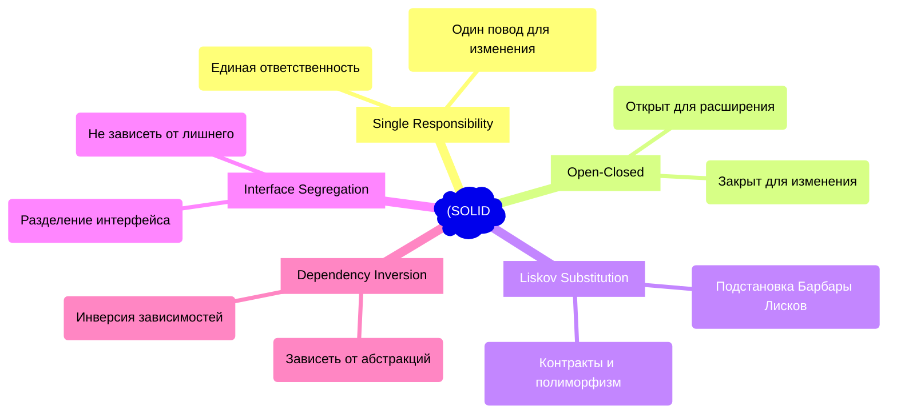

# SOLID во Frontend-разработке

Принципы SOLID — это пять основополагающих принципов объектно-ориентированного программирования и проектирования, которые помогают создавать гибкие, масштабируемые и легко поддерживаемые системы. Хотя изначально они задумывались для классического ООП (Java, C#), их философия идеально ложится на современный Frontend (React, Vue, TypeScript), если адаптировать их к компонентному подходу и функциональному программированию.

## Зачем нам SOLID на клиенте? (Какую боль решаем)

Исторически frontend был лишь слоем представления, но сегодня это полноценные сложные приложения. Без четких принципов проектирования возникают типичные проблемы:
- **God Components (Божественные компоненты):** Компонент на 2000 строк, который делает всё: ходит в сеть, управляет стейтом, валидирует формы и рендерит сложный UI.
- **Хрупкий код (Fragility):** Изменение одной логики (например, формата даты) ломает приложение в пяти неожиданных местах.
- **Невозможность переиспользования:** Бизнес-логика намертво приклеена к React/Vue-специфичным хукам.

## 5 Принципов SOLID

Каждый принцип детально разобран в соседних файлах:
1. [[Single Responsibility Principle]] (SRP)
2. [[Open Closed Principle]] (OCP)
3. [[Liskov Substitution Principle]] (LSP)
4. [[Interface Segregation Principle]] (ISP)
5. [[Dependency Inversion Principle]] (DIP)

## Архитектурные трейдоффы и границы применимости

Несмотря на всю мощь SOLID, слепое следование принципам может привести к оверинжинирингу. 

### Когда SOLID необходим:
* **Крупные Enterprise проекты:** Где над кодовой базой работают десятки разработчиков и цена ошибки высока.
* **Долгоживущие продукты (3+ года):** Где требования бизнеса постоянно меняются.
* **Сложная бизнес-логика:** Калькуляторы, финтех, сложные дашборды.

### Когда SOLID — это оверхед:
* **MVP и прототипы:** Когда задача — максимально быстро проверить гипотезу. Трата времени на абстракции и интерфейсы здесь неуместна.
* **Простые лендинги и промо-сайты:** Логики почти нет, всё сводится к отображению разметки и анимациям.
* **Маленькие компоненты:** Нет смысла дробить 50-строчный компонент кнопки на 5 разных слоев абстракции.

> [!WARNING] Важный нюанс
> Во Frontend мы часто работаем не с классами, а с функциями, хуками и компонентами. Поэтому SOLID здесь — это скорее способ *мышления*, а не строгий набор правил для ООП. Например, SRP отлично применяется к React-хукам (каждый хук делает только одну вещь), а DIP — к пропсам компонентов и инъекции зависимостей через Context.
