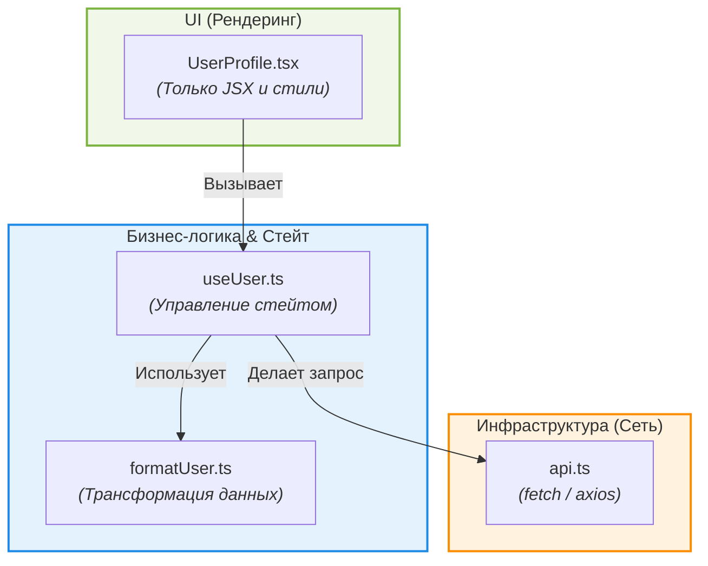

# Single Responsibility Principle (SRP)

**Принцип единственной ответственности (SRP)** гласит: «У модуля/класса/компонента должна быть только одна причина для изменения». В контексте Frontend это означает, что каждый компонент или функция должен решать строго одну задачу.

## Какую боль мы решаем?

Когда разработчик пишет код «в лоб», часто получается God Object (Божественный компонент). Представьте компонент формы логина, который:
1. Отрисовывает инпуты и кнопку.
2. Содержит локальный стейт ввода (useState).
3. Валидирует email и пароль.
4. Отправляет запрос к API (fetch).
5. Показывает тост с ошибкой или делает редирект.

**Проблема:** Если нужно поменять логику валидации, мы лезем в компонент, который отвечает за рендеринг. Если меняется дизайн кнопки — мы опять лезем в этот же файл. Код становится хрупким, разрастается и его невозможно переиспользовать.

## Как это работает на практике

Давайте посмотрим на антипаттерн и на то, как его отрефакторить с учетом SRP.

### ❌ Антипаттерн (Божественный компонент)

```tsx
// ❌ Плохо: Компонент делает слишком много
function UserProfile({ userId }: { userId: string }) {
  const [user, setUser] = useState(null);
  const [loading, setLoading] = useState(true);

  useEffect(() => {
    // 1. Поход в сеть и управление состоянием загрузки
    fetch(`/api/users/${userId}`)
      .then((res) => res.json())
      .then((data) => {
        // 2. Бизнес-логика (парсинг/форматирование)
        data.fullName = `${data.firstName} ${data.lastName}`;
        setUser(data);
        setLoading(false);
      });
  }, [userId]);

  if (loading) return <div>Загрузка...</div>;

  // 3. UI-рендеринг
  return (
    <div className="card">
      
      <h2>{user.fullName}</h2>
      <p>{user.email}</p>
    </div>
  );
}
```

### ✅ Как надо (Разделение ответственности)

Мы выносим работу с сетью и бизнес-логику в кастомный хук или сервисный слой, оставляя компоненту только одну ответственность — рендеринг UI.

```tsx
// 1. Слой данных/инфраструктуры (кастомный хук)
function useUser(userId: string) {
  const [user, setUser] = useState(null);
  const [loading, setLoading] = useState(true);

  useEffect(() => {
    fetch(`/api/users/${userId}`)
      .then((res) => res.json())
      .then((data) => {
        setUser({
          ...data,
          fullName: `${data.firstName} ${data.lastName}`, // Форматирование ушло сюда
        });
        setLoading(false);
      });
  }, [userId]);

  return { user, loading };
}

// 2. Слой UI (глупый компонент)
// ✅ Хорошо: Компонент только отображает данные
function UserProfile({ userId }: { userId: string }) {
  const { user, loading } = useUser(userId);

  if (loading) return <div>Загрузка...</div>;

  return (
    <div className="card">
      
      <h2>{user.fullName}</h2>
      <p>{user.email}</p>
    </div>
  );
}
```

## Визуализация: Разделение слоев



## Скрытые трейдоффы и границы применимости

> [!TIP] Оверхед на абстракции
> SRP часто приводит к увеличению количества файлов. Вместо одного `UserProfile.tsx` у вас может появиться `UserProfile.tsx`, `useUser.ts`, `api.ts` и `types.ts`. 

**Когда применять:**
- Если компонент перешагнул за 150-200 строк и начинает совмещать логику (useState/useEffect) с массивным JSX.
- Если функция форматирования/валидации понадобилась в другом месте (переиспользование).

**Когда не стоит применять (Где ломается):**
- **Микро-компоненты:** Если у вас есть компонент `<Button />`, который просто оборачивает `button` и добавляет стили, не нужно создавать для него хуки или отдельные слои.
- **Преждевременная оптимизация:** Не дробите простой компонент, пока он не начал причинять боль. Принцип "YAGNI" (You Aren't Gonna Need It) иногда важнее SRP на старте проекта.