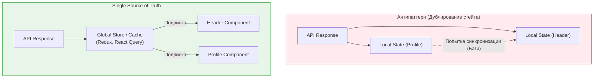

**Единственный источник истины (Single Source of Truth, SSOT)** — это принцип управления состоянием и данными, согласно которому каждая модель данных в системе должна иметь только одно авторитетное (главное) место хранения. Любые другие части системы должны ссылаться на этот источник, а не копировать данные.

## 1. Суть концепции

В современных фронтенд-приложениях состояние (State) — это самая сложная часть. 
**Боль:** Рассинхронизация UI. Пользователь меняет имя в настройках профиля, но в шапке сайта (Header) продолжает отображаться старое имя. Пользователь кладет товар в корзину, кнопка меняется на "В корзине", но счетчик товаров наверху экрана показывает "0".

### Паттерн Синхронизации vs SSOT



## 2. Как это работает на практике

Самое частое нарушение SSOT — это копирование пропсов (props) в локальное состояние (state) компонента.

### Антипаттерн: Копирование данных (Derived State)
Компонент получает массив объектов и сохраняет его копию в `useState`, чтобы фильтровать.

```tsx
// ОШИБКА: У нас появилось два источника истины:
// 1. props.users (Приходят сверху)
// 2. localUsers (Копия внутри компонента)
function UsersTable({ users }) {
  const [localUsers, setLocalUsers] = useState(users); 

  // Если props.users изменятся (добавится новый юзер), 
  // localUsers НЕ обновится автоматически! Возникнет рассинхрон.

  const filterActive = () => {
    setLocalUsers(users.filter(u => u.isActive));
  };

  return <Table data={localUsers} onFilter={filterActive} />;
}
```

### Решение: Вычисление "На лету" (Derived Data)
Источником истины остаются `props.users`. Мы вычисляем производные данные на лету, сохраняя в стейт только *условие* фильтрации.

```tsx
// ПРАВИЛЬНО: Источник истины один (props.users).
// Состояние компонента хранит только UI-настройку (показывать ли только активных).
function UsersTable({ users }) {
  const [showOnlyActive, setShowOnlyActive] = useState(false);

  // Вычисляем данные на лету. Можно обернуть в useMemo, если фильтрация тяжелая.
  const displayUsers = showOnlyActive 
    ? users.filter(u => u.isActive) 
    : users;

  return <Table data={displayUsers} onFilter={() => setShowOnlyActive(true)} />;
}
```

## 3. Неочевидные нюансы и трейдоффы

*   **URL как источник истины:** Разработчики часто забывают, что URL браузера (строка поиска, параметры `?sort=desc`) — это тоже глобальное состояние. Если вы дублируете параметры из URL в стейт Redux или `useState`, вы нарушаете SSOT. Пользователь нажмет кнопку "Назад" в браузере, URL изменится, а стейт Redux — нет. Читайте параметры фильтрации напрямую из URL!
*   **Нормализация данных:** В сложных приложениях SSOT требует нормализации хранилища. Если пост содержит автора `post: { id: 1, author: { id: 2, name: "Ivan" } }`, и у вас есть отдельный список авторов, объект Ивана дублируется. При изменении имени Ивана, оно обновится не везде. Решение — плоские нормализованные структуры (как в базах данных), где посты хранят только `authorId`, а UI сам подтягивает сущность автора по ID.
*   **Осознанное дублирование (Draft State):** Иногда нарушение SSOT необходимо. Например, при редактировании формы профиля. Если форма привязана напрямую к SSOT, каждое нажатие клавиши будет менять глобальный стейт. В таких случаях создается "черновик" (Draft State) — временная копия данных. Она живет, пока пользователь не нажмет "Сохранить", после чего изменения сливаются обратно в SSOT.
