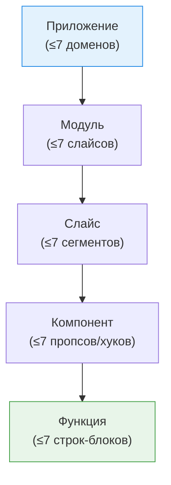

**Фрактальный подход рефакторинга 7±2** — инженерная эвристика (не академический стандарт уровня SOLID или GoF), лежащая на стыке когнитивной психологии и проектирования ПО. Она требует ограничивать сложность *любой* части системы возможностями рабочей памяти человека, причем на всех уровнях абстракции одинаково.

## 1. Суть концепции и какую боль решаем

Термин состоит из двух частей:

- **7 ± 2 (Закон Миллера).** Предел рабочей памяти: мозг одновременно удерживает 5–9 объектов. Больше — теряется контекст, растет число ошибок.
- **Фрактальность (самоподобие).** Правило применяется одинаково на любом масштабе: от всей системы до тела функции.

**Боль:** когнитивная перегрузка. Код читается в разы чаще, чем пишется. Если сущность содержит больше ~7 элементов, разработчик не в состоянии удержать ее целиком в голове — и любая правка становится рискованной.

**Правило:** как только сущность начинает содержать больше 7 (максимум 9) элементов — ее нужно декомпозировать.

| Уровень | Ограничение 7±2 | Рефакторинг при превышении |
|---|---|---|
| Система | 5–9 подсистем / микрофронтендов | Выделение домена |
| Модуль | 5–9 слайсов / сегментов | Разбиение модуля |
| Компонент / класс | 5–9 пропсов, хуков, методов | *Extract Component / Extract Class* |
| Функция | 5–9 логических блоков и переменных | *Extract Method / Hook* |

### Фрактальность декомпозиции


*На каждом масштабе структура выглядит одинаково: небольшое число именованных частей, каждую из которых можно понять изолированно.*

## 2. Как это работает на практике (Frontend)

### Антипаттерн: компонент, превышающий когнитивный лимит

```tsx
// ОШИБКА: 12 пропсов + 8 хуков + 40 строк JSX — мозг не удерживает контекст
function OrderCard({ order, user, products, promo, delivery, payment,
                     currency, locale, permissions, theme, tracking, flags }) {
  const [expanded, setExpanded] = useState(false);
  // ... еще 7 хуков и 40 строк разметки подряд
}
```

### Решение: декомпозиция до 7±2 сущностей на каждом уровне

```tsx
// ПРАВИЛЬНО: компонент оперирует 5 сущностями, каждая — "чанк" с говорящим именем
function OrderCard({ orderId }) {
  const order = useOrder(orderId);        // чанк: данные заказа
  const permissions = usePermissions();   // чанк: права

  return (
    <Card>
      <OrderHeader order={order} />
      <OrderProducts items={order.products} />
      <OrderDelivery delivery={order.delivery} />
      <OrderPayment payment={order.payment} />
      {permissions.canTrack && <OrderTracking id={orderId} />}
    </Card>
  );
}
```
Каждый подкомпонент внутри себя снова подчиняется тому же правилу — это и есть фрактальность.

## 3. Происхождение

Единого автора нет — это синтез идей:

- **Джордж Миллер (1956)** — статья «The Magical Number Seven, Plus or Minus Two», основа ограничения 7±2.
- **Мартин Фаулер** («Рефакторинг») и **Роберт Мартин** («Чистый код») — пропаганда радикальной декомпозиции и коротких методов.
- Сам термин популяризирован IT-конференциями (HighLoad, DotNext) и статьями как научное обоснование того, *почему* нужно дробить функции и классы.

## 4. Смежные концепции

- **Чанкинг (Chunking):** психологический механизм группировки. Метод/компонент с говорящим именем — это чанк: 7 строк кода скрываются за одним именем и освобождают слоты рабочей памяти.
- **Cognitive Complexity:** метрика SonarQube, оценивающая трудность чтения кода именно для человека (в отличие от цикломатической сложности).
- **[[SOLID во Frontend|SRP]]:** класс с одной ответственностью естественно не разрастается сверх 7–9 методов.
- **[[Law of Demeter]]:** ограничивает число связей объекта, не давая превысить когнитивный предел зависимостей.
- **Feature-Sliced Design (FSD):** методология, построенная строго на фрактальности: layers → slices → segments.
- **UX/UI:** тот же закон Миллера — не более ~7 пунктов в навигационном меню, иначе «паралич выбора».

## 5. Неочевидные нюансы и трейдоффы

- **«Спагетти из абстракций» (Ravioli Code).** Слепое дробление всего на функции по 3–5 строк порождает россыпь из сотен микро-файлов. Читать становится тяжело не из-за размера, а из-за постоянных прыжков между файлами — теряется связность. Декомпозируйте по смыслу, а не по счетчику строк.
- **7±2 — не догма, а триггер.** Число — сигнал остановиться и подумать, а не жесткий лимит линтера. Хорошо сгруппированные 10 строк могут читаться легче, чем 6 разрозненных.
- **Современные данные психологии.** Исследования Нельсона Коуэна (2001) показывают, что реальный предел рабочей памяти без техник запоминания — скорее **4 ± 1**. Это аргумент в пользу еще более жесткой декомпозиции и агрессивного чанкинга.

> [!TIP] Прагматичное применение
> Используйте 7±2 как «когнитивный линтер»: если при code review вы не можете пересказать, что делает сущность, перечислив ≤7 ее частей — это кандидат на рефакторинг. Но объединяйте по смыслу (высокая cohesion), а не ради самого числа.
