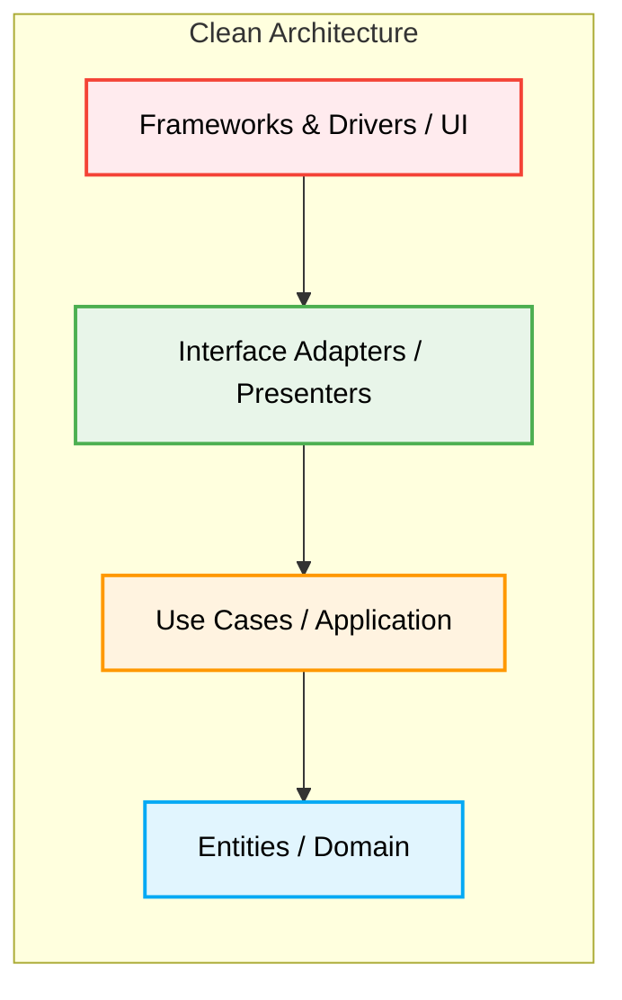

# Clean Architecture

Мы все радостно начинаем новые проекты. Выбираем свежий фреймворк, например, React или Vue, пишем компоненты, прямо в них ходим за данными и щедро мажем это глобальным стейтом. Жизнь прекрасна. Но проект растет. Появляется необходимость сменить UI-библиотеку, переехать на другой API или добавить новый платежный шлюз. И тут начинается кошмар: изменение в одной части ломает десять других. Бизнес-логика намертво сплелась с хуками React и вызовами Axios. Код невозможно тестировать без рендеринга интерфейса, а фреймворк диктует нам, как должна выглядеть архитектура. Боль становится невыносимой.

**Clean Architecture** (Чистая Архитектура), синтезированная Робертом Мартином (Uncle Bob) — это ответ на этот хаос. Это не жесткий шаблон папок, а скорее философия разделения ответственности на концентрические слои. Идея в том, чтобы вытеснить инфраструктуру, UI и фреймворки на самые внешние границы системы, а ядро бизнес-логики оставить в самом центре — изолированным и независимым. Бизнес-правилам должно быть абсолютно все равно, используете вы React или Angular, MongoDB или PostgreSQL.



### Как это работает на практике

Архитектура состоит из слоев, завернутых друг в друга:
1. **Entities (Сущности)** — чистые данные и фундаментальные бизнес-правила (ядро).
2. **Use Cases (Сценарии использования)** — прикладная бизнес-логика (например, "Оформить заказ").
3. **Interface Adapters (Адаптеры интерфейсов)** — контроллеры и презентеры, конвертирующие данные из Use Cases в формат, удобный для UI или БД.
4. **Frameworks & Drivers (Инфраструктура)** — самая внешняя оболочка: React, Axios, LocalStorage.

Скрепляет все это **Правило Зависимостей (Dependency Rule)**: зависимости могут быть направлены только внутрь. Внешние слои знают о внутренних, но внутренние ничего не подозревают о внешних.

```typescript
// ❌ Антипаттерн: бизнес-логика размазана по UI-компоненту 
// и жестко привязана к HTTP-клиенту и стейт-менеджеру
async function CheckoutButton() {
  const cart = useStore(state => state.cart);
  
  const handleCheckout = async () => {
    if (cart.length === 0) return alert('Empty');
    const res = await axios.post('/api/checkout', { items: cart });
    if (res.status === 200) alert('Success');
  };
  
  return <button onClick={handleCheckout}>Buy</button>;
}

// ✅ Clean-подход: Use Case полностью отделен от UI и инфраструктуры
// Этот код можно тестировать в Node.js без браузера и React
class CheckoutUseCase {
  constructor(private api: CheckoutRepository) {}
  
  async execute(cart: Cart): Promise<boolean> {
    if (cart.isEmpty()) throw new Error("Cart is empty");
    return this.api.processPayment(cart);
  }
}
```

### Неочевидные нюансы и границы применимости

**Скрытые трейдоффы**: Главный слон в комнате — это гигантский оверхед. Clean Architecture требует много бойлерплейта: интерфейсов, DTO (Data Transfer Objects), мапперов между слоями. Вам постоянно придется распаковывать данные из одного формата и запаковывать в другой при пересечении границ слоев.

**Где ломается**: Для простого CRUD-приложения, лендинга или быстрого MVP этот оверхед фатален. Вы потратите больше времени на маппинг данных и создание интерфейсов, чем на доставку фичей пользователю. Clean Architecture превращается в антипаттерн, если ваш домен анемичен (состоит просто из интерфейсов данных без логики), а приложение выступает лишь тонким прокси к бэкенду.

**Когда использовать необходимо**: Когда бизнес-логика на клиенте действительно сложна (например, графические редакторы, сложные финансовые дашборды, оффлайн-first приложения), когда долговечность проекта в приоритете, и когда стоимость замены инфраструктурных кусков (например, переезд с REST на GraphQL) должна быть минимальной. В таких условиях Clean Architecture спасает проект от превращения в "Big Ball of Mud".
