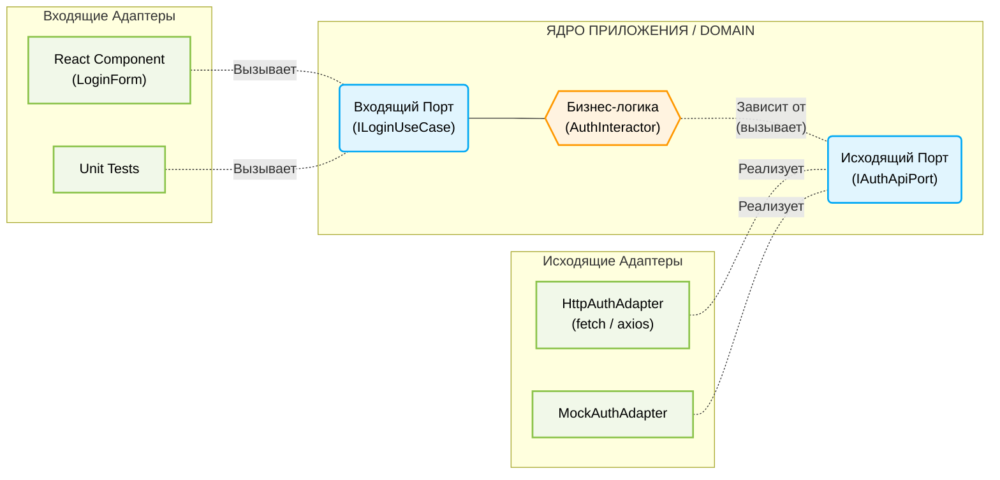

Гексагональная архитектура (также известная как «Порты и Адаптеры») — это паттерн проектирования, который ставит в центр приложения чистую бизнес-логику (Ядро) и полностью изолирует её от внешнего мира: UI-фреймворков, сетевых запросов, браузерного API и баз данных.

Главная цель — сделать так, чтобы бизнес-логика не зависела от того, **откуда** приходят команды (React, Vue, CLI) и **куда** уходят данные (REST API, GraphQL, LocalStorage).

## 1. Суть паттерна: Входящие и Исходящие потоки

В правильной реализации порты строго делятся на два типа:
1. **Входящие порты (Driving / Primary Ports):** Описывают *use-cases* (сценарии использования). Это контракт того, что наше приложение умеет делать. UI использует эти порты, чтобы управлять приложением.
2. **Исходящие порты (Driven / Secondary Ports):** Описывают потребности бизнес-логики. Это контракт того, что нашему приложению нужно от внешнего мира (например, интерфейс для получения данных по сети).

### Архитектурная схема



---

## 2. Практическая реализация (Пример авторизации)

В гексагональной архитектуре UI не общается с API напрямую. Между ними стоит «Ядро» с бизнес-правилами.

### Шаг 1. Порты (Определяются внутри Ядра)

**Входящий порт** — контракт для UI.
```typescript
// domain/ports/incoming/ILoginUseCase.ts
export interface UserSession {
  email: string;
  token: string;
}

export interface ILoginUseCase {
  execute(email: string, password: string): Promise<UserSession>;
}
```

**Исходящий порт** — контракт для общения с внешним миром (сетью).
```typescript
// domain/ports/outgoing/IAuthApiPort.ts
export interface IAuthApiPort {
  fetchToken(email: string, pass: string): Promise<string>;
}
```

### Шаг 2. Ядро / Бизнес-логика (Внутри Гексагона)

Здесь находится реализация входящего порта. Ядро оркестрирует логику, валидацию и обращается к исходящему порту. Оно ничего не знает ни про React, ни про `fetch`.

```typescript
// domain/core/AuthInteractor.ts
import { ILoginUseCase, UserSession } from '../ports/incoming/ILoginUseCase';
import { IAuthApiPort } from '../ports/outgoing/IAuthApiPort';

export class AuthInteractor implements ILoginUseCase {
  // Внедрение зависимости: Ядро требует исходящий порт
  constructor(private api: IAuthApiPort) {}

  async execute(email: string, password: string): Promise<UserSession> {
    // Чистая бизнес-логика и валидация
    if (!email.includes('@')) {
      throw new Error('Некорректный email');
    }
    if (password.length < 8) {
      throw new Error('Пароль должен быть не менее 8 символов');
    }

    // Обращение к внешнему миру через порт (абстракцию)
    const token = await this.api.fetchToken(email, password);
    
    // Возвращаем результат во входящий порт
    return { email, token };
  }
}
```

### Шаг 3. Адаптеры (Инфраструктурный слой снаружи)

**Исходящий адаптер (Driven Adapter)** — реализует работу с сетью.
```typescript
// infrastructure/adapters/HttpAuthAdapter.ts
import { IAuthApiPort } from '../../domain/ports/outgoing/IAuthApiPort';

export class HttpAuthAdapter implements IAuthApiPort {
  async fetchToken(email: string, pass: string): Promise<string> {
    const response = await fetch('/api/login', {
      method: 'POST',
      headers: { 'Content-Type': 'application/json' },
      body: JSON.stringify({ email, password: pass }),
    });
    
    if (!response.ok) throw new Error('Неверные учетные данные');
    const data = await response.json();
    
    return data.access_token;
  }
}
```
*(Примечание: на этапе разработки здесь можно создать `MockAuthAdapter`, который будет возвращать захардкоженный токен без реальных запросов).*

**Входящий адаптер (Driving Adapter - React UI)** — вызывает только входящий порт.
```tsx
// ui/components/LoginForm.tsx
import React, { useState } from 'react';
import { ILoginUseCase } from '../../domain/ports/incoming/ILoginUseCase';

interface Props {
  // UI зависит только от входящего порта (абстракции)
  loginUseCase: ILoginUseCase; 
}

export function LoginForm({ loginUseCase }: Props) {
  const [email, setEmail] = useState('');
  const [password, setPassword] = useState('');
  const [error, setError] = useState('');

  const handleSubmit = async (e: React.FormEvent) => {
    e.preventDefault();
    setError('');
    try {
      // Компонент понятия не имеет, как работает валидация и куда идет запрос
      const session = await loginUseCase.execute(email, password);
      console.log(`Успешный вход, токен: ${session.token}`);
    } catch (err: any) {
      setError(err.message);
    }
  };

  return (
    <form onSubmit={handleSubmit}>
      <input value={email} onChange={e => setEmail(e.target.value)} placeholder="Email" />
      <input type="password" value={password} onChange={e => setPassword(e.target.value)} />
      <button type="submit">Войти</button>
      {error && <p style={{ color: 'red' }}>{error}</p>}
    </form>
  );
}
```

### Шаг 4. Dependency Injection (Сборка приложения)

На верхнем уровне приложения (в файле инициализации или через DI-контейнер) мы соединяем адаптеры с портами:

```tsx
// app/main.tsx
import React from 'react';
import { createRoot } from 'react-dom/client';
import { HttpAuthAdapter } from '../infrastructure/adapters/HttpAuthAdapter';
import { AuthInteractor } from '../domain/core/AuthInteractor';
import { LoginForm } from '../ui/components/LoginForm';

// 1. Инициализируем исходящий адаптер (инфраструктура)
const apiAdapter = new HttpAuthAdapter(); 

// 2. Внедряем адаптер в Ядро. Ядро реализует Входящий Порт (ILoginUseCase)
const authUseCase = new AuthInteractor(apiAdapter); 

// 3. Внедряем сценарий в UI
const root = createRoot(document.getElementById('root')!);
root.render(<LoginForm loginUseCase={authUseCase} />);
```

---

## 3. В чем ценность такого подхода?

1. **Идеальная тестируемость (Unit Tests):** Чтобы протестировать бизнес-логику (`AuthInteractor`), нам не нужен ни React, ни моки HTTP-запросов (msw/jest.mock). Мы просто передаем в конструктор `AuthInteractor` фейковый объект, реализующий `IAuthApiPort`, и тестируем правила мгновенно.
2. **Параллельная разработка:** Фронтенд-инженер может полностью разработать UI и бизнес-логику, используя `MockAuthAdapter`, пока бэкенд-команда еще только проектирует API.
3. **Защита от изменений извне (Гибкость):** 
   * Если мы переедем с React на Vue или Angular, ядро (бизнес-логика) не изменится ни на строчку.
   * Если бэкенд поменяет REST на GraphQL, gRPC или Firebase, мы перепишем только один файл — `HttpAuthAdapter`. UI-компоненты и логика приложения об этом даже не узнают.