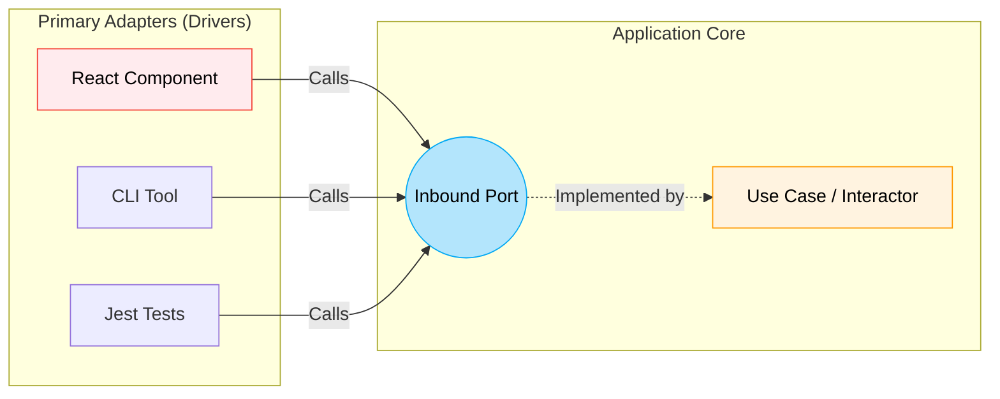

# Inbound Ports (Входящие порты)

Когда мы строим приложение, нам нужно как-то "выставить наружу" его возможности. Будь то React-компонент, реагирующий на клик пользователя, фоновая задача или REST-контроллер (если мы пишем BFF на Node.js) — все эти внешние сущности пытаются *управлять* нашим приложением (drive the application). 

Боль возникает тогда, когда эти внешние драйверы лезут напрямую во внутренности системы: вызывают методы доменных сущностей, напрямую управляют состоянием или знают детали реализации бизнес-правил. В такой ситуации изменение внутри бизнес-логики немедленно ломает UI, а UI становится невозможно переиспользовать.

**Inbound Ports (Входящие/Первичные порты)** — это точки входа в ядро нашего приложения. Это API нашей бизнес-логики. Они определяют *что* приложение умеет делать, абсолютно не интересуясь тем, *кто* просит это сделать.



### Как это работает на практике

Inbound Port — это интерфейс. Ядро приложения (обычно класс Use Case) *реализует* этот интерфейс. Внешние драйверы (Primary Adapters, например UI-компоненты) *вызывают* этот интерфейс.

Это создает жесткую, но очень полезную границу: UI знает только об Inbound Port и о простых объектах передачи данных (DTO), которые через него ходят. UI полностью экранирован от внутренней сложности доменных сущностей.

```typescript
// 🚪 Inbound Port: Определение того, что мы можем сделать
// Это публичный контракт нашего ядра
interface CreateUserCommand {
  email: string;
  age: number;
}

interface CreateUserPort {
  execute(command: CreateUserCommand): Promise<string>;
}

// 🧠 Реализация порта внутри Core (Use Case)
// Это уже скрыто от глаз UI
class CreateUserUseCase implements CreateUserPort {
  async execute(command: CreateUserCommand): Promise<string> {
    // Валидация бизнес-правил, создание сущности, сохранение...
    return "user_123_id";
  }
}

// 🖥️ Primary Adapter (React UI)
// Он просто получает Port через пропсы (или контекст/DI) и вызывает его
function UserRegistrationForm({ createUser }: { createUser: CreateUserPort }) {
  const handleSubmit = () => {
    // UI ничего не знает о том, как устроен User или база данных
    createUser.execute({ email: 'test@test.com', age: 25 });
  };
  // ...
}
```

### Неочевидные нюансы и границы применимости

**Скрытые трейдоффы**: В языках вроде TypeScript явное определение `interface` для каждого входящего порта часто ощущается как ненужная бюрократия. Если у вас есть класс `CreateUserUseCase`, он уже сам по себе формирует публичное API благодаря своим публичным методам. Во многих практичных фронтенд-проектах разработчики пропускают создание строгого `interface CreateUserPort` и просто используют сам класс Use Case как точку входа, чтобы уменьшить количество бойлерплейта.

**Когда это необходимо (и когда ломается)**: Строгий интерфейс порта абсолютно необходим, если вы ожидаете несколько принципиально разных реализаций одного сценария (что во фронтенде бывает редко), или если вы используете сложную систему Dependency Injection, которая требует привязки к интерфейсам. Если же приложение простое, создание "интерфейса ради интерфейса" — это оверхед, который замедляет разработку без ощутимой пользы. В таких случаях достаточно просто изолировать логику в Use Case.
