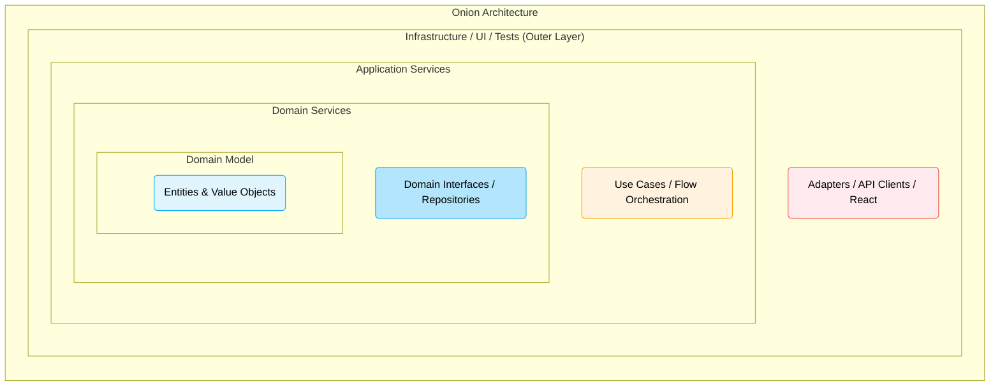

# Onion Architecture (Луковичная архитектура)

Джеффри Палермо предложил Onion Architecture (Луковичную архитектуру) в 2008 году, еще до того, как Uncle Bob кодифицировал "Clean Architecture". Боль, которую наблюдал Палермо, заключалась в том, что традиционные слоистые архитектуры (например: *Презентация -> Бизнес-логика -> Доступ к данным*) непреднамеренно делали базу данных фундаментом всей системы. Поскольку слой бизнес-логики напрямую зависел от слоя данных, любое изменение в структуре БД неминуемо "протекало" и ломало бизнес-правила. Мы строили системы вокруг таблиц с данными, а не вокруг бизнес-поведения.

Onion Architecture переворачивает эту парадигму с ног на голову, помещая **Доменную Модель (Domain Model)** в абсолютный центр. Вокруг нее наслаиваются доменные сервисы, сервисы приложения, и лишь на самой периферии располагаются UI, инфраструктура и тесты. Визуально это выглядит как луковица: слой за слоем, где все стрелки зависимостей направлены строго к центру.



### Как это работает на практике

Архитектура четко разделяет слои по их назначению:
1. **Domain Model**: Центр всего. Здесь живут Сущности (Entities) и Объекты-значения (Value Objects) с их внутренним состоянием и поведением.
2. **Domain Services**: Бизнес-логика, которая не ложится естественно в рамки одной сущности (например, логика перевода денег между двумя счетами). Здесь же определяются интерфейсы для инфраструктуры (Repositories).
3. **Application Services**: Сервисы приложения (сродни Use Cases). Они не содержат бизнес-логики, но дирижируют процессом: получают данные снаружи, передают их в домен, вызывают нужные методы и возвращают результат.
4. **Infrastructure**: Самый внешний слой. Здесь лежат реализации репозиториев (запросы к API), компоненты UI (React) и конфигурации.

Важнейший сдвиг заключается в том, что "база данных" (или для фронтенда — HTTP API/LocalStorage) вытесняется на самый край. Ядро приложения абсолютно агностично к тому, где и как хранятся данные.

```typescript
// 1. Domain Model (самая сердцевина)
class Article {
  constructor(public id: string, public content: string, public isPublished: boolean) {}
  
  // Бизнес-поведение находится внутри сущности, а не размазано по сервисам
  publish() {
    if (this.isPublished) throw new Error("Already published");
    this.isPublished = true;
  }
}

// 2. Domain Service (Интерфейсы для внешнего мира)
interface ArticleRepository {
  getById(id: string): Promise<Article>;
  save(article: Article): Promise<void>;
}

// 3. Application Service (Оркестрация)
class PublishArticleService {
  constructor(private repository: ArticleRepository) {}
  
  async execute(articleId: string) {
    // Получаем сущность
    const article = await this.repository.getById(articleId);
    // Делегируем выполнение бизнес-логики ядру
    article.publish();
    // Сохраняем результат
    await this.repository.save(article);
  }
}
```

### Неочевидные нюансы и границы применимости

**Скрытые трейдоффы**: Луковичная архитектура концептуально очень близка к Hexagonal и Clean Architecture, но она делает гораздо более сильный семантический акцент на концепциях Domain-Driven Design (DDD). Трейдофф здесь заключается в высоком пороге входа: команде нужно будет договориться и понимать, что такое Value Object, Aggregate Root, Domain Service и чем они отличаются друг от друга.

**Где ломается**: Она терпит сокрушительное фиаско, если применять ее к простому UI-приложению, которое просто отображает списки, полученные с бэкенда (когда доменная логика живет на сервере). В таком случае вы получите "анемичный домен" (Anemic Domain Model), где сущности состоят только из полей данных без методов, а вся архитектура вырождается в бессмысленное перекладывание DTO из одного слоя в другой. Луковичная архитектура сияет только в проектах с по-настоящему сложной, ветвистой клиентской бизнес-логикой.
