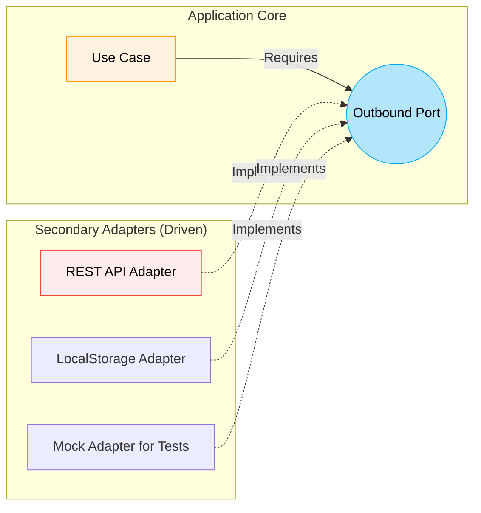

# Outbound Ports (Исходящие порты)

По мере того как наше приложение выполняет свою бизнес-логику, ему неизбежно нужно что-то от внешнего мира. Ему нужно сохранить состояние на сервер, прочитать файл, записать данные в LocalStorage или просто узнать текущее системное время. 

Если бизнес-логика напрямую импортирует `axios`, `window.localStorage` или специфичную библиотеку форматирования дат, она становится заложником этих инструментов. Когда API изменится или вы решите переехать с LocalStorage на IndexedDB (потому что уперлись в лимиты памяти), ваше ядро затрещит по швам — вам придется переписывать внутренние бизнес-правила из-за внешних инфраструктурных изменений. Это больно и дорого.

**Outbound Ports (Исходящие/Вторичные порты)** — это механизм, с помощью которого приложение просит о помощи внешний мир, *не зная, кто именно эту помощь окажет*. Это интерфейсы, которые внешний мир обязан реализовать, чтобы поддержать работу приложения. Здесь приложение диктует условия, а внешний мир под них подстраивается.



### Как это работает на практике

Суть заключается в Инверсии Зависимостей (Dependency Inversion). Ядро декларирует контракт (интерфейс). Например, "Мне нужно уметь сохранять пользователя". Это и есть Outbound Port. Use Case использует этот интерфейс, слепо доверяя, что кто-то его исполнит. 

Во внешнем слое (инфраструктуре) мы пишем Адаптеры, которые физически реализуют этот интерфейс (идут в сеть или в локальную базу данных).

```typescript
// 📜 Outbound Port: Приложение диктует, что ему нужно
// Обратите внимание: никаких упоминаний HTTP, статусов 200 или Axios
interface AnalyticsPort {
  trackEvent(eventName: string, payload: Record<string, any>): void;
}

// 🧠 Core: Использует порт "вслепую"
class CompletePurchaseUseCase {
  // Мы внедряем порт, а не конкретную библиотеку
  constructor(private analytics: AnalyticsPort) {}
  
  execute(orderId: string) {
    // ... сложная логика оплаты ...
    
    // Мы просто сообщаем о факте. Куда это полетит - нас не волнует.
    this.analytics.trackEvent("Purchase_Completed", { orderId });
  }
}

// 🔌 Secondary Adapter: Инфраструктура, реализующая порт (Amplitude / Google Analytics)
// Этот код живет далеко от ядра, на самом краю приложения
class AmplitudeAnalyticsAdapter implements AnalyticsPort {
  trackEvent(eventName: string, payload: Record<string, any>) {
    // Здесь живет грязный код работы с конкретной SDK
    amplitude.getInstance().logEvent(eventName, payload);
  }
}
```

### Неочевидные нюансы и границы применимости

**Проектирование под домен, а не под API**: Дизайн хороших Outbound Ports — это искусство. Самая частая и фатальная ошибка — проектировать порт так, чтобы он просто повторял внешнее API. Например, создание порта с методами `get`, `post`, `put` — это просто создание обертки над HTTP-клиентом. Это не порт. Хороший исходящий порт говорит на языке бизнеса: `saveUser`, `findActiveCarts`, `logSecurityBreach`.

**Скрытые трейдоффы**: Маппинг. Поскольку ядро не должно ничего знать про внешние структуры (например, про то, что сервер присылает `snake_case` поля, а возвращает сложные JSON-ошибки), Адаптеру приходится заниматься грязной работой: он берет ответ от сервера, распаковывает его и перегоняет (маппит) в чистые доменные объекты, которые ожидает порт. Этот слой маппинга (`DTO -> Domain Entity`) добавляет огромное количество кода и замедляет разработку фичей.

**Где ломается**: Если вы пишете тонкий клиент, вся суть которого — быть "умным зеркалом" для серверного API, то создание абстрактных исходящих портов с мапперами просто удвоит кодовую базу без видимой пользы. В таких случаях прагматичнее позволить форматам данных от сервера протекать напрямую в UI, принимая риск (trade-off) жесткой связности с бэкендом ради скорости разработки.
