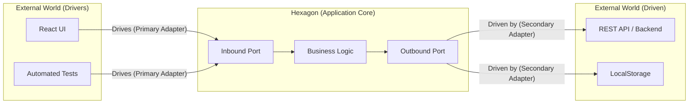

# Ports and Adapters (Порты и Адаптеры)

Также известная как **Hexagonal Architecture (Гексагональная Архитектура)**. Алистер Кокберн (Alistair Cockburn) изобрел этот подход в 2005 году. Боль, которую он наблюдал, была очевидна: бизнес-логика была настолько сильно переплетена с пользовательским интерфейсом и кодом работы с базой данных, что автоматизированное тестирование становилось кошмаром. Нельзя было протестировать бизнес-правила, не поднимая при этом сервер, браузер или полноценную базу данных. Его целью было создать архитектуру, которая позволяла бы приложению быть одинаково управляемым как пользователями через UI, так и автоматизированными тестами, и чтобы оно разрабатывалось в полной изоляции от устройств вывода или источников данных.

Концепция визуализирует приложение в виде шестиугольника (гексагона). Внутри гексагона находится бизнес-логика. Грани гексагона — это **Порты (Ports)**, то есть интерфейсы, позволяющие общаться с приложением (на вход и на выход). Снаружи к этим портам подключаются **Адаптеры (Adapters)**. Адаптеры работают как переводчики: они транслируют запросы из внешнего мира на язык приложения, и наоборот.



### Как это работает на практике

Архитектура строго делит взаимодействие на "входящее" и "исходящее":
*   **Port (Порт)** — это контракт (interface).
*   **Inbound Port (Входящий/Первичный порт)** — описывает, *как* внешний мир может управлять приложением (какие Use Cases доступны).
*   **Outbound Port (Исходящий/Вторичный порт)** — описывает, *что* приложению нужно от внешнего мира для работы (например, интерфейс репозитория).
*   **Adapter (Адаптер)** — это конкретная реализация. Компонент React — это первичный адаптер, который вызывает входящий порт. Класс, использующий `fetch` — это вторичный адаптер, реализующий исходящий порт.

```typescript
// 📜 Port (Outbound): Контракт, который диктует приложение
interface NotificationPort {
  notify(message: string): Promise<void>;
}

// 🧠 Core: Бизнес-логика ничего не знает о Telegram или Slack, она использует только Порт
class OrderService {
  constructor(private notifier: NotificationPort) {}
  
  async placeOrder() {
    // логика оформления заказа...
    await this.notifier.notify("Ваш заказ успешно оформлен!");
  }
}

// 🔌 Adapter (Secondary): Внешняя реализация порта для Telegram
class TelegramNotifierAdapter implements NotificationPort {
  async notify(message: string) {
    await fetch('https://api.telegram.org/bot...', { method: 'POST', body: message });
  }
}

// 🔌 Adapter (Secondary): Мок для тестов (никакой сети!)
class MockNotifierAdapter implements NotificationPort {
  public messages: string[] = [];
  async notify(message: string) {
    this.messages.push(message);
  }
}
```

### Неочевидные нюансы и границы применимости

**Скрытые трейдоффы**: Главная красота портов и адаптеров в их абсолютной симметрии. Подход относится к UI и к Базе Данных (или API) совершенно одинаково — как к заменяемым внешним плагинам. Это делает ядро невероятно тестируемым, так как вы можете за 5 минут написать `MockAdapter` для любых внешних зависимостей. Но оверхед от создания явных портов для абсолютно каждого взаимодействия может показаться чрезмерным. 

**Где ломается**: Во фронтенде UI — это не просто "один из плагинов", это зачастую 80% ценности всего приложения. Попытка абстрагировать UI слишком далеко от логики в простых приложениях приводит к ненужному усложнению и потере гибкости (например, сложно становится использовать продвинутые возможности реактивности фреймворков). Архитектура сияет в сложных "heavy-client" приложениях (оффлайн-редакторы, SaaS-платформы), но является избыточной (антипаттерном) для простых "тупых" представлений, единственная задача которых — отрендерить JSON с бэкенда.
