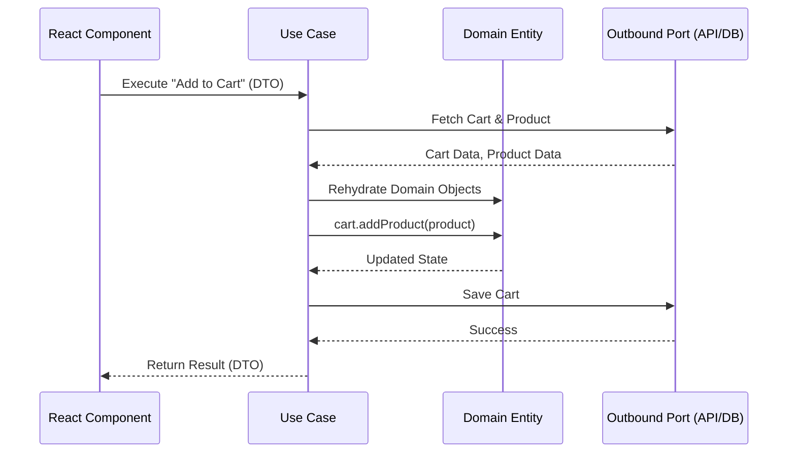

# Use Cases (Сценарии использования)

Исторически во фронтенде (да и в бэкенде) бизнес-логика скапливалась в двух местах: либо мы делали "толстые UI-компоненты" (когда React-компонент сам ходит в сеть, сам фильтрует массивы и сам управляет бизнес-правилами), либо мы создавали "толстые модели" (глобальные сторы типа Redux/MobX, которые превращались в свалку всех возможных экшенов и сайд-эффектов).

В первом случае код невозможно тестировать без рендеринга. Во втором — логика перемешана в огромных "спагетти-файлах", где трудно понять, какое именно действие пользователя привело к цепочке мутаций.

**Use Cases (Сценарии использования)** — также известные как *Interactors* (в Clean Architecture) или *Application Services* (в DDD) — появились, чтобы решить эту проблему. Сценарий использования — это четко изолированное представление одного конкретного намерения пользователя или системного действия. Это класс-дирижер. 

Он не содержит фундаментальных правил предметной области (это задача Сущностей), но он управляет потоком: берет данные из базы (через Outbound Ports), отдает их Сущности для проверки или изменения, и передает результат обратно в UI (через Inbound Ports).



### Как это работает на практике

Сценарий использования инкапсулирует *ровно один* конкретный кусок бизнес-функциональности. Он должен называться глаголом, отражающим действие пользователя: `CreateUser`, `CheckoutCart`, `GenerateReport`.

Когда вы открываете папку `use-cases` в проекте, вы должны с первого взгляда понимать, **что** делает это приложение. Роберт Мартин называет это "Кричащей Архитектурой" (Screaming Architecture): архитектура должна кричать о бизнес-смысле приложения, а не о том, что оно использует React или Redux.

```typescript
// Оркестратор конкретного бизнес-сценария. Никакого UI или HTTP.
class ChangeUserEmailUseCase {
  constructor(
    private userRepository: UserRepositoryPort,
    private emailService: EmailServicePort
  ) {}

  async execute(userId: string, newEmail: string): Promise<void> {
    // 1. Получение данных (инфраструктура)
    const user = await this.userRepository.findById(userId);
    if (!user) throw new Error("User not found");

    // 2. Делегирование бизнес-правил сущности (домен)
    // Сущность сама проверит формат email или бизнес-правила (например, можно ли менять)
    user.changeEmail(newEmail); 

    // 3. Сохранение и побочные эффекты (инфраструктура)
    await this.userRepository.save(user);
    await this.emailService.sendConfirmation(newEmail);
  }
}
```

### Неочевидные нюансы и границы применимости

**Опасность: Анемичная модель (Anemic Domain Model)**: Самый большой риск при работе с Use Cases — высасывание жизни из доменных сущностей. Если вы поместите *все* проверки (`if / else`), валидации и бизнес-расчеты прямо внутрь Use Case, ваши сущности (Entities) превратятся просто в "глупые мешки с данными" (структуры с геттерами и сеттерами). Use Case должен *дирижировать*, а не *вычислять*. Он должен вести себя как менеджер, делегирующий сложную работу настоящим экспертам (сущностям).

**Скрытые трейдоффы**: Создание отдельного класса и отдельного файла для каждого крошечного действия приводит к "взрыву файлов" (file explosion). Ваша файловая система быстро засоряется десятками файлов вроде `GetUserByIdUseCase`, `UpdateUserNameUseCase` и т.д.

**Где это ломается**: Для банальных операций чтения (read-only операций, когда мы просто забираем данные с сервера и показываем на экране без модификации бизнес-правил) слой Use Cases становится абсурдным оверхедом (просто вызывает репозиторий и возвращает результат). В таких случаях сильные команды прагматично применяют подход CQRS (Command Query Responsibility Segregation): они используют Use Cases только для сложных мутаций (Commands), а для чтения (Queries) позволяют UI или тонким сервисам-читалкам обращаться к данным напрямую, минуя слои бизнес-логики.
