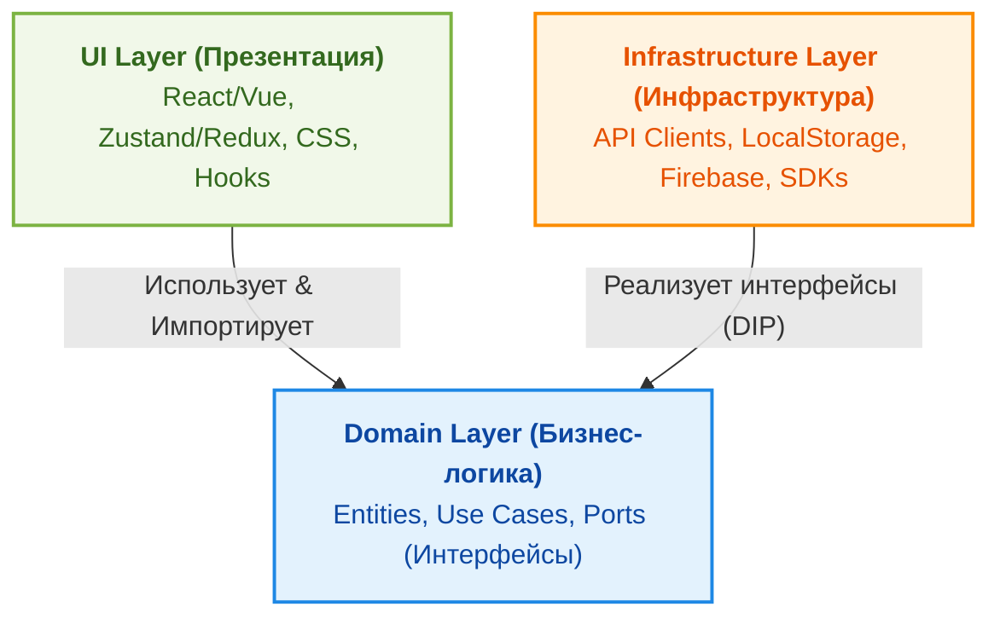
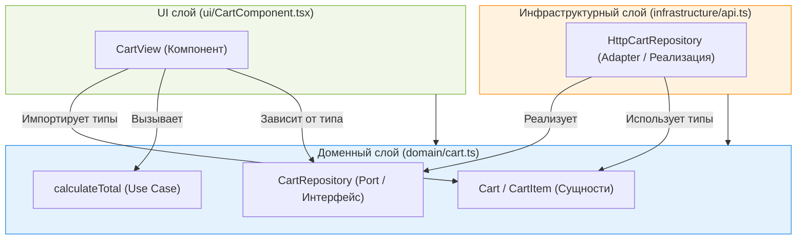
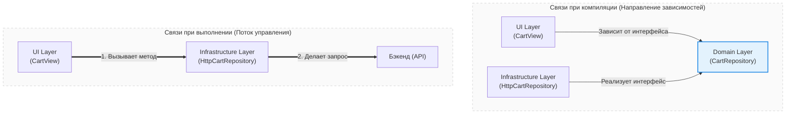

Чистая архитектура (Clean Architecture) во фронтенде направлена на разделение бизнес-логики приложения и деталей реализации (библиотек, UI-фреймворка, API-клиентов). Это делает код расширяемым, легким в тестировании и независимым от изменений внешних библиотек.

## 1. Архитектурные Слои

Современный фронтенд можно разделить на три независимых слоя:



### 1.1. Domain Layer (Бизнес-логика)
Ядро приложения. Содержит только чистые функции и типы TypeScript.
* **Правило:** Domain-слой **не должен импортировать** ничего из внешнего мира (никаких `react`, `axios`, `window.localStorage` или UI-компонентов).
* **Что внутри:** 
  * **Entities (Сущности):** бизнес-модели (например, интерфейс `User` или класс `Cart`).
  * **Use Cases (Сценарии):** функции, реализующие бизнес-сценарии (например, `calculateCartDiscount` или `validatePassword`).
  * **Ports (Интерфейсы сервисов):** описания типов для внешних интеграций (например, `interface UserRepository`).

### 1.2. Infrastructure Layer (Инфраструктура)
Слой внешних деталей. Реализует интерфейсы (порты), описанные в доменном слое.
* **Что внутри:** API-клиенты (Axios/Fetch), обертки над LocalStorage/IndexedDB, интеграции с внешними SDK (например, Firebase, Stripe).
* **Пример:** Класс `ApiUserRepository`, реализующий интерфейс `UserRepository`.

### 1.3. UI Layer (Презентация)
Визуальное отображение и обработка действий пользователя.
* **Что внутри:** Компоненты (React/Vue), стили, клиентский стейт-менеджмент (Zustand/Redux), роутинг.
* **Специфика:** UI-компоненты вызывают сценарии (Use Cases) или обращаются к репозиториям через контекст/пропсы, не зная, как именно под капотом устроены сетевые запросы.

---

## 2. Практический пример: Корзина интернет-магазина

Чтобы наглядно представить, как взаимодействуют слои на практике, рассмотрим диаграмму связей для примера ниже:



### Инверсия зависимостей (Dependency Inversion) в действии

Сравнение связей на этапе компиляции и поведения во время выполнения:



### 2.1. Доменный слой (`domain/cart.ts`)
```typescript
// Сущности
export interface CartItem {
  productId: string;
  price: number;
  quantity: number;
}

export interface Cart {
  items: CartItem[];
}

// Сценарий использования (Use Case) — чистая функция без побочных эффектов
export function calculateTotal(cart: Cart, discountCode?: string): number {
  const sum = cart.items.reduce((acc, item) => acc + item.price * item.quantity, 0);
  if (discountCode === 'SENIOR_LEAD') {
    return sum * 0.9; // 10% скидка
  }
  return sum;
}
```

### 2.2. Инфраструктурный слой (`infrastructure/api.ts`)
```typescript
import { Cart } from '../domain/cart';

// Интерфейс порта для работы с API (может лежать в domain/ports.ts)
export interface CartRepository {
  fetchCart(): Promise<Cart>;
}

// Реализация инфраструктуры
export class HttpCartRepository implements CartRepository {
  async fetchCart(): Promise<Cart> {
    const response = await fetch('/api/cart');
    if (!response.ok) throw new Error('Ошибка загрузки корзины');
    return response.json();
  }
}
```

### 2.3. UI слой (`ui/CartComponent.tsx`)
```tsx
import React, { useEffect, useState } from 'react';
import { Cart, calculateTotal } from '../domain/cart';
import { CartRepository } from '../infrastructure/api';

interface Props {
  repository: CartRepository;
}

export function CartView({ repository }: Props) {
  const [cart, setCart] = useState<Cart | null>(null);

  useEffect(() => {
    repository.fetchCart().then(setCart).catch(console.error);
  }, [repository]);

  if (!cart) return <div>Загрузка...</div>;

  const total = calculateTotal(cart, 'SENIOR_LEAD');

  return (
    <div>
      <h2>Корзина</h2>
      <p>Итого к оплате (со скидкой): {total} руб.</p>
    </div>
  );
}
```

## 3. Преимущества подхода
* **Изолированное тестирование:** Вы можете протестировать функцию `calculateTotal` обычным юнит-тестом без необходимости мокать fetch или рендерить компоненты.
* **Легкая смена библиотек:** Если вы решите перейти с Axios на Fetch, изменения коснутся только инфраструктурного слоя. Domain и UI останутся нетронутыми.
* **Независимость от фреймворка:** Если завтра компания перейдет с React на Svelte, бизнес-логика (Domain) переносится в новый проект простым копированием файлов.

---

## 4. Специфика фронтенда и подводные камни (Чего часто не хватает)

В классической Clean Architecture, пришедшей из бэкенда, не всегда учитываются особенности работы браузера и современных UI-библиотек. Вот ключевые нюансы, которые часто упускают:

### 4.1. Data Mapping (DTO vs Domain Entities)
В приведенном выше примере `HttpCartRepository` возвращает данные из `fetch` напрямую. В реальности бэкенд может изменить структуру API или возвращать неудобные для фронтенда ключи (например, `snake_case` вместо `camelCase`, строки вместо дат или цены в копейках/центах).

Если домен начнет работать с сырыми данными API, он станет зависим от бэкенда.
**Решение:** Инфраструктурный слой должен валидировать (например, с помощью Zod) и маппить (преобразовывать) DTO (Data Transfer Object) в чистые бизнес-модели домена.

```typescript
// infrastructure/dto/cart.dto.ts
export interface ApiCartItem {
  product_id: string;
  price_cents: number;
  qty: number;
}

// infrastructure/mappers/cart.mapper.ts
import { CartItem } from '../../domain/cart';
import { ApiCartItem } from '../dto/cart.dto';

export function mapApiCartItemToDomain(apiItem: ApiCartItem): CartItem {
  return {
    productId: apiItem.product_id,
    price: apiItem.price_cents / 100, // Конвертация центов в рубли/доллары
    quantity: apiItem.qty,
  };
}
```

### 4.2. Где хранить состояние и реактивность (State Management)
Бэкенд работает по принципу «запрос-ответ» (request-response). Фронтенд — это долгоживущее интерактивное приложение. Если бизнес-логика меняет состояние (например, товар добавляется в корзину), UI должен мгновенно перерисоваться.
Существует два подхода к реактивности:
1. **Stateless Domain (Рекомендуется для большинства проектов):**
   Домен полностью «чистый» (состоит из чистых функций и типов). Состояние хранится в UI-слое (Zustand, Redux, Context). Компоненты обновляют стейт стора, используя функции из домена для расчетов.
   * *Плюс:* Простота, легкая интеграция с React/Vue.
   * *Минус:* Логика управления стейтом частично «протекает» в UI-слой.
2. **Stateful Domain:**
   Стор находится внутри доменного слоя. Чтобы домен не зависел от React, используются vanilla-версии библиотек (например, `@rematch/core` или `zustand/vanilla`).
   * *Плюс:* Бизнес-логика полностью контролирует состояние.
   * *Минус:* Больше бойлерплейта для связывания стора с UI.

### 4.3. Асинхронное кэширование (React Query / TanStack Query)
Современный фронтенд часто использует React Query (или SWR) для кэширования, обработки состояний загрузки (loading/error) и фонового обновления данных.

Попытка завернуть всю работу с сервером в классические сценарии (Use Cases) поверх React Query часто приводит к переусложнению: приходится дублировать статусы `isLoading` и кэшировать данные вручную.

**Решение:** Инфраструктурный слой реализует репозитории. UI-слой вызывает эти репозитории через хуки React Query.
```typescript
// ui/hooks/useCart.ts
import { useQuery } from '@tanstack/react-query';
import { CartRepository } from '../../domain/ports';

export function useCart(repository: CartRepository) {
  return useQuery({
    queryKey: ['cart'],
    queryFn: () => repository.fetchCart(),
  });
}
```

### 4.4. Риск оверинжиниринга (Overengineering)
Чистая архитектура требует создания большого количества интерфейсов, папок, файлов и мапперов. 

**Когда Clean Architecture НЕ нужна:**
* Простые CRUD-приложения, лендинги, админ-панели (где UI просто отображает то, что вернула база данных).
* Небольшие стартап-проекты, где скорость проверки гипотез важнее долгосрочной поддерживаемости.
* Если команда не до конца понимает принципы инверсии зависимостей (DIP) — это приведет к созданию запутанного кода с ложным разделением слоев.

**Когда она окупается:**
* Сложные приложения с богатой клиентской бизнес-логикой (офлайн-режимы, графические/текстовые редакторы, сложные калькуляторы).
* Мультиплатформенная разработка (Monorepo), где один домен шарится между Web (React) и Mobile (React Native).
* Крупные enterprise-приложения со сроком жизни более 3–5 лет.

