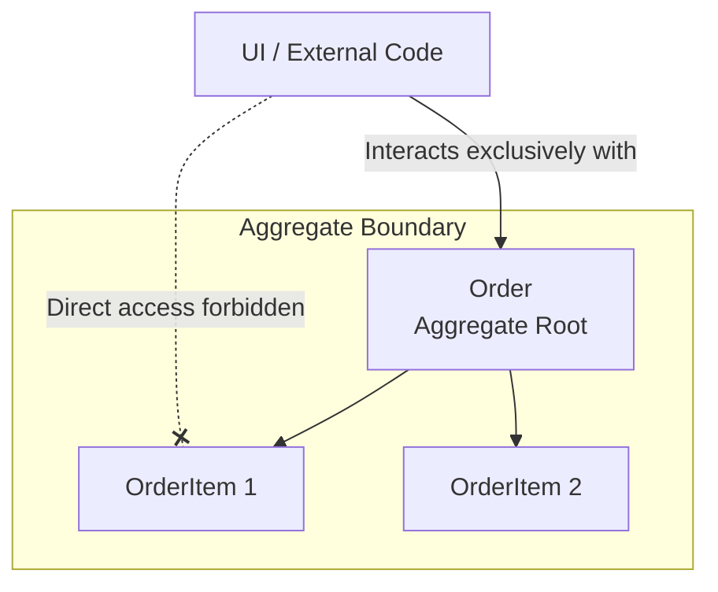

Агрегат (Aggregate) — это паттерн, который выступает строгим телохранителем ваших данных и решает проблему их консистентности. Представьте заказ (`Order`), в котором лежат товарные позиции (`OrderItems`). Бизнес диктует правило: "сумма всех позиций не должна превышать кредитный лимит пользователя". Если любой случайный компонент в системе сможет напрямую добавить элемент в массив `items` в обход самого заказа, мы больше никогда не сможем гарантировать выполнение этого правила.

Агрегат — это кластер из тесно связанных [[Entity]] и [[Value Object]], которые рассматриваются как единое целое. У агрегата всегда есть Корень (Aggregate Root) — главная сущность-вратарь, через которую должно происходить абсолютно любое взаимодействие с внешним миром.

**Механика работы:**
Внешний код не имеет права изменять `OrderItem` напрямую. Он обязан вызвать метод у корня `Order`, а тот уже проверит инварианты (правила) и аккуратно обновит свои внутренности.

**Скрытые трейдоффы на фронтенде:**
Паттерн Агрегат исторически пришел из бэкенда, где он описывает жесткие транзакционные границы базы данных. На фронтенде классических БД-транзакций нет. 

Если начать фанатично применять Агрегаты в React-приложении, можно столкнуться с неприятной болью: для изменения глубоко вложенного стейта вам придется прокидывать апдейты через всю иерархию корня агрегата. Это усложняет код и провоцирует каскадные ререндеры крупных блоков UI. Применяйте агрегаты точечно — только для защиты действительно критичных и сложных бизнес-правил, где нарушение консистентности стоит дорого. Для простого отображения данных (Read-моделей) концепция агрегата будет только мешать.
