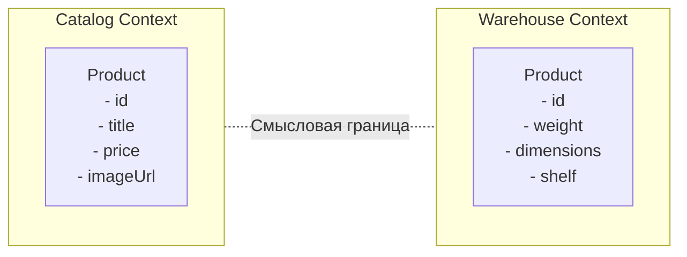

Когда проект растет, возникает непреодолимый соблазн создать универсальные сущности. Например, одну гигантскую модель `Product`, которая содержит поля для отображения в каталоге, данные о габаритах для склада, скидки для маркетинга и метаданные для SEO. В итоге изменение логики расчета скидок случайно ломает расчет стоимости доставки, а сам класс разрастается до тысяч строк.

Ограниченный контекст (Bounded Context) элегантно решает эту боль, признавая, что единой истины не существует. Вместо одной супермодели мы создаем независимые, изолированные модели для каждого смыслового контекста приложения. 

На фронтенде это означает, что модуль визуального каталога и модуль управления корзиной могут иметь свои собственные определения того, что такое "Товар", и они не обязаны переиспользовать общий интерфейс. В каталоге нас волнует картинка и описание, а в корзине — количество и цена.

**Скрытые нюансы и трейдоффы:**
Разделение на контексты не дается бесплатно — оно требует маппинга данных. Когда пользователь добавляет товар из каталога в корзину, нам нужно преобразовать `Catalog.Product` в `Cart.CartItem`. Это порождает рутинный бойлерплейт. 

Более того, контексты должны как-то общаться друг с другом, не нарушая изоляцию, и обычно это делается асинхронно через [[Domain Event]]. Ошибка новичков — дробить систему на микро-контексты слишком рано. Начните с монолитной модели, и возводите границы только тогда, когда заметите, что сущности становятся перегруженными противоречивыми требованиями из разных частей бизнеса.
