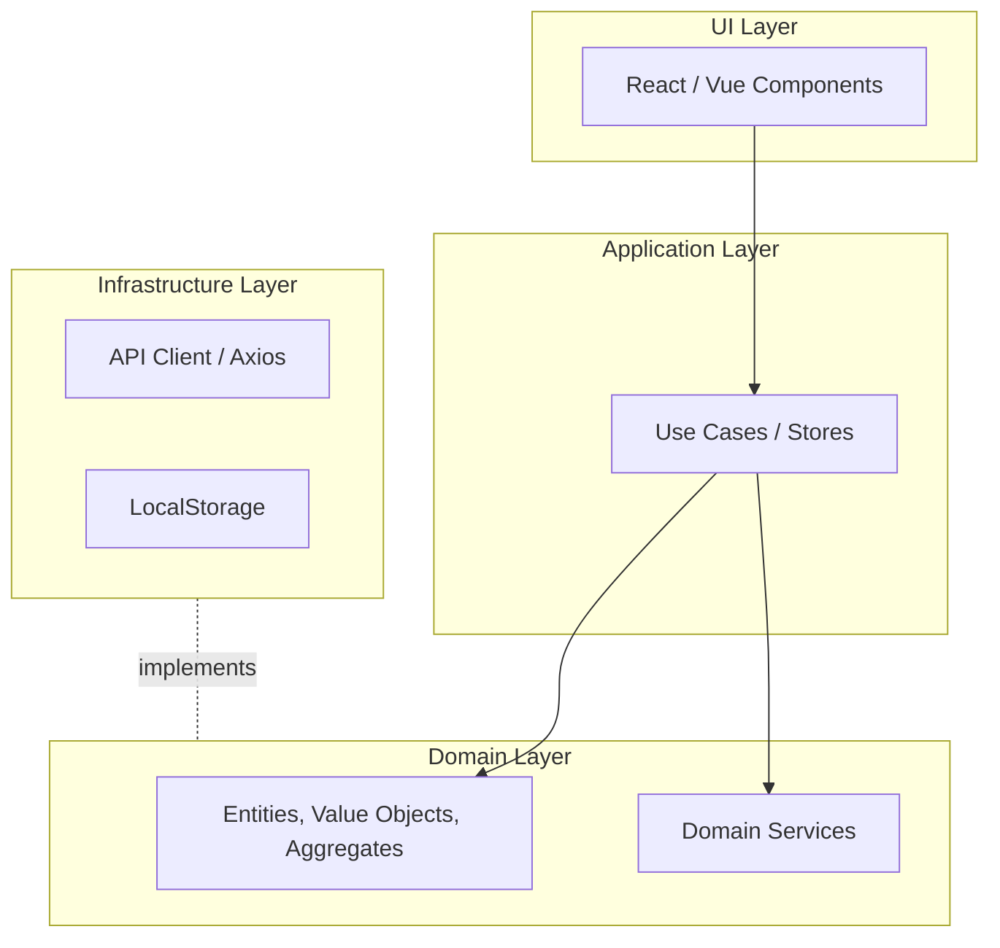

Представь типичный фронтенд-проект, который начинался как простой лендинг с формой, а затем мутировал в энтерпрайз-монстра. Компоненты разрослись до тысяч строк, где вперемешку лежат запросы к API, валидация бизнес-правил, форматирование дат и манипуляции с DOM. Изменение одного поля в корзине внезапно ломает отображение профиля пользователя. Это та самая боль, которую решает Domain Driven Design (DDD) — подход, ставящий во главу угла предметную область (Domain) и бизнес-логику, изолируя их от фреймворков и инфраструктуры.

В основе DDD лежит идея, что код должен отражать реальные бизнес-процессы. Мы перестаем мыслить терминами "состояние компонента" или "респонс от сервера" и начинаем говорить на языке бизнеса: [[Ubiquitous Language]]. Если в бизнесе есть понятие "Оформление заказа", в коде тоже должен появиться явный процесс оформления, а не просто `onClick` с кучей `if/else`.

**Как это работает на практике?**
Мы выделяем ядро приложения — [[Domain Model]]. Оно ничего не знает о React, Redux или Axios. Это чистый JavaScript/TypeScript. Вокруг ядра строится прикладной слой (Application Layer), который оркестрирует юзкейсы, и слой инфраструктуры, который ходит в сеть. UI становится лишь глупым отображением состояния домена. Если завтра мы решим переписать приложение с React на Vue, доменный слой останется нетронутым.

**Где это ломается и скрытые трейдоффы**
DDD — это дорого. Это колоссальный оверхед на старте. Вместо того чтобы написать `await fetch('/api/users')` прямо в компоненте, вам придется создать сущность пользователя, написать порт (интерфейс) для [[Repository]], реализовать его в инфраструктурном слое и связать всё это через DI (Dependency Injection). 
Если ваш проект — это типичный CRUD (Create, Read, Update, Delete) или админка, где данные просто перекладываются из базы в таблицу на экране, DDD убьет вашу производительность. DDD сияет там, где есть сложная, запутанная бизнес-логика: финтех, сложные ERP-системы, редакторы с богатым поведением (как Notion или Figma). Применять его нужно точечно, разделяя приложение на [[Bounded Context]], и использовать DDD только в самых критичных и сложных из них.
