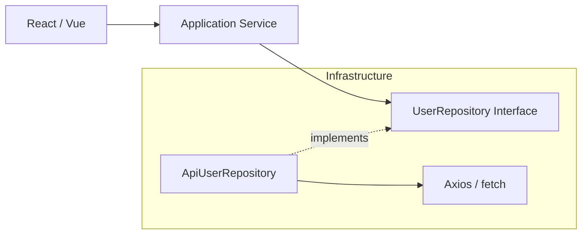

Репозиторий (Repository) — это паттерн-абстракция, который надежно изолирует чистое сердце вашей доменной модели от грязных деталей получения и хранения данных. Для доменного кода репозиторий выглядит просто как умная коллекция объектов в памяти. Домен не догадывается, что под капотом происходит запрос к REST API, обращение к GraphQL или чтение из LocalStorage.

**Какую боль мы решаем?**
Прямая привязка UI-компонентов и бизнес-логики к `axios` или `fetch` делает код абсолютно нетестируемым без сложных моков сети. При малейшем изменении контракта API (переименовали поле) вам приходится рефакторить добрую половину проекта.



**Как это работает на фронтенде:**
В слое домена мы объявляем чистый интерфейс-порт:
```typescript
// Домен ничего не знает об HTTP и JSON
interface UserRepository {
  findById(id: string): Promise<User>;
  save(user: User): Promise<void>;
}
```

А в слое инфраструктуры мы пишем конкретную реализацию, которая забирает данные по сети и маппит их в наши красивые [[Entity]]:
```typescript
class ApiUserRepository implements UserRepository {
  async findById(id: string): Promise<User> {
    const { data } = await axios.get(`/api/v1/users/${id}`);
    // Инфраструктура сама конвертирует сырой DTO в доменную модель
    return new User(data.user_id, data.full_name); 
  }
}
```

**Где это ломается:**
Паттерн Репозиторий — это тяжеловесная абстракция. Для вывода списка из трех статических элементов или простых CRUD-страниц это катастрофический овер-инжиниринг. 
Кроме того, на фронтенде мы часто работаем не с целыми сущностями, а с частичными проекциями (views) для оптимизации рендеринга. Строгий DDD заставляет загружать весь [[Aggregate]] целиком, что может привести к загрузке лишних мегабайт данных. В таких случаях лучше разделить ответственность (подход CQRS): использовать полноценные репозитории для сложных мутаций данных, а для простого отображения делать легковесные прямые запросы.
