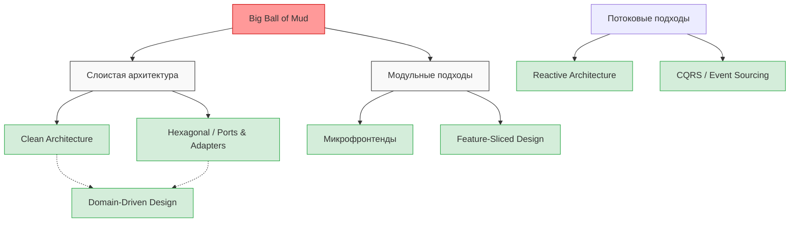

# Архитектурные стили и подходы

Каждый разработчик рано или поздно сталкивается с проектом, который начинался как элегантная и простая идея, а со временем превратился в неподдерживаемый "Большой комок грязи" (Big Ball of Mud). Добавление новой фичи занимает недели, исправление одного бага порождает три новых, а бизнес теряет деньги из-за медленного Time-to-Market. Именно эту боль призваны решать архитектурные стили и подходы. 

Архитектурный стиль — это набор принципов, паттернов и ограничений, определяющих, как мы структурируем код, как модули общаются друг с другом и где проходят границы ответственности. Это язык, на котором инженеры договариваются строить систему, чтобы она оставалась гибкой и предсказуемой.

## Как это работает на практике

Представьте, что мы пишем логику заказа в интернет-магазине. Без чёткого архитектурного стиля код быстро превращается в спагетти: бизнес-логика смешивается с UI и запросами к API.

### Антипаттерн: Spagetti Code (Отсутствие архитектуры)

```javascript
// Плохо: UI, бизнес-логика и работа с сетью смешаны в одном месте
async function handleOrderClick(userId, cartItems) {
  // 1. Прямой вызов API
  const userResponse = await fetch(`/api/users/${userId}`);
  const user = await userResponse.json();

  if (user.balance < cartItems.total) {
    // 2. Прямая манипуляция DOM
    document.getElementById('error').innerText = "Недостаточно средств";
    return;
  }

  // 3. Бизнес-логика вперемешку с сетью
  const order = { items: cartItems, date: new Date() };
  await fetch('/api/orders', { method: 'POST', body: JSON.stringify(order) });
  
  // 4. Опять UI
  alert("Заказ успешно оформлен!");
}
```

### Правильное решение: Разделение слоёв

Введение архитектурных ограничений позволяет разделить ответственность:

```javascript
// Хорошо: Бизнес-логика отделена от инфраструктуры
class OrderService {
  constructor(apiClient) {
    this.apiClient = apiClient;
  }

  async placeOrder(user, cart) {
    if (!user.canAfford(cart.total)) {
      throw new Error("Insufficient funds");
    }
    const order = new Order(cart);
    await this.apiClient.saveOrder(order);
    return order;
  }
}
```

## Визуализация: Разнообразие подходов

Существует множество стилей, каждый из которых решает свои задачи. В этой директории мы разбираем их от простых к сложным.



## Где применимо, а где ломается (Трейдоффы)

Архитектура не бесплатна. Любой стиль — это осознанный компромисс между скоростью первоначальной разработки и стоимостью долгосрочной поддержки.

**Где применимо:**
- Проекты с длительным жизненным циклом (от 1-2 лет).
- Команды от 3-5 человек, где критически важна общая ментальная модель.
- Домены со сложной и запутанной бизнес-логикой (финтех, e-commerce, ERP).

**Скрытые трейдоффы и оверхед (где ломается):**
- **Overengineering:** Применение Clean Architecture или DDD для простого CRUD-приложения (например, лендинга с формой) многократно увеличит объем бойлерплейта и замедлит релиз без видимой пользы.
- **Потеря гибкости "на старте":** Архитектура требует проектирования, маппинга данных между слоями и написания интерфейсов. В стартапе, проверяющем гипотезы каждую неделю, это может стать фатальным.
- **Сложность онбординга:** Чем строже и сложнее архитектурный стиль (например, CQRS или строгий Hexagonal), тем выше порог входа для новых разработчиков.

Выбирайте архитектуру исходя из требований бизнеса, а не из-за хайпа. В следующих статьях мы детально разберем каждый из подходов, чтобы вы могли принимать взвешенные инженерные решения.
