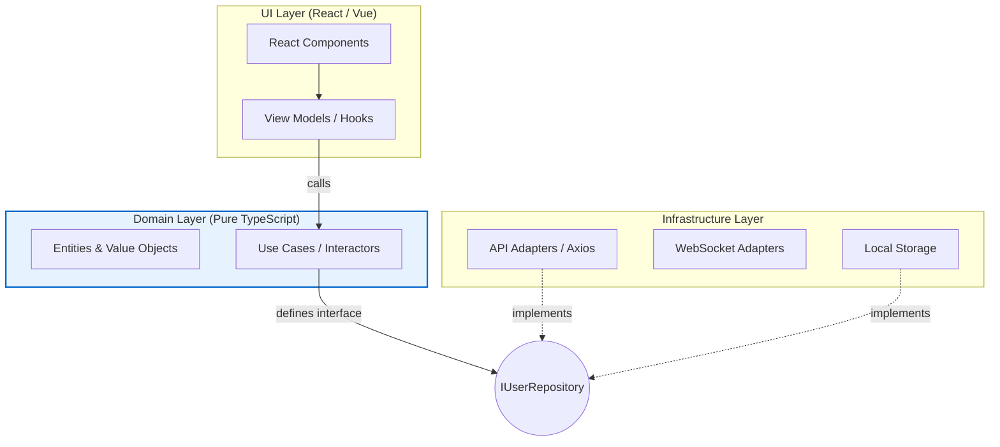

# Архитектура Enterprise приложения

## 📖 Что это и какую боль мы решаем

**Enterprise Frontend** — это огромные B2B системы, банковские CRM, торговые терминалы или Super-Apps. Характеристики:
- **Размер команды:** от 20 до 100+ Frontend-разработчиков.
- **Срок жизни кода:** 5–10 лет.
- **Сложность:** Тысячи бизнес-правил, сложный роутинг, разные уровни доступа (Role-Based), жесткие требования к безопасности и accessibility (a11y).

**Боль:** В таких масштабах любая модульная архитектура (даже FSD) начинает трещать по швам из-за человеческого фактора. Команды блокируют друг друга в релизах. Бизнес-логика незаметно "протекает" в React-компоненты. Смена UI-библиотеки (например, переезд с Ant Design на MUI) или стейт-менеджера (Redux -> Zustand) оценивается в годы работы.

Enterprise-архитектура решает боль **масштабирования разработки** и **изоляции бизнес-логики от технологий**.

## ⚙️ Как это работает на практике

Enterprise-архитектура строится на нескольких фундаментальных столпах:

1. **Clean Architecture / DDD (Domain-Driven Design):**
   Бизнес-логика (Ядро) вообще не знает о существовании браузера, React или API. Она пишется на чистом TypeScript. Общение с внешним миром идет через абстракции (Порты/Интерфейсы).
2. **Strict Design System (Платформенная команда):**
   Кнопки и инпуты не лежат в `src/shared`. Это отдельный npm-пакет (или монорепо-пакет), который разрабатывается отдельной командой (Platform Team).
3. **Microfrontends (Опционально, но часто):**
   Приложение физически дробится на независимые бандлы (Module Federation). Команда "Кредиты" деплоит свой кусок независимо от команды "Депозиты".


*На схеме видно Инверсию Зависимостей (Dependency Inversion): Домен не зависит от API. API реализует интерфейс, продиктованный Доменом.*

## 💻 Пример: Инверсия Зависимостей (DI)

**🟢 Как надо (Слой Domain):**
Домен диктует, что ему нужно для сохранения пользователя, но не знает *как* это будет сделано.
```typescript
// domain/repositories/IUserRepository.ts
export interface IUserRepository {
  saveUser(user: UserEntity): Promise<void>;
}

// domain/useCases/RegisterUserUseCase.ts
export class RegisterUserUseCase {
  // Мы инжектим зависимость. Юзкейс не знает про Axios или LocalStorage!
  constructor(private userRepo: IUserRepository) {}

  async execute(data: RegistrationDTO) {
    const user = new UserEntity(data);
    user.validateStrictAge(18); // Чистая бизнес-логика
    await this.userRepo.saveUser(user);
  }
}
```

**🟢 Слой Infrastructure (Адаптеры):**
```typescript
// infrastructure/api/RestUserRepository.ts
export class RestUserRepository implements IUserRepository {
  async saveUser(user: UserEntity): Promise<void> {
    // Здесь мы мапим доменную сущность в JSON для бэкенда
    await axios.post('/api/users', user.toJSON());
  }
}
```

## ⚠️ Неочевидные нюансы и трейдоффы

1. **Колоссальный Бойлерплейт**
   * **Где ломается:** Чтобы вывести на экран имя пользователя, вам нужно написать: DTO, Mapper, Entity, Interface, Repository Adapter, UseCase, ViewModel и, наконец, Component. Для простой фичи это убивает мотивацию разработчиков. 
   * **Решение:** Enterprise архитектура должна применяться **только** для сложного Core-домена. "Глупые" CRUD-страницы в этом же приложении можно и нужно писать проще (например, просто вызовом хука).

2. **Затраты на Инфраструктуру**
   * Микрофронтенды и монорепозитории требуют выделенных DevOps/Platform инженеров. Вы будете тратить 20-30% времени команды на настройку Webpack, CI/CD, версионирование пакетов и решение проблем дублирования зависимостей (когда один микрофронтенд тянет React 17, а другой React 18).

3. **Сложность тестирования (Парадокс)**
   * С одной стороны, Clean Architecture тестируется идеально (Домен можно покрыть unit-тестами на 100% за миллисекунды, так как нет DOM и сети).
   * С другой стороны, интеграционные (E2E) тесты в Enterprise с Микрофронтендами — это сущий ад. Поднять всё приложение целиком локально часто невозможно (не хватает оперативной памяти), поэтому тестирование идет на staging-стендах, которые постоянно падают.
