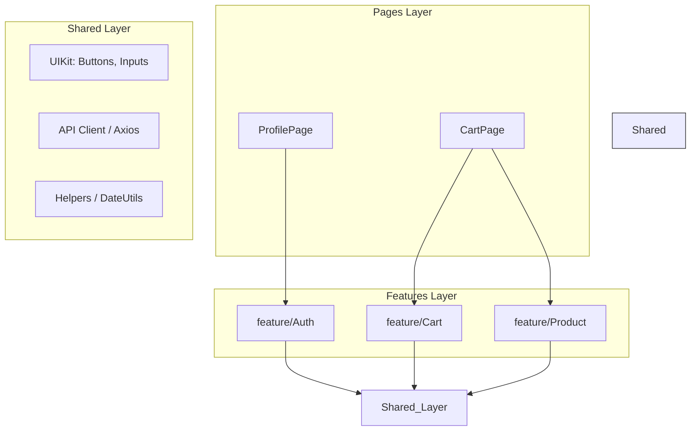

# Архитектура среднего приложения

## 📖 Что это и какую боль мы решаем

**Архитектура среднего приложения** — это "золотая середина" Frontend-разработки. Это продукты, которые разрабатывает команда из 3–15 человек, срок жизни которых от 1 года до нескольких лет (SaaS-платформы, интернет-магазины, внутренние порталы).

**Боль:** Архитектура малого приложения (когда всё лежит в папке `components`) сломалась. Папка раздулась до 200 файлов. Разработчики постоянно ломают код друг друга, потому что компонент `UserProfile` случайно заиспользовал вспомогательную функцию из `CartWidget`. Изменение одной кнопки ломает половину приложения из-за жесткой связности.

Здесь нам необходима строгая **модульность** и **изоляция бизнес-фич**.

## ⚙️ Как это работает на практике

На этом этапе происходит переход от группировки "по типу файлов" к **группировке по фичам (Feature-Based / Feature-Sliced Design)**.

- **Вертикальные слайсы (Features):** Код группируется вокруг бизнес-смысла. Всё, что связано с "Корзиной" (UI-компоненты, запросы к API, Redux-слайс, хелперы), лежит в одной папке `features/cart`.
- **Слой Shared (Общее):** Изолированная папка для действительно глупых UI-компонентов (UIKit: кнопки, модалки), общих утилит (форматирование дат) и настроек axios. Shared не имеет права импортировать ничего из Features!
- **Глобальный стейт-менеджер:** Появляется Redux Toolkit, Zustand или Pinia. Но он используется *только* для данных, которые реально нужны на разных страницах (Тема, Авторизация, Настройки).


*Стрелки показывают зависимости: Pages знают про Features, Features знают про Shared. Shared не знает ни о ком (направленность сверху вниз).*

## 💻 Пример: Инкапсуляция Фичи

**🔴 Антипаттерн (Протекание абстракций):**
Любой компонент системы берет и напрямую импортирует Redux-экшены корзины и сырые запросы, связывая себя по рукам и ногам:
```tsx
import { addToCartAction } from '../../store/cartSlice';
import { fetchCartApi } from '../../api/cartApi';
// Этот компонент теперь намертво прибит к Redux и конкретному API
```

**🟢 Как надо (Публичный API Фичи / index.ts):**
Фича `cart` экспортирует только то, что разрешает использовать другим. Она скрывает свои внутренности.
```tsx
// src/features/cart/index.ts (Public API фичи)
export { CartWidget } from './ui/CartWidget';
export { useAddToCart } from './hooks/useAddToCart';
// Никакие другие внутренние компоненты или редюсеры наружу не торчат!

// В компоненте продукта:
import { useAddToCart } from '@/features/cart';

function ProductCard({ product }) {
  const { add, isLoading } = useAddToCart();
  return <button onClick={() => add(product.id)}>В корзину</button>;
}
```

## ⚠️ Неочевидные нюансы и трейдоффы

1. **Кросс-фичевые зависимости (Cross-Feature Coupling)**
   - **Где ломается:** Фича `Cart` нуждается в данных из фичи `Auth` (чтобы знать токен). Если `features/cart` напрямую импортирует стейт из `features/auth`, возникает жесткая связность (и часто циклические зависимости).
   - **Решение:** Общение через слой `Shared` (общий стор), проброс зависимостей на уровне `Pages` (Страница собирает фичи вместе), или использование Event Bus / middleware стейт-менеджера.

2. **Оверхед на создание фич**
   - Чтобы добавить простую кнопку "Лайк", разработчику нужно создать папку фичи, внутри папки `ui`, `model`, `api` и файл `index.ts`. Это замедляет разработку мелких тасок. Команда должна иметь четкие договоренности: что является Фичей, а что — просто локальным компонентом внутри Страницы.

3. **Сложность рефакторинга границ**
   - Бизнес-требования часто меняют границы понятий. То, что вчера было частью фичи `Profile`, сегодня стало огромной независимой фичей `Billing`. Разрезать заросшую фичу на две новые — больно. Поэтому внутри фичи всё равно нужно соблюдать принцип единственной ответственности.
