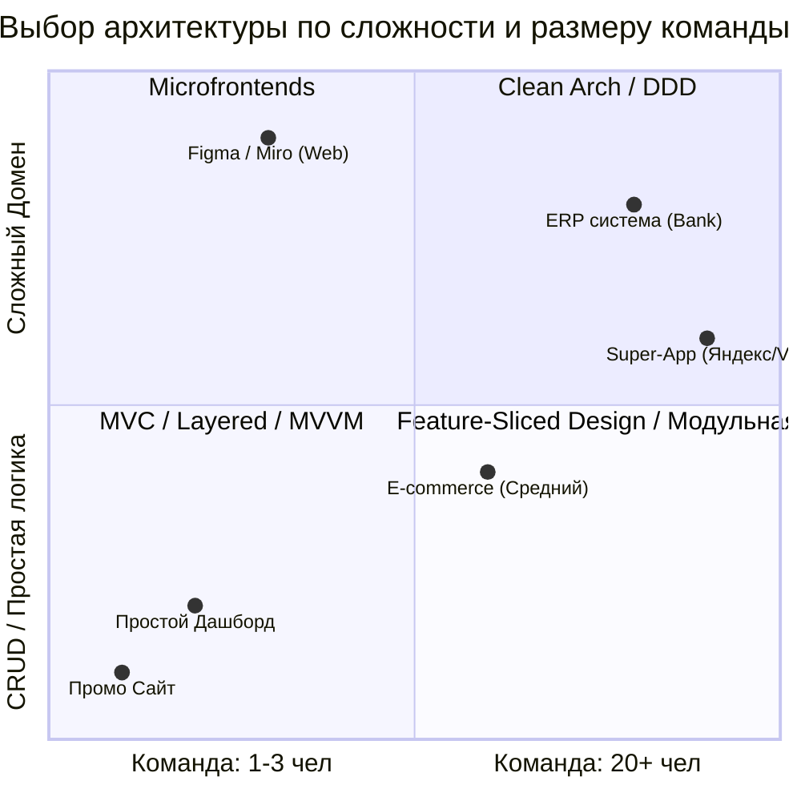

# Критерии выбора архитектурного стиля во Frontend

## 📖 Что это и какую боль мы решаем

Архитектура не бывает "правильной" или "неправильной" в вакууме. Она бывает лишь **адекватной** или **неадекватной** текущим требованиям бизнеса, команде и ограничениям проекта.

**Боль:** Часто команды выбирают "Хайповую" архитектуру (например, жесткий Clean Architecture + DDD + CQRS) для простейшего CRUD-приложения на 3 экрана. Итог: разработка фичи занимает неделю из-за слоев мапперов и DTO. Обратная ситуация: команда начинает писать огромный B2B-портал в стиле "Скрипт в одном файле", и через полгода проект захлебывается в техдолге.

Цель выбора архитектуры — найти баланс между **скоростью разработки сейчас** (Time-to-Market) и **стоимостью поддержки потом** (Maintainability).

## ⚙️ Матрица критериев (Как работает на практике)

При старте проекта задайте себе 5 вопросов из разных плоскостей. Ответив на них, стиль архитектуры выкристаллизуется сам.

### 1. Бизнес-критерии (Домен)
- **Сложность бизнес-логики:** Это просто отображение таблиц из БД (CRUD)? Или это Figma/Google Docs с тяжелыми алгоритмами, Undo/Redo и оффлайном? (Если второе — смотрим на *Event Sourcing / DDD / Hexagonal*).
- **Срок жизни проекта:** Это промо-лендинг на месяц или Enterprise-портал, который будут поддерживать 10 лет?
- **Time-to-Market:** Нужно ли выкатить MVP за 2 недели, чтобы проверить гипотезу? (Тогда забываем про слои, берем MVC/Modular и клепаем фичи).

### 2. Организационные критерии (Команда)
- **Размер команды:** 1-2 человека? (Хватит монолита и простой Feature-Sliced Design). 50+ Frontend-разработчиков? (Нужны *Microfrontends* или строгий *Monorepo* с изоляцией доменов).
- **Квалификация:** Поймут ли джуниоры ваши абстракции RxJS и CQRS, или они будут копипастить код, не понимая сути? Архитектура должна соответствовать среднему уровню команды.

### 3. Технические критерии
- **Требования к UI/UX:** Нужна ли сложная анимация, 60fps, 3D? (Возможно, потребуется вынесение логики в Web Workers / *Actor Model*).
- **Обновляемость данных:** Данные запрашиваются раз при загрузке страницы, или это Trading-платформа с 1000 вебсокетов в секунду? (Второе — это *Reactive Architecture / Event-Driven*).

## 💻 Визуализация Trade-offs

## ⚠️ Неочевидные нюансы и трейдоффы

1. **Premature Abstraction (Преждевременная абстракция)**
   * Самая частая ошибка джуниор-архитекторов — закладывать архитектуру уровня Enterprise на этапе стартапа. Любая абстракция стоит денег (в часах разработки). Если абстракция не решает реальную боль *сейчас* или в ближайшие 3-6 месяцев — выкидывайте её.
   * *"Лучше написать код, который легко удалить, чем код, который легко расширять".*

2. **Закон Конвея (Conway's Law)**
   * *"Организации проектируют системы, которые копируют структуру коммуникаций в этой организации"*. 
   * Если у вас Frontend-отдел разделен на 3 независимые команды (Корзина, Каталог, Профиль), ваша архитектура неминуемо разделится на 3 независимых модуля/микрофронтенда. Пытаться насадить строгий монолит поверх разрозненных команд — путь к бесконечным merge-конфликтам.

3. **Эволюционность**
   * Хорошая архитектура — это не та, которую выбрали 1 января и не меняли 5 лет. Хорошая архитектура позволяет **безопасно эволюционировать**. Начните с простой модульной архитектуры, и по мере роста изолируйте самый сложный модуль (например, расчет скидок) в Clean Architecture, оставив остальные модули простыми. Архитектура не обязана быть гомогенной (одинаковой) по всему приложению!
