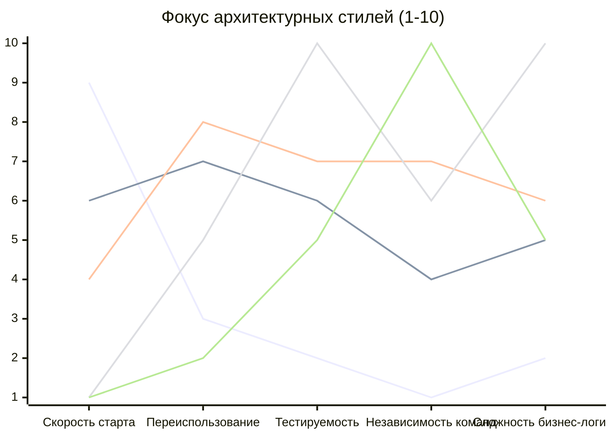

# Сравнение архитектурных стилей во Frontend

## 📖 Что это и какую боль мы решаем

Существует десяток архитектурных стилей: от классического MVC до зубодробительной Clean Architecture и хайпового Feature-Sliced Design. 

**Боль:** Разработчики путают стили, пытаются применять паттерны из бэкенда (MVC) в компонентных фреймворках (React/Vue), или внедряют слоистые архитектуры там, где нужна модульная. Это приводит к Франкенштейну: в проекте есть папка `controllers`, в которой лежат React-хуки, вызывающие Redux.

## ⚙️ Сводная таблица архитектурных подходов

Ниже приведено наглядное сравнение основных подходов, отсортированных по уровню сложности и масштабируемости.

| Подход | Суть (Ключевая идея) | Когда использовать | Главный недостаток (Трейдофф) |
| :--- | :--- | :--- | :--- |
| **Monolith (По типам файлов)** | Папки `/components`, `/hooks`, `/api`. Вся логика размазана по типам файлов. | MVP, лендинги, админки на 3 экрана. | При росте проекта изменение одной фичи требует прыжков по 10 папкам. |
| **Layered (Слоистая)** | Разделение на `UI Layer`, `BLL (Business Logic)`, `DAL (Data Access)`. UI ничего не знает про сеть. | Средние проекты с выраженной работой с данными, но без сложного домена. | Слои разрастаются. Изменение одной кнопки часто требует протаскивания данных через 3 слоя (Бойлерплейт). |
| **Modular / FSD** | Группировка по бизнес-сущностям или фичам (`/features/Cart`, `/features/Auth`). | Средние и крупные проекты, когда над кодом работают от 3 до 15 человек. | Требует жесткой дисциплины: нужно постоянно следить, чтобы фича А не импортировала логику напрямую из фичи Б. |
| **Clean / Hexagonal** | Выделение чистого "Домена" (Domain) в центре, независимого от React/Vue и сети. Взаимодействие через порты (Interfaces) и адаптеры. | Сложные B2B-продукты, веб-приложения со сложной бизнес-логикой (как Figma, Notion), срок жизни 5+ лет. | Огромный оверхед на старт (DIP, абстракции, мапперы). Замедляет Time-to-Market в первые месяцы. |
| **Microfrontends** | Физическое разделение приложения на разные репозитории или независимые сборки (Module Federation). | Корпорации (Яндекс, Tinkoff), где 50+ Frontend-разработчиков не могут делить один репозиторий без конфликтов. | Адская инфраструктурная сложность (CI/CD, шаринг зависимостей, кросс-роутинг, дублирование кода). |

## 💻 Графическое сравнение (Векторы развития)

## ⚠️ Неочевидные нюансы: Где стили ломаются?

1. **MVC во Frontend**
   - **Где ломается:** Современные фреймворки (React, Vue, Svelte) уже навязывают компонентный подход. Пытаться искусственно натянуть контроллеры (`Controller.ts`) на React-компоненты чаще всего приводит к боли. Компонент — это уже и View, и частично Controller. Лучше использовать паттерны MVVM (Model-View-ViewModel), где ViewModel — это кастомный хук (`useCart`) или store-модуль.

2. **Границы между Layered и Clean Architecture**
   - В Layered архитектуре верхний слой (UI) зависит от нижнего (БД/Сеть). Если у вас поменяется контракт бэкенда, вам придется менять UI.
   - В Clean Architecture **зависимости инвертированы** (Dependency Inversion). Домен находится в центре, и UI зависит от Домена, и Сеть зависит от Домена (Сеть адаптируется под домен, а не наоборот). Это стоит дорого (написание мапперов DTO -> Domain Model), но дает полную изоляцию от причуд бэкенда.

3. **Гибридизация (Hybrid Architectures)**
   - В реальном мире никто не пишет "чистый FSD" или "чистый Clean". Чаще всего это гибрид: глобальная структура строится по FSD (фичам), а внутри самой сложной фичи (например, `PaymentProcessor`) применяется Clean Architecture для строгой валидации. Это абсолютно нормально и является признаком зрелого инженерного подхода.
