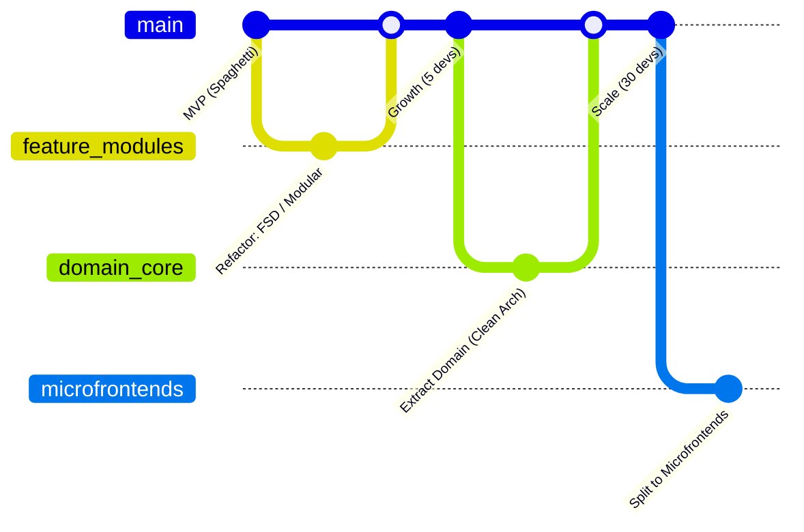

# Эволюция архитектуры (Evolutionary Architecture)

## 📖 Что это и какую боль мы решаем

**Evolutionary Architecture (Эволюционная Архитектура)** — это подход, который признает один фундаментальный факт: **требования бизнеса, технологии и размер команды будут неизбежно меняться**. 

**Боль:** Архитектура, которая казалась идеальной в первый год (например, монолитный SPA на React с Redux), на третий год становится якорем (сборка идет 10 минут, 3 команды блокируют друг друга в релизах, бизнес жалуется на медленные фичи). Команда решает "переписать всё с нуля v2.0" — что является катастрофой для бизнеса.

Эволюционный подход учит не "угадывать будущее на 5 лет вперед" (что ведет к over-engineering), а строить систему так, чтобы её части можно было **безопасно заменять, выкидывать или переписывать**, не ломая всё приложение.

## ⚙️ Как это работает на практике

Эволюция архитектуры Frontend-приложения обычно проходит несколько стадий по мере роста продукта:

1. **Стадия 1: Хаос / MVP (Быстрая проверка гипотез)**
   - **Архитектура:** Smart/Dumb компоненты, всё вперемешку, прямые вызовы API из компонентов.
   - **Цель:** Выжить, найти Product-Market Fit.
2. **Стадия 2: Структурирование (Layered / Modular)**
   - Продукт "выстрелил". Появились баги и дублирование кода.
   - **Архитектура:** Внедрение слоев (отделение API-сервисов от UI) или переход на Feature-Sliced Design (разбиение по фичам).
3. **Стадия 3: Изоляция сложности (Clean Architecture / DDD)**
   - Бизнес-логика стала невероятно сложной (сотни правил валидации, расчеты).
   - **Архитектура:** Выделение "Ядра" (Domain), независимого от фреймворка (React/Vue).
4. **Стадия 4: Масштабирование организации (Microfrontends)**
   - В проекте работают 10+ независимых кросс-функциональных команд.
   - **Архитектура:** Разделение приложения на микрофронтенды, внедрение Monorepo, платформенных команд (Platform Engineering).



## 💻 Инструменты эволюционной архитектуры (Fitness Functions)

Как понять, что архитектура не "гнила" в процессе эволюции? Использовать **Архитектурные Фитнес-функции** (автоматизированные проверки).

В мире Frontend это:
- **Линтеры архитектуры:** `eslint-plugin-boundaries` или `Dependencycruiser` — автоматически запрещают модулю `Profile` импортировать логику из модуля `Cart`.
- **Bundle Size Checks:** Запрет на рост бандла выше X килобайт на PR (например, `size-limit`).
- **TypeScript:** Строгие контракты между модулями (Interfaces).

**Пример (Dependency Cruiser):**
```javascript
// .dependency-cruiser.js
// Автоматически ломаем CI, если нарушено архитектурное правило
module.exports = {
  forbidden: [
    {
      name: 'no-cross-feature-imports',
      comment: 'Фичи не должны зависеть друг от друга напрямую!',
      severity: 'error',
      from: { path: '^src/features/([^/]+)/' },
      to: { path: '^src/features/([^/]+)/', pathNot: '^src/features/$1/' }
    }
  ]
};
```

## ⚠️ Неочевидные нюансы и трейдоффы

1. **Стоимость "Отложенного рефакторинга"**
   * Эволюция подразумевает, что вы копите техдолг (пишете быстро) и затем отдаете его (рефакторите в модули). Если бизнес **не выделяет время на рефакторинг**, "эволюция" превращается в "накопление мусора". Договоритесь с бизнесом: 20% времени спринта всегда уходит на архитектурные улучшения.

2. **Защита границ модулей (APIs)**
   * Чтобы компонент можно было в будущем легко заменить или переписать, он должен скрывать свои внутренности (Инкапсуляция) и предоставлять узкий `public API`. В Frontend (особенно React) часто грешат тем, что экспортируют всё подряд (`export *`). Это убивает эволюционность: если всё связано со всем, выдернуть кусок невозможно. 

3. **Strangler Fig Pattern (Паттерн "Фикус-душитель")**
   * Когда приходит время переписать старый кусок архитектуры на новый, не делайте "Big Bang Rewrite" (переписать всё и выкатить разом). 
   * **Правильно:** Оборачиваем старый код фасадом. Новые фичи пишем в новой архитектуре (рядом). Постепенно, роут за роутом, переводим трафик на новый код, пока старый не "отомрет".
