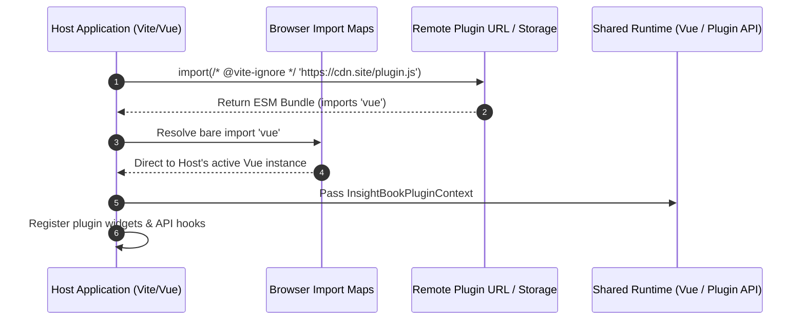

# Динамическая загрузка плагинов через ESM (Dynamic ESM Plugins)

При переходе от статических плагинов (подключаемых при сборке приложения через `npm` или monorepo workspaces) к **динамическим плагинам** главная задача — научить приложение выполнять внешне загруженный JavaScript-код в рантайме без полной пересборки и перезапуска хост-системы.

В современном Web-стеке (Vue 3, Vite, PWA, Tauri) нативным стандартом для этого служат **ESM (ECMAScript Modules)**. Разработчики плагинов компилируют свой код в независимый ESM-бандл и публикуют его на CDN или сервере приложения, а хост-система импортирует модуль по HTTP/HTTPS URL через нативный `import()`.



## Проблема дублирования контекста и решение

Если плагин собран классическим бандлером без указания внешних зависимостей, он включит копию библиотек (например, Vue, Pinia или Router) внутрь своего бандла. 

В Vue 3 это приведет к фатальной ошибке рантайма: `provide() can only be used inside setup()` или рассогласованию реактивного реактора, так как реактивный контекст хоста и экземпляры `ref`/`computed` плагина окажутся разнесены по разным экземплярам библиотеки.

### Решение 1: External в конфигурации сборки плагина

В конфигурации Vite/Rollup разработчика плагина все платформенные библиотеки отмечаются как внешние (`external`):

```typescript
// vite.config.ts (Репозиторий стороннего плагина)
import { defineConfig } from 'vite';
import vue from '@vitejs/plugin-vue';

export default defineConfig({
  plugins: [vue()],
  build: {
    lib: {
      entry: './src/index.ts',
      formats: ['es'],
      fileName: 'plugin-bundle',
    },
    rollupOptions: {
      // Исключаем синглтоны платформы из бандла плагина
      external: ['vue', 'vue-router', '@injurka/insight-book-plugin-api'],
    },
  },
});
```

### Решение 2: Import Maps на стороне Хост-приложения

Чтобы браузер понимал, откуда плагину брать `import { ref } from 'vue'` при исполнении удаленного кода, хост-приложение декларирует **Import Map** в своем `index.html`:

```html
<!-- index.html Хост-приложения -->
<script type="importmap">
{
  "imports": {
    "vue": "/assets/vendor/vue.runtime.esm-browser.js",
    "@injurka/insight-book-plugin-api": "/assets/shared/plugin-api.js"
  }
}
</script>
```

### Загрузчик плагинов в рантайме (Plugin Manager)

```typescript
// plugin-loader.ts (Хост-приложение)
export async function loadRemotePlugin(manifestUrl: string): Promise<InsightBookPlugin> {
  try {
    // Аннотация /* @vite-ignore */ обязательна, 
    // чтобы Vite dev-server не пытался проанализировать динамический URL во время сборки
    const pluginModule = await import(/* @vite-ignore */ manifestUrl);
    
    const plugin: InsightBookPlugin = pluginModule.default;
    return plugin;
  } catch (error) {
    console.error(`[PluginLoader] Ошибка загрузки плагина по URL: ${manifestUrl}`, error);
    throw error;
  }
}
```

## Неочевидные нюансы и скрытые трейдоффы

1. **Vite Dev Server vs Production:** На этапе разработки Vite транспилирует модули «на лету» (on-demand). Использование `import(/* @vite-ignore */ url)` обходит пайплайн Vite, поэтому локальное тестирование динамических плагинов требует поднятого CORS на сервере плагина и точного совпадения версий ESM-сборок.
2. **Строгая бинарная совместимость (SemVer Breakages):** Если хост-приложение обновит Vue с `3.3` на `3.5`, а плагин рассчитывал на внутренние API специфичной версии, произойдет падение в рантайме. Платформенный пакет API (`plugin-api`) должен жестко зафиксировать контракт.
3. **CORS и Сетевые задержки:** Загрузка модулей по внешним URL подвержена сетевым сбоям и блокировкам ad-blocker'ами. Необходим механизм локального кэширования JS-файлов плагина (IndexedDB / Service Worker).
