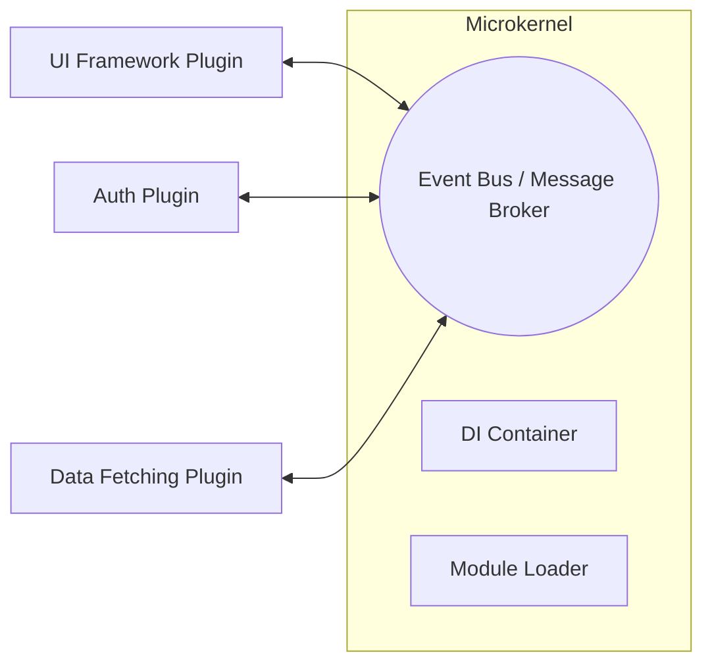

# Архитектура Микроядра (Microkernel Architecture)

Если плагинная архитектура предполагает, что у нас есть тяжелое, функциональное ядро, к которому мы цепляем фичи, то микроядро возводит эту идею в абсолют. В архитектуре микроядра само приложение не умеет почти ничего. Оно представляет собой лишь крошечный фундамент — шину событий, роутер, систему внедрения зависимостей (DI) и механизм загрузки модулей. Всё остальное, включая то, что кажется "базовым функционалом", является плагинами. 

Эту архитектуру мы используем, когда строим сложные, долгоживущие платформы, которые должны адаптироваться к совершенно непредсказуемым требованиям. Боль, которую мы решаем — это паралич монолита, где изменение одной подсистемы требует тестирования всей программы. В микроядре подсистемы общаются не напрямую, а через центральную шину, что обеспечивает максимальную развязку.



Код в таком приложении максимально опирается на события и интерфейсы.

Антипаттерн (сильная связность модулей):
```javascript
import { AuthService } from './auth';
import { ApiService } from './api';

const auth = new AuthService();
const api = new ApiService(auth); // Api жестко зависит от Auth
```

Как надо (модули общаются через ядро):
```javascript
// Плагины регистрируются в микроядре
kernel.register('auth', AuthPlugin);
kernel.register('api', ApiPlugin);

// Модуль API запрашивает зависимость у ядра абстрактно
const token = kernel.request('auth:getToken');
```

Скрытый нюанс: микроядро вводит чудовищную неявность. Когда модули общаются через абстрактную шину событий или DI, навигация по коду (Go to Definition) в IDE перестает работать. Вы видите, что модуль бросает событие `USER_LOGGED_IN`, но чтобы найти, кто его слушает, приходится делать полнотекстовый поиск по проекту. Более того, возрастает риск "событийного спагетти", когда цепочки событий приводят к бесконечным циклам или гонкам состояний (race conditions). Этот стиль категорически не стоит брать для простых корпоративных порталов, но он жизненно необходим при создании сложных десктопоподобных веб-приложений (например, VS Code в браузере или сложной среды для 3D-моделирования).
