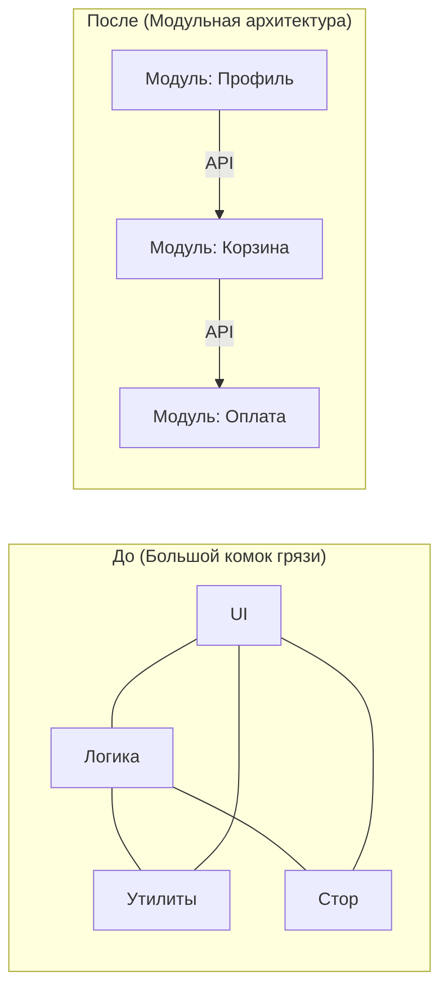

# Модульная Архитектура (Modular Architecture)

Представьте, что вы строите город. Сначала это просто деревня, где все дома стоят вперемешку, и каждый житель ходит за водой к одному колодцу. Это наш типичный монолит, или "большой комок грязи". Когда деревня разрастается до мегаполиса, управлять ею без четкого зонирования становится невозможно. Модульная архитектура — это процесс разделения нашего монолитного кода на изолированные районы-модули, каждый из которых отвечает за свою четкую задачу и скрывает свои внутренние детали от остальных.

Боль, которую мы здесь решаем, знакома каждому: вы меняете логику форматирования даты в компоненте профиля, а неожиданно ломается корзина покупок, потому что они неявно делили общую утилиту. Модульность заставляет нас проводить жесткие границы. Модуль инкапсулирует свою внутреннюю структуру и выставляет наружу только строго определенный публичный API.



На практике это означает, что мы перестаем импортировать файлы из глубин чужих папок. 

Антипаттерн (пробивание инкапсуляции):
```javascript
// Мы лезем глубоко во внутренности чужого модуля
import { calculateTax } from '@modules/cart/internal/utils/taxCalculator';
```

Как надо (работа через публичный API):
```javascript
// Модуль корзины экспортирует только то, что разрешает использовать
import { getCartTotal } from '@modules/cart'; 
```

Но у этого подхода есть скрытые трейдоффы. Во-первых, это оверхед на проектирование границ: если вы ошибетесь с нарезкой модулей, вам придется постоянно передавать данные туда-сюда, создавая циклические зависимости. Во-вторых, не весь код легко поддается модульности. Кросс-модульные задачи (cross-cutting concerns), такие как авторизация или логирование, часто становятся "проклятием" модульной архитектуры, требуя выноса в отдельное общее ядро. Модульность работает блестяще, когда бизнес-домены четко разделены (например, "Поиск", "Оформление заказа", "Поддержка"), но ломается, если ваше приложение — это один большой, сильно связанный редактор (например, табличный процессор).
