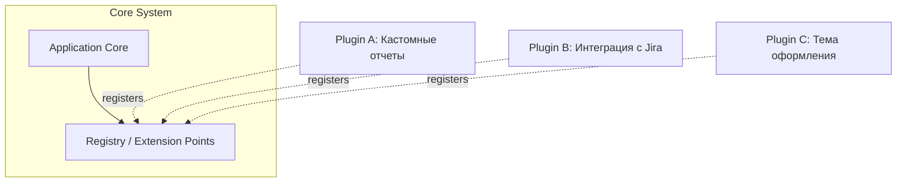

# Плагинная Архитектура (Plugin Architecture)

Вспомните момент, когда ваш успешный продукт получает первых крупных enterprise-клиентов. Каждому из них нужна "вот та маленькая уникальная фича", которая остальным не уперлась. Вы начинаете писать `if (client === 'AcmeCorp')`, и через год ваше ядро приложения превращается в спагетти из костылей. Плагинная архитектура спасает нас от этой участи, позволяя ядру оставаться чистым, а всей кастомной логике жить в изолированных расширениях.

Суть концепции в том, что базовое приложение ничего не знает о конкретных фичах. Оно лишь предоставляет "точки расширения" (extension points) — хуки или интерфейсы, к которым могут подключаться плагины. Плагин — это самодостачный кусок кода, который можно включить или выключить без пересборки всего приложения.



В коде это выглядит как инверсия контроля. Ядро не вызывает плагины напрямую.

Антипаттерн (хардкод в ядре):
```javascript
function processOrder(order) {
  saveToDb(order);
  if (config.enableEmailPlugin) {
    sendEmail(order);
  }
}
```

Как надо (плагины реагируют на события ядра):
```javascript
// В ядре:
function processOrder(order) {
  saveToDb(order);
  hooks.emit('onOrderProcessed', order);
}

// В коде плагина:
core.hooks.on('onOrderProcessed', (order) => {
  sendEmail(order);
});
```

Главный трейдофф здесь — это сложность API ядра. Как только вы открываете точку расширения, она становится публичным контрактом. Вы больше не можете просто так поменять внутреннюю структуру ядра, потому что сломаете сторонние плагины. Кроме того, возникает проблема изоляции: криво написанный плагин может вызвать утечку памяти или "положить" весь UI. Этот подход идеально применим для расширяемых инструментов (как Figma или Webpack), но несет огромный оверхед для типичных CRUD-приложений, где требования меняются предсказуемо и находятся под контролем одной команды.
