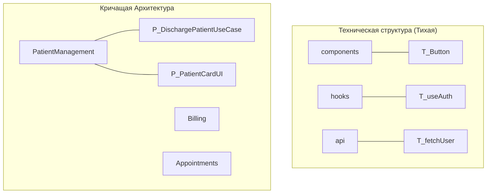

# Кричащая Архитектура (Screaming Architecture)

Откройте папку `src` в вашем типичном React/Vue приложении. Что вы там видите? `components`, `hooks`, `services`, `utils`, `store`. Если бы к вам подошел человек с улицы и посмотрел на эти папки, он бы сказал: "О, это приложение, которое использует хуки и компоненты!". Но он бы никогда не догадался, что это — медицинская система для больниц или маркетплейс криптовалют. Кричащая архитектура, предложенная Робертом Мартином (Uncle Bob), требует, чтобы структура вашего проекта "кричала" о его бизнес-направленности, а не о используемых технологиях.

Мы решаем боль размытия контекста. Когда мы группируем файлы по техническому типу, разработчику приходится прыгать по всему дереву проекта, чтобы собрать в голове то, как работает фича "Выписка пациента". Кричащая архитектура ставит во главу угла доменную область.



На практике это означает, что фреймворк и технические детали становятся деталью реализации, спрятанной глубоко внутри бизнес-модулей.

Антипаттерн (структура, кричащая о фреймворке):
```text
src/
  ├── components/
  │   └── PatientCard.tsx
  ├── redux/
  │   └── patientSlice.ts
  └── api/
      └── patientApi.ts
```

Как надо (структура, кричащая о бизнесе):
```text
src/
  ├── patients/
  │   ├── useCases/
  │   │   └── dischargePatient.ts
  │   ├── ui/
  │   │   └── PatientCard.tsx
  │   └── api/
  │       └── patientApi.ts
  ├── billing/
```

Неочевидный трейдофф: чтобы фреймворк действительно оставался "деталью реализации", вам придется вводить множество абстракций. В мире фронтенда, где UI-фреймворк (тот же React) сильно диктует архитектуру, пытаться полностью абстрагироваться от него — это путь к созданию избыточных слоев-адаптеров. Кроме того, общие технические компоненты (кнопки, модалки) всё равно придется куда-то выносить (обычно в папку `shared` или `core`), и грань между "доменным" и "общим" часто становится предметом бесконечных споров в команде. Эта архитектура прекрасно работает в сложных энтерпрайз-приложениях с богатой бизнес-логикой, но для простых контентных сайтов это ненужный оверхед.
