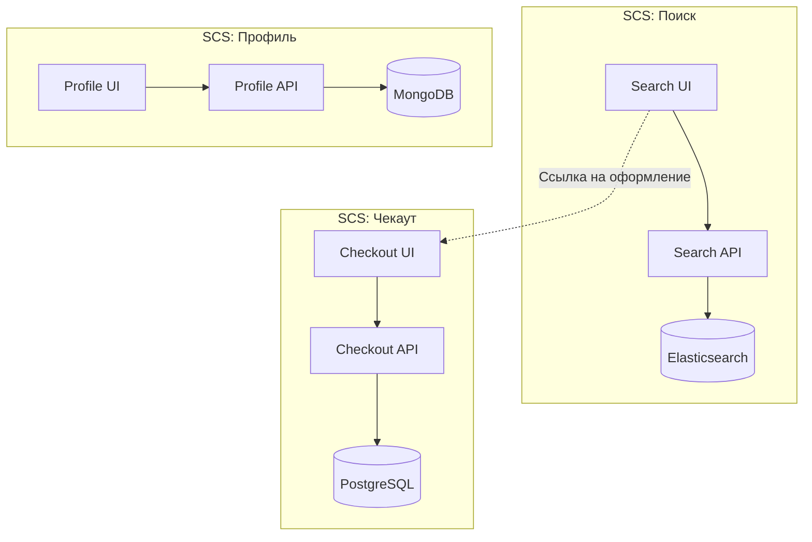

# Самодостаточные Системы (Self-Contained Systems)

Представьте себе классическую историю внедрения микрофронтендов: компания разбивает монолит на десяток независимых UI-кусочков, но все они ходят в один и тот же монолитный бэкенд и используют общую базу данных. В итоге релиз маленькой кнопочки всё равно требует синхронизации трех команд. Самодостаточные системы (SCS) — это архитектурный подход макроуровня, который говорит: система должна быть изолирована вертикально от базы данных до пользовательского интерфейса, и ею должна владеть только одна команда.

Боль, которую лечит SCS, — это коммуникационные издержки и блокеры между командами. В этой парадигме мы строим не одно большое приложение, а набор независимых веб-систем, которые интегрируются друг с другом на самом простом уровне (чаще всего через обычные гиперссылки на уровне браузера).



Интеграция между SCS намеренно делается "тупой" и слабой. Никаких сложных шин событий на клиенте или общих стейт-менеджеров.

Антипаттерн (сильное зацепление систем):
```javascript
// Приложение корзины импортирует и рендерит компонент из другой системы
import { RecommendationSlider } from '@scs/recommendations';

function CartPage() {
  return <RecommendationSlider productId={123} />;
}
```

Как надо (слабое зацепление в SCS):
```html
<!-- Интеграция через Edge-сервер (ESI) или просто ссылки -->
<div class="cart-page">
   <!-- Бэкенд склеит это на уровне сервера/CDN -->
   <esi:include src="https://recommendations.scs.internal/slider?productId=123" />
</div>
```

Скрытый нюанс этого подхода — потеря консистентности пользовательского опыта. Так как каждая команда полностью контролирует свой стек и деплой, навигация между SCS может ощущаться пользователем как переход на разные сайты (иногда даже с полной перезагрузкой страницы). Также дублируется множество ресурсов: каждая система может загружать свою версию React или свои стили, что бьет по перфомансу. SCS — это идеальный выбор для гигантских e-commerce порталов (как Amazon), где независимость и скорость доставки фич важнее, чем идеальный "бесшовный" SPA-опыт, но это катастрофа для небольших команд, которые просто утонут в поддержке десятка независимых пайплайнов и инфраструктур.
