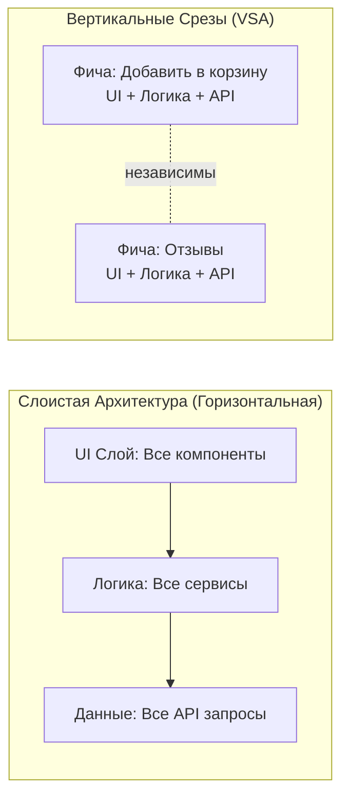

# Вертикальные Срезы (Vertical Slice Architecture)

Классическая слоистая архитектура учит нас делить код горизонтально: здесь у нас слой UI, под ним слой бизнес-логики, а еще ниже — слой работы с данными. На практике это оборачивается тем, что для реализации одной простой фичи "Добавить товар в избранное" разработчик вынужден прыгать через пять файлов в разных концах проекта: создать кнопку, добавить экшен, написать редьюсер, обновить API-сервис и поправить модель. Вертикальные срезы (VSA) переворачивают эту логику на 90 градусов. Мы объединяем всё, что нужно для реализации одной конкретной фичи, в один плотный "вертикальный кусок".

Боль, которую мы решаем — это чудовищно низкая связность (cohesion) внутри слоев. В контроллерах лежат сотни методов, никак не связанных друг с другом, кроме того факта, что они обрабатывают HTTP-запросы. VSA изолирует фичи друг от друга, позволяя каждой из них выбирать свои собственные инструменты и подходы.



В коде вертикальный срез может быть просто одной папкой или даже одним файлом (если фича тривиальна).

Антипаттерн (распределение фичи по слоям):
```text
src/
  ├── components/AddToCartButton.tsx
  ├── hooks/useCart.ts
  └── api/cartRequests.ts
```

Как надо (высокая связность внутри фичи):
```text
src/
  └── features/
      └── AddToCart/
          ├── index.tsx (Кнопка UI)
          ├── api.ts (Запросы к серверу)
          └── store.ts (Локальный стейт фичи)
```

Скрытый трейдофф VSA заключается в риске дублирования кода. Поскольку срезы изолированы и не зависят друг от друга, вы можете обнаружить, что три разные фичи реализуют одну и ту же логику валидации или форматирования данных. Если вовремя не выносить такие общие вещи в общее ядро (Shared Kernel), проект быстро обрастает копипастой. Кроме того, VSA отлично работает, когда фичи действительно независимы (отправил форму — сохранил), но начинает скрипеть, когда бизнес-требования заставляют срезы активно общаться друг с другом (например, добавление в корзину должно мгновенно обновить три других виджета на странице). В таких случаях приходится вводить шину событий или глобальный стейт, что размывает изначальную изоляцию.
