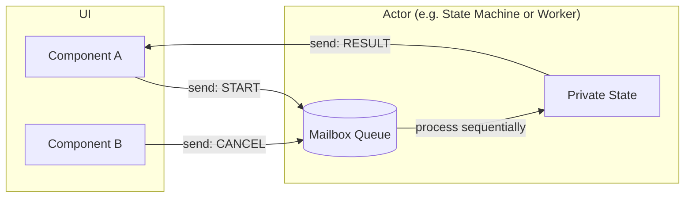

# Модель Акторов (Actor Model) во Frontend

## 📖 Что это и какую боль мы решаем

**Actor Model (Модель Акторов)** — это математическая модель конкурентных вычислений. Главный принцип: **Актор — это фундаментальная единица вычисления**.

У каждого Актора есть:
1. **Приватное состояние**, которое никто извне не может прочитать или изменить напрямую.
2. **Почтовый ящик (Mailbox)** — очередь входящих сообщений.
3. **Поведение** — правила, как Актор реагирует на конкретное сообщение (может изменить свое состояние, отправить сообщение другому Актору или создать новых Акторов).

**Боль:** "Гонки данных" (Race conditions) и спагетти-код из-за Shared Mutable State (разделяемого изменяемого состояния). Когда 10 компонентов напрямую модифицируют глобальный объект пользователя, отследить, кто и зачем это сделал — невозможно.

## ⚙️ Как это работает на практике

На Frontend модель Акторов чаще всего применяется в двух сценариях:

1. **Web Workers:** Главный поток браузера и Worker физически изолированы (не имеют общей памяти). Они общаются строго через `postMessage` (передача сообщений). Worker выступает как Актор, выполняющий тяжелые задачи.
2. **State Machines (Конечные автоматы / XState):** Машина состояний изолирует логику внутри себя. Компоненты UI не могут поменять ее `context` (состояние) напрямую, они могут лишь отправить ей событие (сообщение). Машина сама решает, как на него реагировать в зависимости от текущего статуса.



## 💻 Пример: Как надо и Антипаттерн

**🔴 Антипаттерн (Shared State - Глобальная переменная):**
```typescript
let isUploading = false;
let progress = 0;

// Любой компонент может сломать логику, случайно перезаписав переменные
export function startUpload() {
  if(isUploading) return;
  isUploading = true;
  // ...
}
```

**🟢 Как надо (Актор через XState):**
```typescript
import { createMachine, assign } from 'xstate';

// Актор (Машина) инкапсулирует стейт. Никто не может поменять progress напрямую.
const uploadActor = createMachine({
  id: 'upload',
  initial: 'idle',
  context: { progress: 0 },
  states: {
    idle: {
      on: { START_UPLOAD: 'uploading' }
    },
    uploading: {
      on: {
        UPLOAD_PROGRESS: {
          // Актор сам меняет свое приватное состояние при получении сообщения
          actions: assign({ progress: (context, event) => event.value })
        },
        UPLOAD_COMPLETE: 'success'
      }
    },
    success: {}
  }
});

// UI просто отправляет сообщения (события)
uploadService.send({ type: 'START_UPLOAD' });
```

## ⚠️ Неочевидные нюансы и трейдоффы

1. **Асинхронная природа всего**
   * В чистой модели акторов нет синхронных вызовов "дай мне данные". Ты должен отправить актору сообщение "пришли данные" и ждать ответа в виде другого сообщения. На UI это часто порождает неудобства, поэтому в XState/Redux мы можем *синхронно* читать текущий снапшот состояния, хоть мутируем его строго через сообщения (экшены).

2. **Оверхед на сериализацию (в случае с Web Workers)**
   * Сообщения между главным потоком и Worker'ом копируются алгоритмом *Structured Clone*. Передача больших объемов данных (сотни мегабайт JSON) может повесить главный поток только на этапе сериализации сообщений. (Используйте `Transferable Objects`, если это массив байт).

3. **Когда это не нужно**
   * Модель акторов избыточна для простых форм и лендингов. Её стоит применять для сложных, долгоживущих процессов со сложной логикой переходов (аудио/видео плееры, сложные визарды, фоновые синхронизации, игры).
