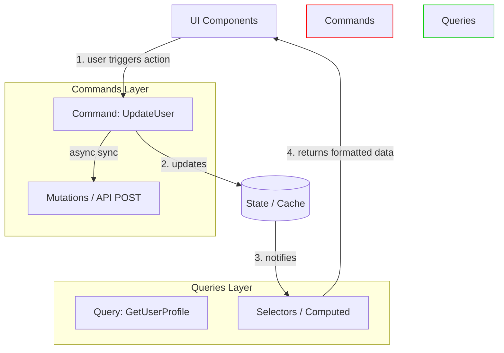

# CQRS во Frontend (Command Query Responsibility Segregation)

## 📖 Что это и какую боль мы решаем

**CQRS** — это принцип, гласящий, что операции, которые *читают* данные (Queries), и операции, которые *изменяют* данные (Commands), должны быть строго разделены, вплоть до использования разных моделей или даже разных сторов.

**Боль:** В сложных Frontend-приложениях мы часто используем одни и те же модели (типы, классы) и для отображения данных на UI, и для отправки формы на бэкенд. Но UI требует данных в агрегированном, "красивом" виде (с джоинами, отформатированными датами, локализацией), а для мутации (записи) нужен сырой и строгий payload (IDшники, числа). Попытка упихать это в одну "Универсальную Модель" приводит к Франкенштейну с кучей опциональных полей `?`.

## ⚙️ Как это работает на практике

Во Frontend CQRS естественно ложится на паттерны управления состоянием и работу с API:

- **Queries (Чтение):** Селекторы в Redux, хуки `useQuery` (React Query / Apollo), getters в Vuex. Они не имеют побочных эффектов. Они могут вычислять, фильтровать, мемоизировать данные.
- **Commands (Запись):** Экшены (Actions), thunks, хуки `useMutation`. Они меняют состояние системы (локальное или на сервере), но *не возвращают* само состояние для рендера.



## 💻 Пример: Как надо и Антипаттерн

**🔴 Антипаттерн (Смешивание ответственности):**
```typescript
// Метод и читает, и меняет данные. Сложно переиспользовать.
async function getUserAndMarkAsActive(userId: string) {
  const user = await api.get(`/users/${userId}`);
  
  // Мутация прямо внутри функции чтения
  if (!user.isActive) {
    await api.post(`/users/${userId}/active`);
    user.isActive = true;
  }
  
  // Форматирование для UI
  return { ...user, fullName: `${user.firstName} ${user.lastName}` };
}
```

**🟢 Как надо (CQRS):**
```typescript
// Command: Только намерение изменить систему. Ничего не возвращает для UI.
async function activateUser(userId: string): Promise<void> {
  await api.post(`/users/${userId}/active`);
  // Инвалидация кэша или диспатч экшена в стор
  queryCache.invalidateQueries(['user', userId]); 
}

// Query: Только чтение и подготовка данных для UI. Без сайд-эффектов.
function useUserProfile(userId: string) {
  // Возвращает производную (computed) модель
  return useQuery(['user', userId], async () => {
    const user = await api.get(`/users/${userId}`);
    return { 
      id: user.id, 
      fullName: `${user.firstName} ${user.lastName}`,
      isActive: user.isActive 
    };
  });
}
```

## ⚠️ Неочевидные нюансы и трейдоффы

1. **Рассинхронизация (Eventual Consistency)**
   * Когда вы разделяете команды и запросы, возникает вопрос: как быстро UI узнает об изменениях? Если команда успешно выполнилась на бэкенде, нам нужно обновить модель чтения (Query). Это делается через инвалидацию кэша (как в React Query) или через оптимистичные обновления (Optimistic UI).

2. **Оверхед на инфраструктуру**
   * **Где ломается:** Для простейшего CRUD-приложения выделять отдельные слои команд и запросов — это избыточный бойлерплейт. CQRS сияет там, где логика отображения (Dashboards, сложные таблицы) кардинально отличается от логики изменения (сложные бизнес-транзакции).

3. **Асимметрия моделей (DTO)**
   * Смиритесь с тем, что `UserReadDto` и `UserWriteDto` — это разные типы. Не пытайтесь слить их в интерфейс `IUser`. Это нормально, что для чтения мы отдаем объект `{ id, name, roleName }`, а для записи отправляем `{ id, name, roleId }`.
