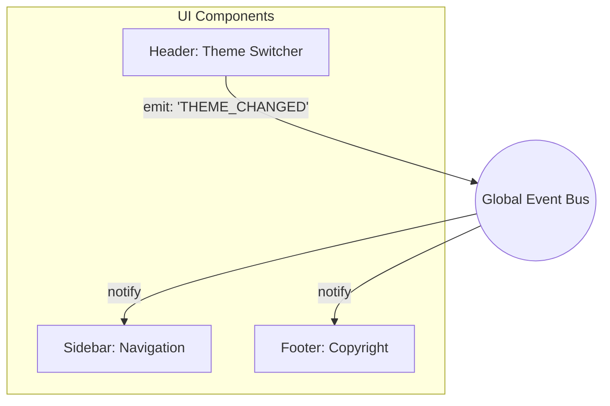

# Event Bus (Шина Событий)

## 📖 Что это и какую боль мы решаем

**Event Bus** — это паттерн проектирования, представляющий собой централизованный узел (посредника) для передачи сообщений между независимыми компонентами системы. 

**Боль:** В иерархии компонентов UI часто возникает необходимость передать информацию от глубоко вложенного дочернего компонента к совершенно другому дочернему компоненту в другой ветке дерева. В React/Vue это приводит к **Prop-Drilling'у** — пробросу коллбэков через десятки компонентов, которым они не нужны, только ради того, чтобы связать отправителя и получателя.

Event Bus позволяет компонентам общаться напрямую через глобальную "радиоволну", минуя дерево компонентов.

## ⚙️ Как это работает на практике

Event Bus строится на основе паттерна **Pub/Sub** (Издатель/Подписчик). 
Любой компонент может:
1. Подписаться на конкретную "тему" (topic / event name).
2. Опубликовать событие в эту тему.

Сам Event Bus ничего не знает о бизнес-логике. Он лишь хранит словарь: `Тема -> Массив 콜лбэков`.



## 💻 Пример: Как надо и Антипаттерн

**🔴 Антипаттерн (Prop-Drilling):**
```jsx
// Чтобы передать действие от Header к Footer, приходится засорять App и Layout
const App = () => {
  const [theme, setTheme] = useState('light');
  return <Layout theme={theme} onThemeChange={setTheme} />;
};
// Где-то в глубине...
<ThemeSwitcher onThemeChange={props.onThemeChange} />
```

**🟢 Как надо (Простейший Event Bus на Native API):**
В браузере уже есть мощный Event Bus — это `window` (или `document`) и `CustomEvent`.

```typescript
// utils/eventBus.ts
export const EventBus = {
  emit(eventName: string, detail?: any) {
    const event = new CustomEvent(eventName, { detail });
    window.dispatchEvent(event);
  },
  on(eventName: string, callback: (event: CustomEvent) => void) {
    window.addEventListener(eventName, callback as EventListener);
    // Обязательно возвращаем функцию отписки!
    return () => window.removeEventListener(eventName, callback as EventListener);
  }
};

// В компоненте-отправителе:
EventBus.emit('THEME_CHANGED', 'dark');

// В компоненте-получателе:
useEffect(() => {
  return EventBus.on('THEME_CHANGED', (e) => setTheme(e.detail));
}, []);
```

## ⚠️ Неочевидные нюансы и трейдоффы

1. **Глобальный Event Bus — это `GOTO` в мире архитектуры**
   * **Где ломается:** Event Bus невероятно просто внедрить, и поэтому он часто становится "глобальной мусоркой". Если все компоненты начнут общаться через шину событий, код станет абсолютно нечитаемым. Вы не сможете понять поток данных (Data Flow), потому что зависимости неявные (Implicit).
   * **Решение:** Используйте Event Bus **только** для тех событий, которые действительно являются "широковещательными" (Broadcasting) и кросс-доменными. Например: "Пользователь разлогинился", "Потеряно соединение с интернетом", "Сменилась глобальная тема". Для локальных данных используйте React Context или State Manager.

2. **Проблема типизации (TypeScript)**
   * Кастомный Event Bus часто работает со строками (названия событий) и `any` payload. Это убивает безопасность типов. 
   * Всегда типизируйте Event Bus через строгие Event Map (как показано в заметке про Pub/Sub).

3. **Утечки памяти (Memory Leaks)**
   * Если компонент при монтировании подписывается на глобальный `EventBus` и забывает отписаться при размонтировании (Unmount), коллбэк останется в памяти (замыкая переменные компонента). Это приводит к багам "Cannot update unmounted component" и утечкам памяти. *Всегда возвращайте и вызывайте функцию `unsubscribe`.*
