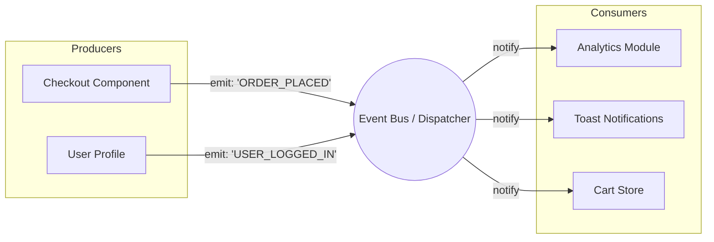

# Event-Driven Architecture (EDA) во Frontend

## 📖 Что это и какую боль мы решаем

В классической императивной архитектуре компоненты жестко связаны друг с другом. Если компонент `Checkout` завершает покупку, он должен напрямую вызвать `AnalyticsService.track()`, `NotificationService.show()` и `CartStore.clear()`. Это приводит к **сильному зацеплению (tight coupling)**: `Checkout` знает слишком много о других частях системы.

**Event-Driven Architecture (EDA)** решает эту боль, разворачивая зависимость. Компоненты общаются не прямыми вызовами методов, а путем генерации **событий (events)**. 

Суть как в хорошей истории: герой (Продюсер) просто кричит на всю площадь "Дракон повержен!" (событие), а толпа (Консьюмеры) реагирует каждый по-своему: кто-то радуется, кто-то бежит собирать лут, кто-то пишет летопись. Герою не нужно подходить к каждому и давать указания.

## ⚙️ Как это работает на практике

На Frontend эта архитектура проявляется на нескольких уровнях:
1. **DOM Events**: Нативные события браузера (`click`, `custom events`).
2. **State Management**: Redux, Vuex, NgRx работают на основе событий (Actions).
3. **Event Bus / PubSub**: Кастомные шины событий для межмодульной коммуникации.



## 💻 Пример: Как надо и Антипаттерн

**🔴 Антипаттерн (Императивный вызов):**
```typescript
class CheckoutProcess {
  constructor(
    private analytics: AnalyticsService,
    private cart: CartService,
    private notifier: NotificationService
  ) {}

  async completeOrder(orderId: string) {
    await api.submitOrder(orderId);
    // Checkout знает обо всех! Это ад при рефакторинге и тестировании.
    this.analytics.trackPurchase(orderId);
    this.cart.clear();
    this.notifier.success('Заказ оформлен');
  }
}
```

**🟢 Как надо (Event-Driven):**
```typescript
class CheckoutProcess {
  constructor(private eventBus: EventBus) {}

  async completeOrder(orderId: string) {
    await api.submitOrder(orderId);
    // Мы просто сообщаем факт. Кто слушает — тот среагирует.
    this.eventBus.publish({ type: 'ORDER_PLACED', payload: { orderId } });
  }
}

// Где-то в точке инициализации приложения (или в соответствующих модулях):
eventBus.subscribe('ORDER_PLACED', (event) => analytics.trackPurchase(event.payload.orderId));
eventBus.subscribe('ORDER_PLACED', () => cart.clear());
eventBus.subscribe('ORDER_PLACED', () => notifier.success('Заказ оформлен'));
```

## ⚠️ Неочевидные нюансы и трейдоффы

1. **Потеря Traceability (прослеживаемости)**
   * **Боль:** Когда вы читаете код `this.eventBus.publish('ORDER_PLACED')`, вы **не знаете**, что произойдет дальше. Логика размазана по приложению. В IDE сложно нажать "Go to Definition" и увидеть весь флоу.
   * **Решение:** Документирование событий, типизация (TypeScript Event Maps), строгий нейминг (формат `[Source] Event_Name`, например `[Checkout] Order_Placed`).

2. **Event Hell ("Пинг-понг событиями")**
   * **Где ломается:** Если реакция на событие `A` порождает событие `B`, которое порождает `C`, которое снова триггерит `A`. Возникают скрытые бесконечные циклы или race conditions, которые невозможно отладить.
   * **Правило:** События должны быть *фактами* о том, что *уже произошло*, а не командами (не `CLEAR_CART`, а `ORDER_PLACED`).

3. **Оверхед на отписку (Memory Leaks)**
   * Во Frontend компоненты монтируются и размонтируются. Если компонент подписался на глобальную шину событий и не отписался при `unmount`, он останется в памяти, и его коллбэки будут вызываться (утечка памяти и зомби-рендеры). Всегда возвращайте функцию `unsubscribe`.

**Границы применимости:** Идеально для слабосвязанных доменов (например, модули микрофронтенда, аналитика, глобальные нотификации). **Не стоит использовать** внутри одного тесно связанного компонента или формы — там лучше явный проброс пропсов или прямые вызовы.
