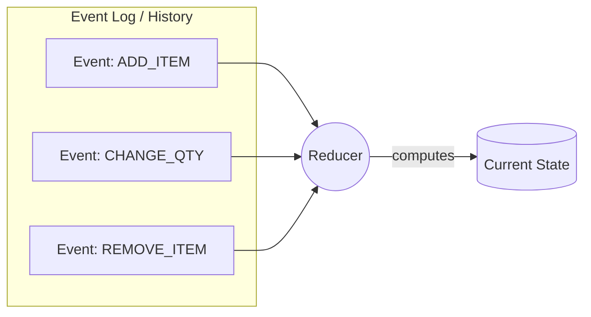

# Event Sourcing во Frontend

## 📖 Что это и какую боль мы решаем

В традиционных архитектурах (CRUD) база данных или стейт-менеджер хранит только **текущее состояние** (snapshot). Если баланс пользователя равен $100, мы знаем только это число, но не знаем, *как* мы к нему пришли. 

**Event Sourcing** предлагает принципиально иной подход: источником истины является **не текущее состояние, а неизменяемая последовательность событий (журнал/append-only log)**, которые привели к этому состоянию. Текущее состояние вычисляется динамически путем последовательного применения этих событий к начальному состоянию (свертка/reduce).

**Боль:** Невозможность аудита, отмены действий (Undo/Redo), воспроизведения плавающих багов, аналитики поведения пользователя.

## ⚙️ Как это работает на практике

На Frontend концепция Event Sourcing лежит в основе **Redux** и архитектуры **Elm**. 
- Стейт в Redux — это лишь проекция (snapshot).
- Истинный источник правды — это массив `Actions`, которые были сдиспатчены.
- Reducer — это чистая функция, накатывающая событие на текущий стейт: `State = (State, Action) => State`.

Благодаря этому работает **Redux DevTools**: он просто запоминает цепочку событий и позволяет вам путешествовать во времени (Time-Travel Debugging), отменяя или воспроизводя события заново.



## 💻 Пример: Как надо и Антипаттерн

**🔴 Антипаттерн (Прямая мутация состояния):**
```typescript
class EditorState {
  content: string = "";

  // Мы просто перетираем данные. Невозможно сделать Undo!
  typeText(text: string) {
    this.content += text;
  }
}
```

**🟢 Как надо (Event Sourcing для Undo/Redo):**
```typescript
type Event = 
  | { type: 'TYPED'; text: string }
  | { type: 'DELETED'; count: number };

class EditorStore {
  private events: Event[] = [];
  
  // Добавляем событие в журнал
  dispatch(event: Event) {
    this.events.push(event);
  }

  // Вычисляем состояние "на лету" из журнала событий
  get content(): string {
    return this.events.reduce((state, event) => {
      switch (event.type) {
        case 'TYPED': return state + event.text;
        case 'DELETED': return state.slice(0, -event.count);
        default: return state;
      }
    }, "");
  }

  // Undo - это просто удаление последнего события и пересчет!
  undo() {
    this.events.pop();
  }
}
```

## ⚠️ Неочевидные нюансы и трейдоффы

1. **Производительность и Снапшоты (Snapshots)**
   * **Боль:** Если у вас 10 000 событий, пересчитывать стейт с нуля (reduce) при каждом новом событии — огромный оверхед.
   * **Решение:** Кэширование текущего состояния (что и делает Redux). Event Sourcing не означает, что вы *обязаны* каждый раз вычислять стейт с нуля, вы просто *можете* это сделать. На практике мы храним текущий снапшот, а новые события применяем инкрементально.

2. **Эволюция структуры событий**
   * **Где ломается:** Если вы сохраняете события локально (например, в `localStorage`) или на бэкенде, и через год меняете структуру экшена (payload), старые события больше не смогут быть обработаны вашим новым Reducer'ом. Вам придется писать механизмы "миграции" старых событий (upcasting).

3. **Границы применимости**
   * **Когда использовать:** Графические редакторы (Figma, Canvas), текстовые процессоры (Google Docs), сложные формы-визарды, где требуется богатый функционал Undo/Redo/Collaborative editing (через CRDT/OT).
   * **Когда не использовать:** Обычные CRUD-таблицы, простые дашборды. Оверхед на написание экшенов и редьюсеров не окупится.
