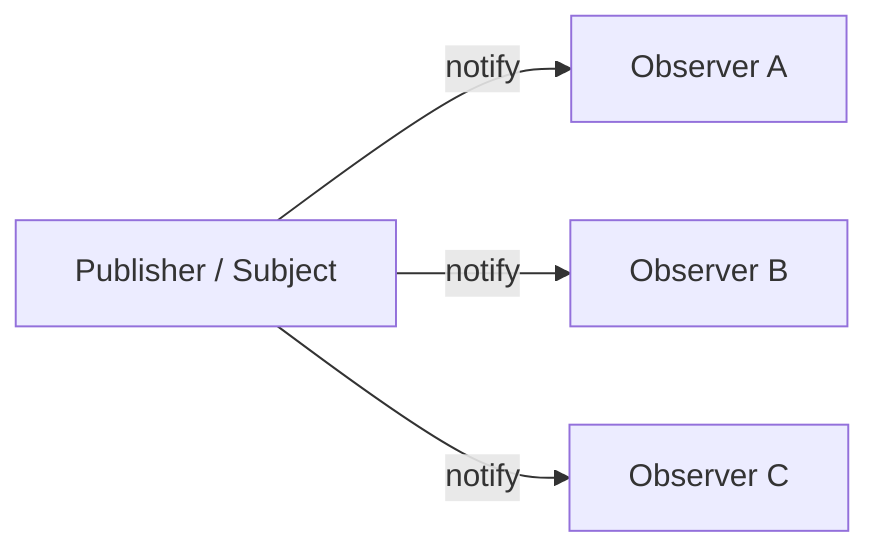

## Observer — Наблюдатель

**Observer** создаёт зависимость «один ко многим»: когда состояние одного объекта меняется, все подписчики получают уведомление.

Примеры:

- обработчики DOM-событий;
- Redux store;
- Vue watchers;
- RxJS;
- подписка на WebSocket;
- обновление UI после изменения данных.

### Простой EventEmitter

```ts
type Listener<T> = (data: T) => void;

class EventEmitter<T> {
  private listeners = new Set<Listener<T>>();

  subscribe(listener: Listener<T>): () => void {
    this.listeners.add(listener);

    return () => {
      this.listeners.delete(listener);
    };
  }

  emit(data: T): void {
    this.listeners.forEach((listener) => listener(data));
  }
}
```

Использование:

```ts
const userUpdated = new EventEmitter<{ id: string; name: string }>();

const unsubscribe = userUpdated.subscribe((user) => {
  console.log("User updated:", user.name);
});

userUpdated.emit({
  id: "1",
  name: "Анна",
});

// User updated: Анна

unsubscribe();
```

### Диаграмма Observer



---