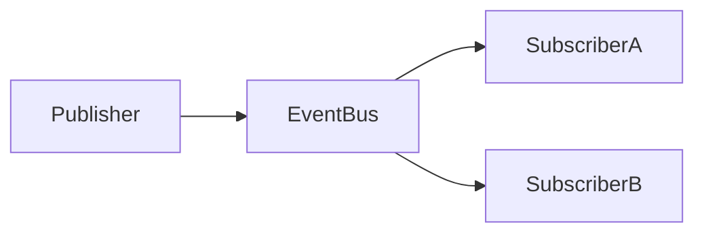

## Observer и Pub/Sub: разница

Эти понятия часто используют как синонимы, но есть отличие.

### Observer

Подписчики обычно подписываются напрямую на конкретный объект.

```ts
store.subscribe(listener);
```

### Pub/Sub

Между издателем и подписчиками есть посредник — брокер событий.



Пример Event Bus:

```ts
type EventMap = {
  "user:logged-in": { userId: string };
  "cart:updated": { count: number };
};

class EventBus {
  private listeners = new Map<string, Set<(payload: any) => void>>();

  on<T extends keyof EventMap>(
    event: T,
    listener: (payload: EventMap[T]) => void
  ) {
    if (!this.listeners.has(event)) {
      this.listeners.set(event, new Set());
    }

    this.listeners.get(event)!.add(listener);

    return () => {
      this.listeners.get(event)?.delete(listener);
    };
  }

  emit<T extends keyof EventMap>(event: T, payload: EventMap[T]) {
    this.listeners.get(event)?.forEach((listener) => listener(payload));
  }
}
```

```ts
const eventBus = new EventBus();

eventBus.on("cart:updated", ({ count }) => {
  console.log(`Items in cart: ${count}`);
});

eventBus.emit("cart:updated", { count: 3 });
```

---