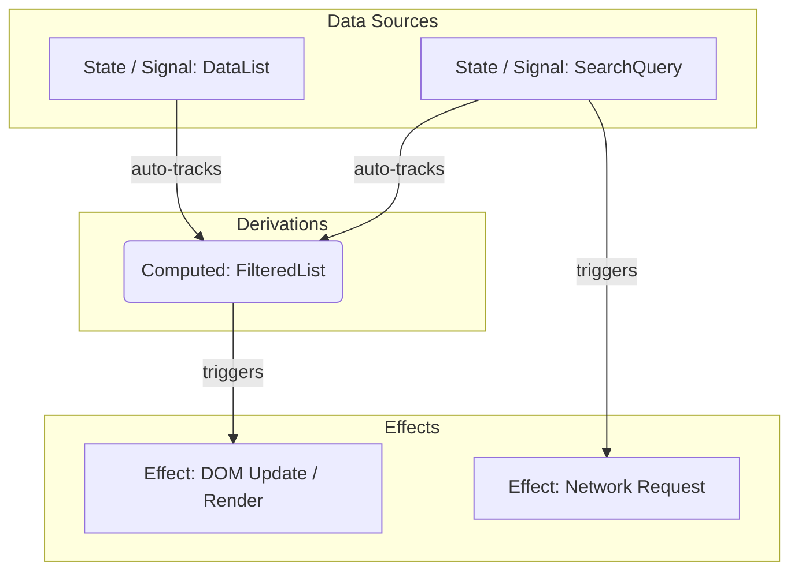

# Реактивная архитектура (Reactive Architecture)

## 📖 Что это и какую боль мы решаем

**Реактивная архитектура** — это парадигма, в которой потоки данных (Data Streams) и распространение изменений (Propagation of Change) лежат в основе системы. Вместо того чтобы *спрашивать* данные об изменениях (Pull), данные сами *сообщают* заинтересованным частям о том, что они изменились (Push).

**Боль:** В традиционных UI-интерфейсах мы страдаем от необходимости вручную синхронизировать состояние и View. Когда переменная `x` меняется, разработчик должен не забыть вызвать функцию обновления UI. Это ведет к багам рассинхронизации, спагетти-коду ручных вызовов `render()` и неконсистентному состоянию.

В реактивной системе мы объявляем связи один раз: `C = A + B`. Когда `A` меняется, `C` обновляется автоматически.

## ⚙️ Как это работает на практике

Реактивность во Frontend исторически развивалась по двум направлениям:
1. **Потоки событий (Functional Reactive Programming - FRP):** RxJS, где все является "потоком" (Stream), и мы применяем операторы (map, filter, merge).
2. **Прозрачная реактивность (Transparent Reactivity / Signals):** MobX, Vue Reactivity, Solid.js, Angular Signals. Система автоматически отслеживает зависимости (Dependency Tracking) во время доступа к данным (getter) и оповещает при изменении (setter).



## 💻 Пример: Как надо и Антипаттерн

**🔴 Антипаттерн (Императивное обновление DOM):**
```javascript
let count = 0;

function increment() {
  count++;
  // Разработчик ДОЛЖЕН не забыть обновить DOM
  document.getElementById('counter').innerText = count;
  // И не забыть обновить зависимые элементы
  document.getElementById('message').innerText = count > 5 ? "Много!" : "Мало!";
}
```

**🟢 Как надо (Signals / Transparent Reactivity):**
```javascript
import { signal, computed, effect } from '@preact/signals-core';

// 1. Источник истины
const count = signal(0);

// 2. Производное состояние (Derivation)
const message = computed(() => count.value > 5 ? "Много!" : "Мало!");

// 3. Сайд-эффект (реакция)
effect(() => {
  // Система САМА поняла, что зависит от count и message
  document.getElementById('counter').innerText = count.value;
  document.getElementById('message').innerText = message.value;
});

// Нам достаточно просто поменять данные. UI обновится сам.
function increment() {
  count.value++; 
}
```

## ⚠️ Неочевидные нюансы и трейдоффы

1. **Непредсказуемость сайд-эффектов (Magic)**
   * **Боль:** Из-за "магии" автотрекинга, если вы случайно прочитаете Signal внутри эффекта, эффект подпишется на него. Это может привести к лишним ре-рендерам или бесконечным циклам, если эффект одновременно читает и пишет в один и тот же стейт.
   * **Решение:** Строгое разделение: Computed — чистые функции (без эффектов). Effects — только на самом краю системы (рендер DOM, логгирование).

2. **Glitches (Промежуточные неконсистентные состояния)**
   * В наивных реализациях реактивности, если `A` меняется и триггерит `B` и `C`, а `D` зависит от `B` и `C`, то `D` может пересчитаться дважды (временно получив старое значение `C` и новое `B`).
   * Современные библиотеки (Solid, Vue, MobX) решают это алгоритмами топологической сортировки (Push-Pull), гарантируя **Glitch-free** реактивность.

3. **Крутая кривая обучения (Особенно RxJS)**
   * RxJS с его 100+ операторами — это отдельный язык внутри JavaScript. Использование RxJS для простых задач приводит к излишней переусложненности. Signals сейчас становятся стандартом де-факто, так как они предоставляют схожую мощь с гораздо более простым императивным DX.
