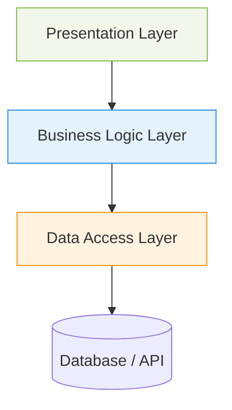

Слоистая архитектура — это естественный ответ на хаос растущей кодовой базы. Когда приложение превращается в «большой ком грязи», где кнопка интерфейса напрямую отправляет SQL-запросы или дергает сеть, мы вводим логические границы. Суть подхода проста: код группируется по ролям, выстраиваясь в стопку, где каждый уровень знает только о том, что находится строго под ним. Мы изолируем отображение от бизнес-логики, а бизнес-логику от механизмов хранения данных, чтобы случайное изменение дизайна не сломало расчет налогов или обработку корзины.

На практике это означает жесткий контроль потока управления, когда запрос от пользователя плавно проваливается сквозь абстракции, обрастая контекстом на каждом шаге.



Типичный антипаттерн, породивший саму потребность в слоях — смешивание всего в одном флаконе:

```javascript
// Антипаттерн: UI, бизнес-логика и инфраструктура склеены намертво
function CheckoutButton() {
  const handlePay = async () => {
    const user = JSON.parse(localStorage.getItem('user')); // Данные
    if (user.balance < 100) return alert('Недостаточно средств'); // Бизнес-правило
    await axios.post('/api/charge', { id: user.id }); // Сеть
  };
  return <button onClick={handlePay}>Оплатить</button>;
}
```

Разнеся это по слоям, мы получим переиспользуемый сервис оплаты, независимый от того, нажали ли кнопку в вебе или вызвали команду в CLI. 

Однако у этого подхода есть скрытый враг — паттерн «воронка» (sinkhole). Это ситуация, когда слои превращаются в бессмысленных посредников. Если запрос просто проходит через UI, контроллер, сервис и репозиторий без какой-либо трансформации и логики, мы платим налог на абстракцию без получения выгоды. Архитектура начинает ломаться в простых CRUD-приложениях: там, где нужно просто сохранить формочку в базу, строгие слои генерируют лишь оверхед в виде DTO-мапперов и дублирования кода. Этот стиль блестит только там, где бизнес-правила достаточно массивны и сложны, чтобы их нужно было тщательно изолировать и покрывать юнит-тестами.
