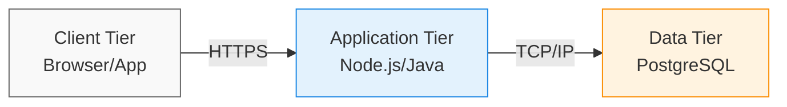

Если классические слои делят код логически внутри одного процесса, то ярусная (N-Tier) архитектура рубит систему топором по физическим серверам. Исторически она родилась из необходимости масштабировать разные части приложения независимо и прятать данные за сетевыми экранами. Традиционная «трехзвенка» (3-Tier) физически разносит клиентское приложение (браузер или мобилку), сервер бизнес-логики и базу данных по разным машинам. Это решает фундаментальную боль безопасности и ресурсоемкости: злоумышленник, взломавший веб-сервер, не получает прямого доступа к дискам с данными, а тяжелые вычисления бэкенда не вешают пользовательский интерфейс.



Оборотная сторона физического разделения — это сеть. Сеть ненадежна, медленна и требует постоянной сериализации данных. Архитектура начинает катастрофически трещать по швам, если мы проектируем общение между ярусами так же беспечно, как обычные вызовы функций в памяти.

```javascript
// Антипаттерн: "чатти" (chatty) интерфейс между ярусами
async function calculateTotal() {
  let total = 0;
  for (const itemId of cart) {
     // Убийство перформанса: сетевой запрос на каждую итерацию
     const item = await fetch(`/api/items/${itemId}`); 
     total += item.price;
  }
}
```

Неочевидный нюанс многоярусной архитектуры — взрывной рост сложности деплоя, мониторинга и поддержки контрактов (API). Каждое изменение функциональности потенциально затрагивает несколько физических узлов и требует синхронных релизов. Использовать N-Tier стоит тогда, когда у вас действительно разные профили нагрузки (например, тяжелый аналитический бэкенд и легкий клиент) или существуют строгие корпоративные требования безопасности по изоляции сетей. Если же вся ваша система спокойно умещается на одном сервере и не требует параноидальной изоляции, принудительное разрезание на ярусы или микросервисы лишь добавит сетевых задержек, точек отказа и боли в отладке.
