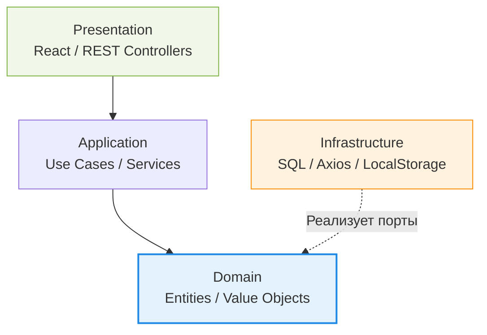

Разделение на Presentation, Application, Domain и Infrastructure (PADI) — это логическая эволюция слоистой архитектуры, кристаллизованная в Domain-Driven Design (DDD) и Чистой Архитектуре. Главная инженерная боль, которую мы здесь решаем — это защита ядра бизнес-правил от гниения под давлением внешних фреймворков и библиотек. 

В классических трехуровневых системах база данных часто находится в самом низу и невольно диктует правила игры всему приложению. В PADI-архитектуре ядро (Domain) становится абсолютным королем. Базы данных, UI-компоненты и API (Infrastructure и Presentation) — это лишь взаимозаменяемые плагины, которые подстраиваются под нужды домена. Слой Application выступает в роли дирижера: он не содержит бизнес-правил сам по себе, но знает, кого вызвать для их выполнения и как оркестровать транзакцию.



В коде это проявляется радикально: доменные сущности ничего не знают о внешнем мире. Никаких импортов ORM, никаких хуков React, никаких HTTP-запросов.

```typescript
// Как надо: Домен чист от деталей инфраструктуры
class Cart {
  constructor(private items: CartItem[]) {}
  
  applyDiscount(code: string) {
    if (code === 'VIP' && this.total > 100) {
      // Изолированная бизнес-логика
    }
  }
}

// Application слой оркестрирует флоу
class CheckoutUseCase {
  constructor(private repo: ICartRepository) {} // Зависит от абстракции (Порта)
  
  async execute(cartId: string) {
    const cart = await this.repo.findById(cartId);
    cart.applyDiscount('VIP');
    await this.repo.save(cart);
  }
}
```

Трейдофф здесь колоссален — это boilerplate. Вам придется писать бесконечные мапперы, чтобы перекладывать данные из DTO презентации в сущности домена, а затем из домена в модели базы данных. Оверхед на поддержку такой структуры оправдан только в долгоживущих проектах с реально сложной, запутанной бизнес-логикой, которая должна пережить несколько смен фреймворков. В стартапах, где нужно быстро проверять гипотезы, или в простых CRUD-приложениях этот подход превратит тривиальную фичу в многодневную разработку с размазыванием логики по десятку файлов.
