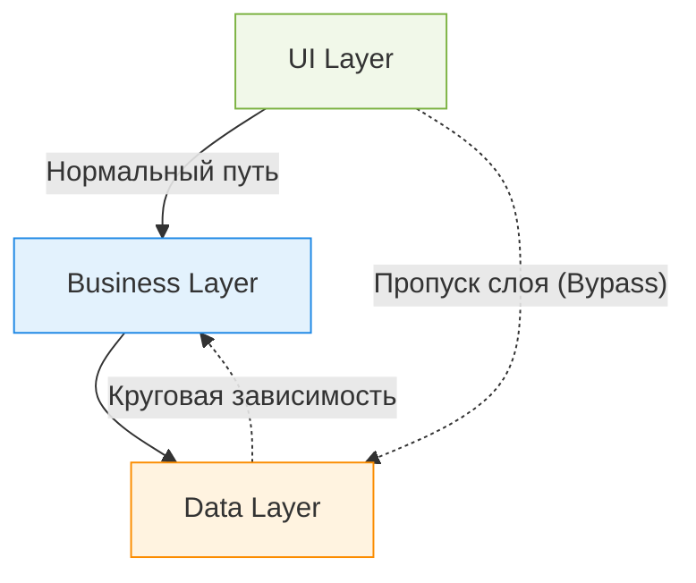

Слоистая архитектура держится на строгой дисциплине, но на практике часто покрывается трещинами из-за протекающих абстракций (Leaky Abstractions) и так называемых шорткатов. Когда сроки горят, разработчик решает «срезать угол» — например, дернуть базу данных напрямую из UI или пробросить объект HTTP Request прямо в бизнес-логику. Это решает сиюминутную задачу, но мгновенно уничтожает смысл разделения: теперь, чтобы поменять формат API или перейти на другой фреймворк, вам придется переписывать бизнес-правила.



Самое частое и разрушительное нарушение — это «отравление» слоев чужими контекстами. Это происходит, когда детали инфраструктуры начинают диктовать свои условия высокоуровневым абстракциям.

```typescript
// Антипаттерн: протечка инфраструктуры прямо в домен
class UserService {
  // Мы завязали бизнес-логику на конкретный фреймворк (Express)
  createUser(req: express.Request, res: express.Response) {
    const { name } = req.body;
    if (!name) return res.status(400).send('Error');
    // ...
    res.status(200).send('OK'); 
  }
}
```

Однако, есть неочевидный нюанс: строгая, наглухо закрытая слоистая архитектура (Strict Layering), где прыгать через слой категорически запрещено, иногда сама становится источником боли. В паттернах вроде CQRS мы умышленно создаем «открытую» архитектуру (Relaxed Layering) для операций чтения. Если нам нужно просто вывести список товаров на экран, прогонять данные через сложные доменные сущности и сервисы-оркестраторы бессмысленно и дорого. В таких случаях мы осознанно разрешаем презентационному слою читать напрямую из оптимизированных инфраструктурных вьюх (Read Model), сохраняя строгую многослойность только для операций записи (Write Model), где действительно важна сложная валидация и инварианты.
