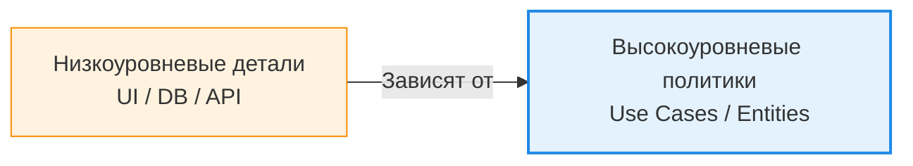

Кровеносная система любой слоистой архитектуры — это направление её зависимостей. Главное правило (The Dependency Rule), популяризованное Робертом Мартином, гласит непреложную истину: зависимости исходного кода могут указывать только внутрь, в сторону высокоуровневых политик. Инфраструктура зависит от бизнес-логики, но бизнес-логика не имеет права даже догадываться о существовании инфраструктуры. Это решает фатальную проблему жесткой сцепленности (Coupling), когда безобидная замена базы данных с MySQL на MongoDB требовала переписывания половины приложения.



Для реализации этого правила на практике, особенно когда высокоуровневому слою все-таки нужно сохранить данные в базу, применяется Инверсия Зависимостей (Dependency Inversion). Мы заставляем верхний слой определять интерфейс (Порт), который затем реализует нижний слой (Адаптер).

```typescript
// В доменном слое (Высокоуровневый)
// Мы только объявляем контракт, не зная как он работает под капотом
interface IEmailSender {
  send(to: string, text: string): Promise<void>;
}

class NotifyUserUseCase {
  constructor(private emailer: IEmailSender) {}
  
  async execute() {
      await this.emailer.send('user@test.com', 'Welcome!');
  }
}

// В инфраструктурном слое (Низкоуровневый)
// Мы импортируем контракт из домена и реализуем его физически
class SmtpEmailSender implements IEmailSender {
  async send(to: string, text: string) { /* Реализация работы с SMTP */ }
}
```

Скрытый трейдофф инверсии зависимостей — усложнение навигации по коду и раздувание числа интерфейсов. Когда вы кликаете «Go to Definition» в IDE, вы попадаете в пустой интерфейс, а не в реальный код, и вынуждены искать реализации. Более того, чрезмерное увлечение абстракциями приводит к созданию «моков ради моков» в тестах. Это невероятно мощный инструмент для отвязки от внешних зависимостей, но применять его стоит только на границах систем (базы данных, файловая система, сторонние API), а не внутри собственного жестко согласованного кода, где прямой вызов функции был бы гораздо эффективнее.
