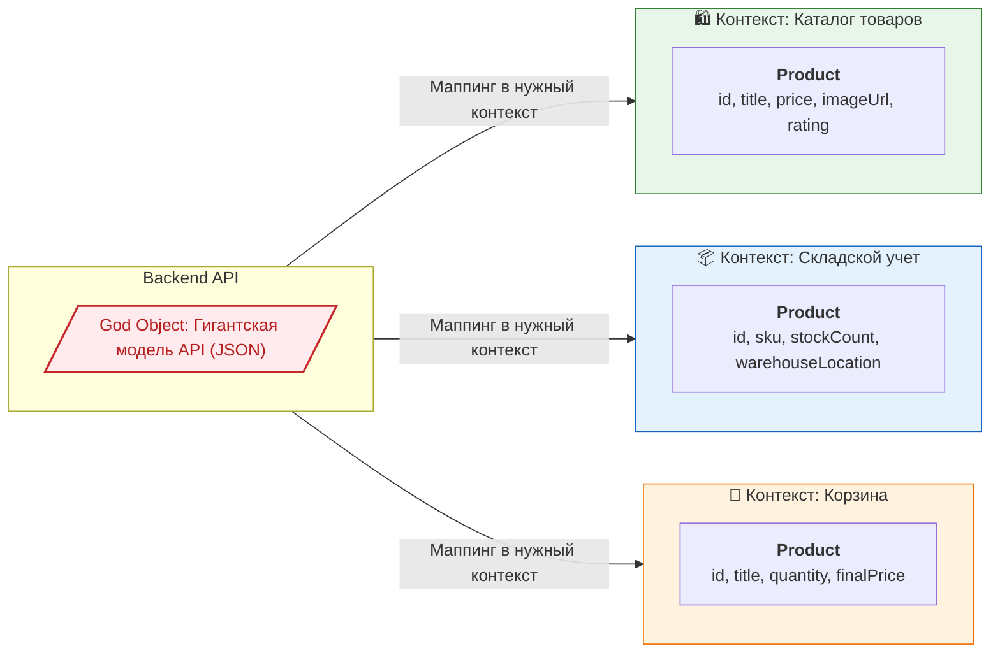

Концепция **Bounded Context (Ограниченный контекст)** пришла во фронтенд из Domain-Driven Design (DDD). Она утверждает, что одна и та же бизнес-сущность может (и должна) иметь совершенно разные модели данных и поведение в зависимости от того, в каком контексте (модуле или экране) она используется.

Во фронтенде эта концепция решает проблему **God Object ("Божественного объекта")**. Когда приложение растет, разработчики часто пытаются создать единый, универсальный тип `User` или `Product`, который содержит все возможные поля для всех экранов. В итоге модель разрастается до сотен полей (большинство из которых опциональны), а любой компонент становится неясно, какие именно данные ему действительно гарантированно придут.

## 1. Как это работает на практике

Вместо одной универсальной сущности мы создаем несколько узконаправленных моделей, специфичных для конкретного экрана или фичи.



Когда бэкенд присылает один огромный JSON с товаром, инфраструктурный слой фронтенда (Anti-Corruption Layer) маппит эти сырые данные в ту модель, которая нужна конкретному модулю.

### Примеры кода

**❌ Антипаттерн: God Object**
Один тип на всё приложение. Чтобы использовать его в каталоге, приходится делать почти все поля опциональными (ведь в списке товаров нет информации о складе).
```typescript
// Отвратительный God Object
interface Product {
  id: string;
  title: string;
  price: number;
  // Специфично для каталога
  imageUrl?: string;
  rating?: number;
  // Специфично для склада
  sku?: string;
  stockCount?: number;
  warehouseLocation?: string;
  // Специфично для корзины
  quantity?: number;
  appliedPromo?: string;
}
```
Такой подход ломает строгую типизацию: TypeScript заставит вас делать проверки на `undefined` (`product.sku?.toLowerCase()`) везде, даже там, где поле точно есть.

**✅ Как надо: Разделение по Bounded Context**
Каждый модуль определяет свою собственную сущность товара.
```typescript
// modules/catalog/models.ts
interface CatalogProduct {
  id: string;
  title: string;
  price: number;
  imageUrl: string; 
  rating: number;
}

// modules/cart/models.ts
interface CartItem {
  productId: string;
  title: string;
  price: number;
  quantity: number;
}
```

## 2. Неочевидные нюансы и трейдоффы

* **Дублирование кода (DRY vs Decoupling):** В разных контекстах модели будут иметь общие поля (например, `id`, `title`, `price`). Разработчикам часто психологически тяжело писать дублирующийся код из-за слепой веры в принцип DRY (Don't Repeat Yourself). Однако в архитектуре **слабая связность (Decoupling) почти всегда важнее, чем DRY**. Лучше два раза написать `title: string`, чем связать корзину и админ-панель единым типом.
* **Сложность синхронизации:** Если пользователь меняет название товара в одном контексте, а на экране отображаются компоненты из двух разных контекстов (например, страница товара и мини-корзина сбоку), вам придется синхронизировать состояние между разными моделями данных (через глобальные события, Zustand или инвалидацию кэша React Query).
* **Оверхед на маппинг:** Фронтенду придется писать функции-мапперы, чтобы трансформировать данные API в локальные модели каждого контекста. Это добавляет рутины.
* **Где применимо:** Паттерн обязателен в крупных enterprise-системах, дашбордах, ERP и E-commerce. 
* **Где ломается:** В простых CRUD-приложениях, где фронтенд просто рисует формочки один-в-один совпадающие с таблицами базы данных. В таких случаях маппинг в Bounded Context — это пустая трата времени.
