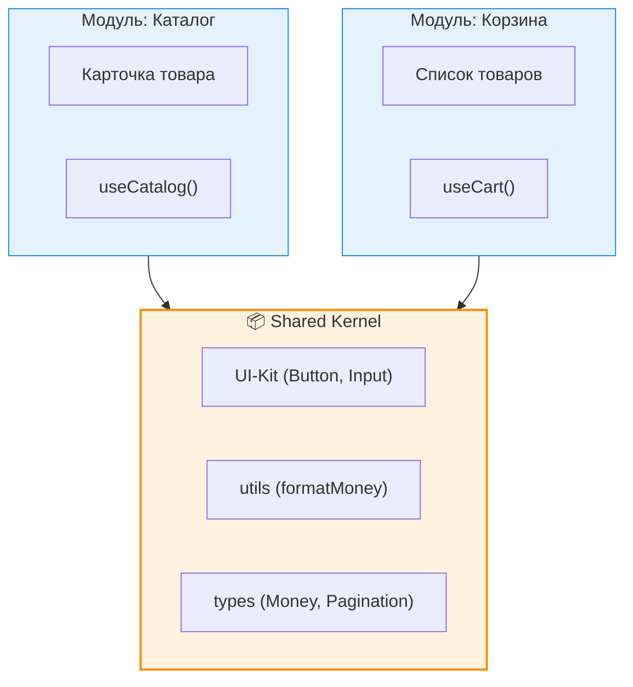

**Shared Kernel (Общее ядро)** — это паттерн из Domain-Driven Design, который описывает ту часть кодовой базы (или домена), которая разделяется между несколькими Bounded Context'ами или модулями. 

Боль, которую мы решаем: хотя концепция Bounded Context призывает нас изолировать модули и дублировать код ради слабой связности (decoupling), на практике доводить это до абсолюта безумно дорого. Мы не хотим писать свою функцию форматирования даты, свою кнопку или свой базовый тип пагинации в каждом модуле. Shared Kernel предоставляет "легальную" зону для общих зависимостей.

## 1. Как это работает на практике

Shared Kernel во фронтенде обычно делится на две категории:
1. **Технический (Утилитарный):** UI-кит (Design System), хелперы (форматирование дат, работа с числами), абстракции над API-клиентом.
2. **Доменный:** Базовые типы данных, которые настолько фундаментальны для бизнеса, что их дублирование приведет к хаосу (например, `Currency` или тип `UserId`).



### Примеры кода

**❌ Антипаттерн: Мусорка (Dumpster)**
Часто папка `shared` или `common` превращается в помойку, куда скидывают всё, что понадобилось больше одного раза, включая бизнес-логику.
```typescript
// src/shared/utils.ts
export function formatMoney(amount: number) { ... }
export function validateEmail(email: string) { ... }
// ПЛОХО: Эта функция содержит бизнес-правила конкретной фичи! Ей не место в Shared!
export function calculateCartDiscount(items: any[], userStatus: string) { ... } 
```
Если `calculateCartDiscount` лежит в Shared Kernel, то изменения правил скидок в Корзине могут внезапно повлиять на другие места, или же разработчикам придется менять код "ядра".

**✅ Как надо: Строгий и "тупой" Shared Kernel**
Shared Kernel должен быть максимально абстрактным и не знать о бизнес-правилах приложения.
```typescript
// src/shared/ui/Button.tsx
export const Button = () => { ... } // Максимально "тупая" кнопка

// src/shared/lib/money.ts
export function formatMoney(amount: number, currency: string) { ... }

// src/shared/types/index.ts
// Базовые типы, которые используются повсеместно
export type PaginationParams = { limit: number; offset: number };
```

## 2. Неочевидные нюансы и трейдоффы

* **Огромная стоимость изменений:** Изменение любой функции внутри Shared Kernel потенциально может сломать любой модуль в приложении, так как от ядра зависят все. Поэтому код в Shared Kernel должен быть **максимально стабильным**.
* **Никаких зависимостей "наверх":** Shared Kernel — это самый нижний уровень графа зависимостей. Файлы внутри Shared Kernel **никогда не должны импортировать** что-либо из фич, бизнес-сущностей или других модулей приложения. Если это происходит — вы создали циклическую зависимость.
* **Тенденция к разрастанию (Bloat):** Разработчикам психологически проще положить код в `shared`, чем думать о правильном месте для него. Чтобы Shared Kernel не превратился в свалку, необходимо проводить строгий код-ревью: "Действительно ли этот код является доменно-независимым?". 
* **Где ломается:** В микрофронтендах. Если у вас несколько независимых SPA, общий Shared Kernel становится узким местом. Обновление Shared Kernel потребует релиза всех микрофронтендов (или приведет к конфликту версий библиотек в рантайме). В таких случаях часть Shared (например, UI Kit) выносят в отдельный NPM-пакет с жестким версионированием.
