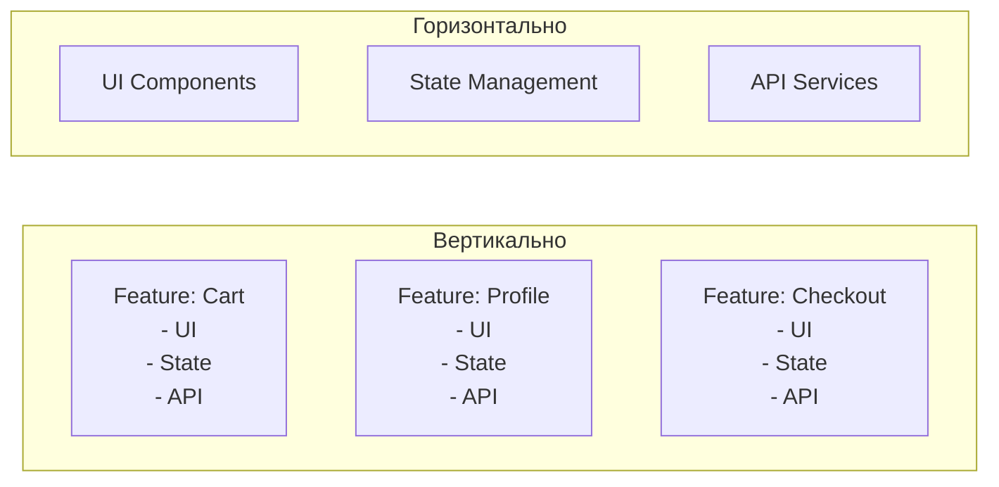

# Вертикальная декомпозиция

В традиционном подходе разработчики часто складывают все компоненты в папку `components`, все сервисы в `services`, а сторы в `store`. Это называется *горизонтальной* декомпозицией. И она отлично работает... пока проект небольшой. 

Но как только приложение вырастает, возникает **боль**: чтобы добавить одну простую кнопку "Купить", вам нужно потрогать 5 разных папок. Вы начинаете прыгать по всему проекту, а шансы поймать merge conflict с коллегой, который делает кнопку "Отменить" в тех же файлах, стремятся к 100%.

**Вертикальная декомпозиция** решает эту проблему. Мы режем приложение не по технологиям (слоям), а по *смыслу* (фичам). Каждая фича или бизнес-домен — это независимый, изолированный кусок (срез или slice), который содержит внутри себя всё необходимое: от UI-компонентов до API-клиентов и стейт-менеджмента.

## Как это работает

Вместо того чтобы размазывать логику "Корзины" тонким слоем по всему приложению, мы собираем ее в одном месте: `features/Cart`. Если мы захотим удалить эту фичу, мы просто удалим одну папку.



## Примеры кода

**Антипаттерн (Горизонтальная декомпозиция):**
```text
src/
  components/
    CartButton.tsx
    ProfileCard.tsx
  store/
    cartSlice.ts
    profileSlice.ts
  api/
    cartApi.ts
    profileApi.ts
```
Чтобы понять, как работает Корзина, нужно держать в голове структуру всего `src/`.

**Правильное решение (Вертикальная декомпозиция):**
```text
src/
  features/
    Cart/
      ui/CartButton.tsx
      model/cartSlice.ts
      api/cartApi.ts
    Profile/
      ui/ProfileCard.tsx
      model/profileSlice.ts
      api/profileApi.ts
```
Всё, что относится к Корзине, лежит в Корзине. Высокая связность (cohesion) внутри модуля и низкая зацепление (coupling) снаружи.

## Неочевидные нюансы и трейдоффы

1. **Сложнее переиспользовать код.** Если вам нужен кусочек стейта "Корзины" в модуле "Чекаут", вам придется строить жесткие контракты (Public API) между вертикальными срезами. Нельзя просто "импортнуть файлик из соседней папки".
2. **Дублирование.** Иногда проще скопировать интерфейс или утилиту в два разных вертикальных модуля, чем выносить её в `shared` слой, создавая лишние зависимости. Это нарушает принцип DRY, но соблюдает независимость (что в архитектуре часто важнее).
3. **Границы применимости:** Вертикальная декомпозиция избыточна для простых CRUD-приложений или лендингов, где слой UI намного тяжелее бизнес-логики. Она раскрывается только на средних и крупных проектах.
