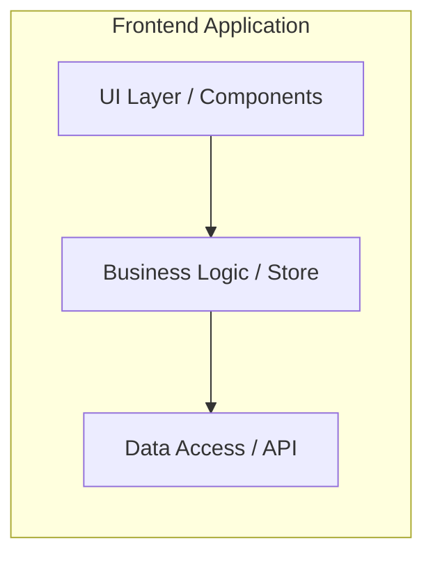

# Горизонтальная декомпозиция

Горизонтальная декомпозиция (или разделение по технологическим слоям) — это самый старый, самый понятный и самый популярный способ структурирования кода, которому учат во всех туториалах. Суть проста: мы группируем файлы не по тому, *что* они делают для бизнеса (корзина, профиль), а по тому, *чем* они являются технически (компоненты, хуки, сервисы).

## Какую боль решает

Когда вы только создали проект (например, через `create-react-app` или `vite`), перед вами пустой `src/`. Если начать писать всё в один файл `App.tsx` — наступит хаос. Горизонтальная декомпозиция даёт интуитивно понятные "полочки" для раскладывания кода. Вы всегда знаете: хуки лежат в папке `hooks`, а стили — в `styles`. Это снижает порог входа для джунов.


*Зависимости всегда направлены сверху вниз: UI ничего не знает об API, а общается с ним через слой логики.*

## Примеры кода

**Типичная структура:**
```text
src/
  ├── components/
  │   ├── UserProfile.tsx
  │   ├── OrderList.tsx
  │   └── Button.tsx
  ├── hooks/
  │   ├── useAuth.ts
  │   └── useDebounce.ts
  ├── store/
  │   ├── userReducer.ts
  │   └── orderReducer.ts
  └── api/
      ├── users.ts
      └── orders.ts
```

**Антипаттерн в этой структуре:**
Несмотря на наличие слоёв, разработчики часто начинают делать "шорткаты", вызывая API прямо из компонента, игнорируя слой логики:
```tsx
// Плохо: Компонент из слоя UI лезет напрямую в слой API
import { fetchUsers } from '../api/users';

const UserList = () => {
  // ...
  useEffect(() => { fetchUsers(); }, []);
}
```

## Где ломается и неочевидные нюансы

Горизонтальная декомпозиция — это "бомба замедленного действия". Она идеально работает первые полгода жизни проекта. Но когда файлов становится сотни, всплывают фатальные проблемы:

1. **Низкий cohesion (связность).** Чтобы понять, как работает фича "Заказы", вам нужно открыть `components/OrderList.tsx`, потом перейти в `store/orderReducer.ts`, а затем в `api/orders.ts`. Логически связанные вещи физически разнесены по разным концам проекта.
2. **Merge Conflicts.** Вся команда постоянно коммитит в одни и те же папки (`components`, `store`), создавая бутылочное горлышко.
3. **Невозможность удалить фичу.** Если бизнес просит выпилить старую систему скидок, вам придется искать её "остатки" по всем технологическим слоям. Нет одной папки, которую можно было бы просто удалить.

**Вывод:** Использовать только для прототипов, UI-китов и очень маленьких проектов. Для enterprise переходить на вертикальную или feature-sliced декомпозицию.
