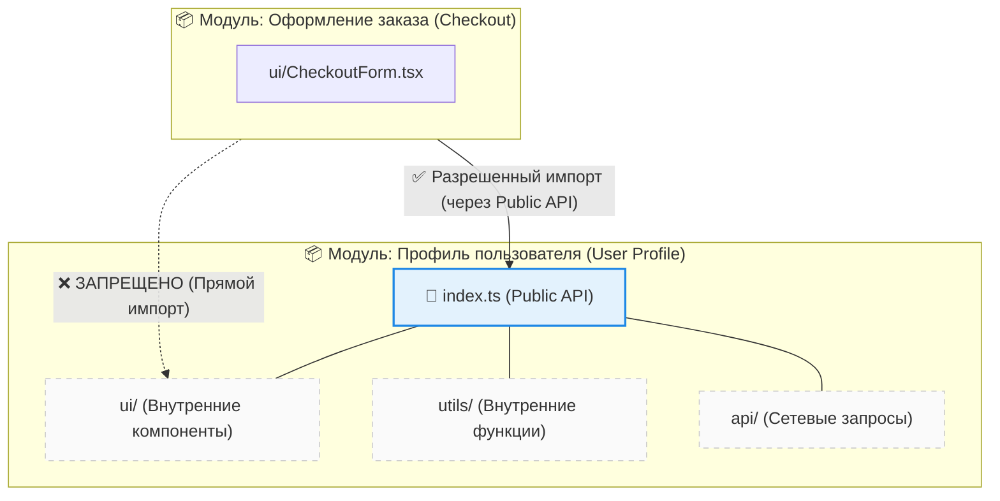

Границы модулей во фронтенде — это логические или физические барьеры, разделяющие кодовую базу на независимые, сцепленные внутри себя части (модули) с четко очерченными правилами внешнего взаимодействия. 

Концепция решает классическую проблему **"спагетти-кода"**: когда в проекте без границ любой файл может импортировать любой другой файл. Со временем это приводит к тому, что изменение одной функции в утилитах ломает корзину покупок, а рефакторинг становится невозможным без переписывания половины приложения. Модульные границы заставляют код общаться только через заранее определенные "двери" — **Public API**.

## 1. Как это работает на практике

Главное правило модульных границ: **внутренности модуля скрыты от внешнего мира**. Модуль решает, что именно он готов предоставить другим частям приложения, экспортируя это через единую точку входа (обычно `index.ts` или `public-api.ts`).



### Примеры кода

**❌ Антипаттерн: Нарушение инкапсуляции**
Модуль оформления заказа лезет глубоко во внутренности модуля пользователя, жестко привязываясь к структуре его папок.
```typescript
// features/checkout/ui/CheckoutForm.tsx

// Плохо: мы знаем внутреннюю структуру папок другого модуля. 
// Если UserCard перенесут или переименуют, здесь код сломается.
import { UserCard } from '../../user/ui/components/UserCard';
import { formatUserName } from '../../user/utils/formatters/name';
```

**✅ Как надо: Строгие границы через Public API**
Модуль пользователя экспортирует только то, что безопасно использовать снаружи.
```typescript
// entities/user/index.ts (Public API)
export { UserCard } from './ui/UserCard';
export { formatUserName } from './utils';
export type { User } from './model/types';
// Заметьте: мы НЕ экспортируем внутренние api-методы или служебные хуки.

// features/checkout/ui/CheckoutForm.tsx
// Хорошо: мы обращаемся к модулю как к черному ящику
import { UserCard, formatUserName } from 'entities/user';
```

## 2. Инструменты контроля границ

В реальности договоренности "на словах" не работают. Границы нужно защищать автоматикой на CI/CD:
1. **ESLint (eslint-plugin-boundaries / eslint-plugin-import)** — запрет импортов в обход `index.ts` и контроль направления зависимостей (например, фичи не могут импортировать другие фичи).
2. **Dependency Cruiser** — построение графа зависимостей и валидация архитектурных правил.
3. **Nx / Turborepo** — физическое разделение на пакеты/библиотеки, где границы защищаются на уровне конфигурации сборщика и `tsconfig.json`.

## 3. Неочевидные нюансы и трейдоффы

* **Оверхед на проектирование:** Вам придется постоянно принимать решения: "А должен ли этот интерфейс быть публичным?". Это замедляет разработку фич "на скорую руку".
* **Проблема Barrel Files:** Использование `index.ts` как единой точки входа (Barrel exports) может привести к проблемам с производительностью сборщика (Webpack/Vite) и циклическим зависимостям, так как при импорте одной функции бандлер может попытаться распарсить весь модуль.
* **Слишком мелкие модули:** Если сделать каждый компонент отдельным модулем со своим Public API, вы получите "анемичную архитектуру" с огромным количеством связей и бойлерплейта. Границы должны проводиться по **бизнес-смыслу**, а не по техническим слоям.
* **Когда это ломается:** В стартапах на стадии MVP жесткие границы модулей часто избыточны. Когда продукт быстро пивотится, код переписывается целыми кусками. Строгие ограничения на импорты в такой момент вызовут лишь раздражение команды. Внедрять строгие границы стоит, когда команда превышает 3-5 человек или проект переходит в стадию долгосрочной поддержки.
