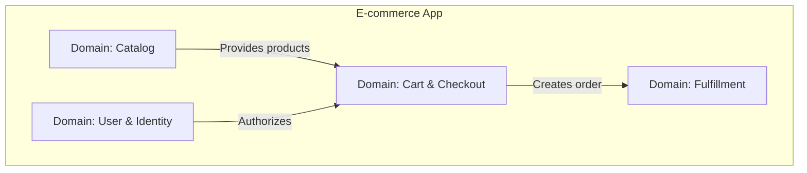

# Декомпозиция по доменам

Декомпозиция по доменам — это архитектурный подход, пришедший из Domain-Driven Design (DDD). Его главная идея в том, что структура кода должна отражать **предметную область бизнеса**, а не фантазии программистов о технических слоях или UI-фичах.

## Какую боль решаем?

В больших приложениях часто возникает проблема "технического перевода". Бизнес говорит: "Нам нужно изменить процесс онбординга водителя". Разработчик переводит это как: "Так, мне нужно потрогать `RegistrationForm`, обновить `userReducer`, добавить флаг в `AuthContext` и поправить эндпоинт в `api/users`". 

Разрыв между языком бизнеса и структурой кода ведет к багам и замедлению разработки. Декомпозиция по доменам создает "Ubiquitous Language" (Единый язык) — если в бизнесе есть понятие "Каталог" или "Заказ", то и в коде должны быть точно такие же модули.



## Как это работает на практике

Домен — это самодостаточная сфера знаний. Внутри домена могут быть свои UI-компоненты, своя логика и свои модели. Важно то, что домен защищает свои внутренности и общается с другими доменами только через строгие контракты (Public API).

**Пример структуры:**
```text
src/
  domains/
    Catalog/         # Домен каталога товаров
      models/        # Product, Category
      api/
      ui/            # ProductCard, CategoryTree
    Identity/        # Домен авторизации и пользователей
      models/        # User, Role, Session
      services/      # AuthService
    Ordering/        # Домен заказов
      models/        # Order, CartItem
      features/      # CheckoutProcess
```

**Антипаттерн:**
Смешивание моделей разных доменов. Например, когда сущность `Product` из домена `Catalog` напрямую импортируется и мутируется в домене `Ordering` при добавлении в корзину.

**Правильное решение:**
`Ordering` не должен зависеть от полной модели `Product`. У `Ordering` должен быть свой минимальный маппинг, например `CartItem`, который хранит только `productId`, `price` и `quantity`.

## Неочевидные нюансы и границы применимости

1. **Сложность выделения границ.** Самое сложное в DDD — правильно нарезать домены. Является ли "Корзина" частью домена "Каталог", частью "Заказов" или отдельным доменом? Неправильно выделенные границы (Bounded Contexts) приведут к тому, что домены будут слишком сильно связаны (High Coupling), и вам придется постоянно гонять данные между ними.
2. **Оверхед на маппинг.** При передаче данных из одного домена в другой часто приходится писать мапперы (Anti-Corruption Layer), чтобы изменение структуры данных в одном домене не сломало другой. Это требует написания "лишнего" boilerplate кода.
3. **Где применимо:** Крупные монолиты и микрофронтенды с глубокой бизнес-логикой.
4. **Где ломается:** На простых CRUD-приложениях, где доменная модель один в один совпадает со структурой базы данных (Active Record). Там DDD и декомпозиция по доменам создадут только лишнюю абстракцию.
